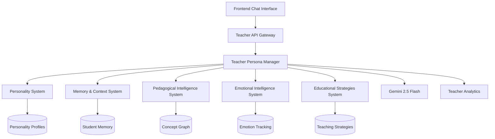

# Enhanced Teacher Persona Architecture

## Executive Summary

This document defines a comprehensive architecture for transforming the basic AI service into a
sophisticated educational companion with advanced personality, memory, and pedagogical intelligence
capabilities.

**Current State**: Basic prompting with Gemini 2.5 Flash **Target State**: Sophisticated educational
AI with persistent memory, adaptive personality, and pedagogical intelligence

## 1. Architecture Overview

### 1.1 High-Level System Design



### 1.2 Core Components

1. **Teacher Persona Manager** - Central orchestrator
2. **Personality System** - Adaptive teacher personalities
3. **Memory & Context System** - Long-term student memory
4. **Pedagogical Intelligence** - Educational decision-making
5. **Emotional Intelligence** - Student emotion awareness
6. **Educational Strategies** - Teaching methodologies

## 2. Detailed Component Architecture

### 2.1 Teacher Persona Manager

**Purpose**: Central orchestrator that coordinates all teacher systems to generate contextually
appropriate, educationally sound responses.

```typescript
interface TeacherPersonaManager {
  generateResponse(request: TeacherRequest): Promise<TeacherResponse>;
  updateStudentContext(studentId: string, interaction: Interaction): Promise<void>;
  selectPersonality(studentState: StudentState): Promise<PersonalityProfile>;
  assessLearningProgress(studentId: string, subject: string): Promise<LearningAssessment>;
}

interface TeacherRequest {
  studentId: string;
  message: string;
  sessionId: string;
  subject?: string;
  timestamp: Date;
  metadata?: {
    emotion?: string;
    confidence?: number;
    strugglingIndicators?: string[];
  };
}

interface TeacherResponse {
  message: string;
  personality: PersonalityProfile;
  pedagogicalStrategy: PedagogicalStrategy;
  emotionalTone: EmotionalTone;
  followUpSuggestions: string[];
  conceptsIntroduced: string[];
  difficultyAdjustment?: DifficultyAdjustment;
  metadata: ResponseMetadata;
}
```

**Database Schema**:

```sql
CREATE TABLE teacher_interactions (
  id UUID PRIMARY KEY DEFAULT gen_random_uuid(),
  student_id UUID NOT NULL REFERENCES users(id),
  session_id UUID NOT NULL,

  -- Input Analysis
  student_message TEXT NOT NULL,
  detected_emotion VARCHAR(50),
  detected_confusion_level DECIMAL(3,2),
  detected_concepts TEXT[],

  -- Teacher Decision Making
  selected_personality VARCHAR(50) NOT NULL,
  pedagogical_strategy VARCHAR(50) NOT NULL,
  response_approach VARCHAR(50) NOT NULL,

  -- Generated Response
  teacher_response TEXT NOT NULL,
  emotional_tone VARCHAR(50),
  confidence_level DECIMAL(3,2),
  follow_up_suggestions TEXT[],

  -- Educational Metadata
  concepts_taught TEXT[],
  difficulty_level VARCHAR(20),
  learning_objectives_addressed TEXT[],

  -- Performance Tracking
  response_generation_time_ms INTEGER,
  student_engagement_predicted DECIMAL(3,2),

  created_at TIMESTAMP WITH TIME ZONE DEFAULT CURRENT_TIMESTAMP
);

-- Indexes for performance
CREATE INDEX idx_teacher_interactions_student_id ON teacher_interactions(student_id);
CREATE INDEX idx_teacher_interactions_session_id ON teacher_interactions(session_id);
CREATE INDEX idx_teacher_interactions_personality ON teacher_interactions(selected_personality);
CREATE INDEX idx_teacher_interactions_created_at ON teacher_interactions(created_at);
```

### 2.2 Personality System

**Purpose**: Dynamic teacher personality selection and adaptation based on student needs and
emotional state.

```typescript
interface PersonalitySystem {
  getPersonalityForStudent(studentId: string, context: StudentContext): Promise<PersonalityProfile>;
  adaptPersonality(
    currentPersonality: PersonalityProfile,
    studentFeedback: StudentFeedback
  ): Promise<PersonalityProfile>;
  getPersonalityMetrics(personalityId: string): Promise<PersonalityMetrics>;
}

interface PersonalityProfile {
  id: string;
  name: string;
  description: string;
  traits: PersonalityTraits;
  communicationStyle: CommunicationStyle;
  teachingApproach: TeachingApproach;
  emotionalSupport: EmotionalSupportLevel;
  adaptationRules: AdaptationRule[];
}

interface PersonalityTraits {
  patience: number; // 0-1
  enthusiasm: number; // 0-1
  formality: number; // 0-1
  directness: number; // 0-1
  humor: number; // 0-1
  empathy: number; // 0-1
  encouragement: number; // 0-1
}

interface CommunicationStyle {
  tone: 'formal' | 'casual' | 'friendly' | 'professional';
  language_complexity: 'simple' | 'moderate' | 'advanced';
  example_frequency: 'low' | 'medium' | 'high';
  question_style: 'direct' | 'socratic' | 'guided';
}
```

**Database Schema**:

```sql
CREATE TABLE personality_profiles (
  id UUID PRIMARY KEY DEFAULT gen_random_uuid(),
  name VARCHAR(100) NOT NULL,
  description TEXT,

  -- Personality Traits (0.0 to 1.0)
  patience DECIMAL(3,2) NOT NULL,
  enthusiasm DECIMAL(3,2) NOT NULL,
  formality DECIMAL(3,2) NOT NULL,
  directness DECIMAL(3,2) NOT NULL,
  humor DECIMAL(3,2) NOT NULL,
  empathy DECIMAL(3,2) NOT NULL,
  encouragement DECIMAL(3,2) NOT NULL,

  -- Communication Style
  tone VARCHAR(20) NOT NULL,
  language_complexity VARCHAR(20) NOT NULL,
  example_frequency VARCHAR(20) NOT NULL,
  question_style VARCHAR(20) NOT NULL,

  -- Usage Metrics
  usage_count INTEGER DEFAULT 0,
  effectiveness_rating DECIMAL(3,2) DEFAULT 0,

  created_at TIMESTAMP WITH TIME ZONE DEFAULT CURRENT_TIMESTAMP,
  updated_at TIMESTAMP WITH TIME ZONE DEFAULT CURRENT_TIMESTAMP
);

CREATE TABLE student_personality_preferences (
  id UUID PRIMARY KEY DEFAULT gen_random_uuid(),
  student_id UUID NOT NULL REFERENCES users(id),
  personality_id UUID NOT NULL REFERENCES personality_profiles(id),

  -- Preference Strength
  preference_score DECIMAL(3,2) NOT NULL, -- How much student likes this personality
  effectiveness_score DECIMAL(3,2) NOT NULL, -- How effective it is for learning

  -- Context
  subject VARCHAR(50),
  emotional_state VARCHAR(50),

  -- Tracking
  sessions_used INTEGER DEFAULT 0,
  last_used_at TIMESTAMP WITH TIME ZONE,

  created_at TIMESTAMP WITH TIME ZONE DEFAULT CURRENT_TIMESTAMP,
  updated_at TIMESTAMP WITH TIME ZONE DEFAULT CURRENT_TIMESTAMP,

  UNIQUE(student_id, personality_id, subject)
);
```

**Predefined Personalities**:

```typescript
const PERSONALITY_PROFILES = {
  ENCOURAGING_MENTOR: {
    name: 'Encouraging Mentor',
    traits: { patience: 0.9, enthusiasm: 0.8, empathy: 0.9, encouragement: 0.95 },
    communicationStyle: { tone: 'friendly', language_complexity: 'simple' },
    bestFor: ['anxiety', 'low_confidence', 'struggling_students'],
  },

  SOCRATIC_GUIDE: {
    name: 'Socratic Guide',
    traits: { patience: 0.8, directness: 0.7, humor: 0.6 },
    communicationStyle: { question_style: 'socratic', tone: 'professional' },
    bestFor: ['critical_thinking', 'advanced_students', 'problem_solving'],
  },

  ENTHUSIASTIC_COACH: {
    name: 'Enthusiastic Coach',
    traits: { enthusiasm: 0.95, encouragement: 0.9, humor: 0.8 },
    communicationStyle: { tone: 'casual', example_frequency: 'high' },
    bestFor: ['motivation', 'engagement', 'making_learning_fun'],
  },

  PATIENT_EXPLAINER: {
    name: 'Patient Explainer',
    traits: { patience: 0.95, empathy: 0.8, formality: 0.3 },
    communicationStyle: { language_complexity: 'simple', tone: 'friendly' },
    bestFor: ['complex_concepts', 'step_by_step', 'learning_disabilities'],
  },

  STRUCTURED_INSTRUCTOR: {
    name: 'Structured Instructor',
    traits: { formality: 0.8, directness: 0.8, patience: 0.7 },
    communicationStyle: { tone: 'professional', language_complexity: 'moderate' },
    bestFor: ['organized_learning', 'systematic_approach', 'exam_prep'],
  },
};
```

### 2.3 Memory & Context System

**Purpose**: Persistent student memory and context management for personalized learning experiences.

```typescript
interface MemoryContextSystem {
  getStudentMemory(studentId: string): Promise<StudentMemory>;
  updateStudentMemory(studentId: string, interaction: LearningInteraction): Promise<void>;
  getSessionContext(sessionId: string): Promise<SessionContext>;
  updateSessionContext(sessionId: string, updates: ContextUpdate): Promise<void>;
  getLearningHistory(studentId: string, subject?: string): Promise<LearningHistory>;
}

interface StudentMemory {
  studentId: string;
  personalProfile: StudentPersonalProfile;
  learningPatterns: LearningPattern[];
  strugglingAreas: StruggleArea[];
  masteredConcepts: MasteredConcept[];
  preferences: StudentPreferences;
  emotionalHistory: EmotionalState[];
  achievements: Achievement[];
  lastUpdated: Date;
}

interface LearningPattern {
  pattern_type: 'learning_style' | 'time_preference' | 'difficulty_preference' | 'mistake_pattern';
  pattern_value: string;
  confidence: number;
  evidence: string[];
  first_observed: Date;
  last_confirmed: Date;
}

interface StruggleArea {
  concept: string;
  subject: string;
  struggle_type: 'comprehension' | 'application' | 'retention' | 'motivation';
  severity: number; // 0-1
  first_identified: Date;
  improvement_attempts: InterventionAttempt[];
  status: 'active' | 'improving' | 'resolved';
}
```

**Database Schema**:

```sql
CREATE TABLE student_memory (
  id UUID PRIMARY KEY DEFAULT gen_random_uuid(),
  student_id UUID NOT NULL REFERENCES users(id),

  -- Personal Learning Profile
  preferred_learning_style VARCHAR(20), -- visual, auditory, kinesthetic, mixed
  optimal_session_length INTEGER, -- minutes
  best_time_of_day VARCHAR(20), -- morning, afternoon, evening
  attention_span_minutes INTEGER,

  -- Learning Patterns
  common_mistake_patterns TEXT[],
  successful_learning_strategies TEXT[],
  motivation_triggers TEXT[],
  confidence_builders TEXT[],

  -- Struggle Areas
  struggling_concepts JSONB, -- { concept: {severity, attempts, status} }
  mastered_concepts JSONB, -- { concept: {mastery_date, confidence_level} }

  -- Emotional Profile
  typical_emotional_state VARCHAR(30),
  anxiety_triggers TEXT[],
  confidence_boosters TEXT[],
  frustration_indicators TEXT[],

  -- Preferences
  preferred_personalities TEXT[],
  disliked_approaches TEXT[],
  preferred_example_types TEXT[],

  -- Progress Tracking
  total_interactions INTEGER DEFAULT 0,
  successful_sessions INTEGER DEFAULT 0,
  improvement_rate DECIMAL(3,2) DEFAULT 0,

  created_at TIMESTAMP WITH TIME ZONE DEFAULT CURRENT_TIMESTAMP,
  updated_at TIMESTAMP WITH TIME ZONE DEFAULT CURRENT_TIMESTAMP,

  UNIQUE(student_id)
);

CREATE TABLE learning_sessions (
  id UUID PRIMARY KEY DEFAULT gen_random_uuid(),
  student_id UUID NOT NULL REFERENCES users(id),
  session_id VARCHAR(100) NOT NULL,

  -- Session Context
  subject VARCHAR(50),
  initial_topic VARCHAR(100),
  current_topic VARCHAR(100),
  learning_objectives TEXT[],

  -- Progress Tracking
  concepts_introduced TEXT[],
  concepts_practiced TEXT[],
  concepts_mastered TEXT[],
  difficulty_progression JSONB, -- track difficulty changes

  -- Student State
  initial_confidence DECIMAL(3,2),
  current_confidence DECIMAL(3,2),
  emotional_state_progression JSONB,
  engagement_level DECIMAL(3,2),

  -- Teacher Adaptations
  personality_changes JSONB, -- track personality switches
  strategy_changes JSONB, -- track pedagogical strategy changes

  -- Session Outcomes
  session_rating INTEGER, -- 1-5 student rating
  learning_effectiveness DECIMAL(3,2),
  concepts_to_review TEXT[],
  next_session_recommendations TEXT[],

  started_at TIMESTAMP WITH TIME ZONE,
  ended_at TIMESTAMP WITH TIME ZONE,
  total_duration_minutes INTEGER,

  created_at TIMESTAMP WITH TIME ZONE DEFAULT CURRENT_TIMESTAMP
);

-- Indexes for performance
CREATE INDEX idx_student_memory_student_id ON student_memory(student_id);
CREATE INDEX idx_learning_sessions_student_id ON learning_sessions(student_id);
CREATE INDEX idx_learning_sessions_session_id ON learning_sessions(session_id);
CREATE INDEX idx_learning_sessions_subject ON learning_sessions(subject);
```

### 2.4 Pedagogical Intelligence System

**Purpose**: Educational decision-making engine that implements advanced teaching methodologies.

```typescript
interface PedagogicalIntelligenceSystem {
  selectTeachingStrategy(context: TeachingContext): Promise<PedagogicalStrategy>;
  adaptDifficulty(
    currentLevel: number,
    studentPerformance: PerformanceData
  ): Promise<DifficultyAdjustment>;
  detectLearningStyle(studentInteractions: StudentInteraction[]): Promise<LearningStyleAssessment>;
  generateScaffoldedExplanation(
    concept: string,
    studentLevel: number
  ): Promise<ScaffoldedExplanation>;
  assessConceptualUnderstanding(responses: string[]): Promise<UnderstandingAssessment>;
}

interface PedagogicalStrategy {
  name: string;
  approach:
    | 'socratic'
    | 'direct_instruction'
    | 'guided_discovery'
    | 'problem_based'
    | 'collaborative';
  techniques: string[];
  scaffolding_level: number; // 0-1
  questioning_style: QuestioningStyle;
  feedback_approach: FeedbackApproach;
  metacognitive_prompts: string[];
}

interface ScaffoldedExplanation {
  concept: string;
  difficulty_level: number;
  explanation_layers: ExplanationLayer[];
  prerequisites: string[];
  practice_suggestions: string[];
  assessment_questions: string[];
}

interface ExplanationLayer {
  level: number; // 1-5 (simple to complex)
  title: string;
  content: string;
  examples: string[];
  analogies?: string[];
  visual_aids?: string[];
}
```

**Database Schema**:

```sql
CREATE TABLE pedagogical_strategies (
  id UUID PRIMARY KEY DEFAULT gen_random_uuid(),
  name VARCHAR(100) NOT NULL,
  description TEXT,

  -- Strategy Classification
  approach VARCHAR(30) NOT NULL,
  complexity_level INTEGER NOT NULL, -- 1-5
  subject_applicability TEXT[], -- ['math', 'science', 'language']

  -- Implementation Details
  techniques JSONB NOT NULL, -- array of technique objects
  questioning_patterns TEXT[],
  scaffolding_approach TEXT,
  feedback_timing VARCHAR(20), -- immediate, delayed, progressive

  -- Usage Context
  best_for_student_types TEXT[], -- ['visual_learner', 'struggling', 'advanced']
  best_for_concepts TEXT[], -- ['abstract', 'procedural', 'factual']
  best_for_emotions TEXT[], -- ['anxious', 'confident', 'frustrated']

  -- Effectiveness Metrics
  usage_count INTEGER DEFAULT 0,
  success_rate DECIMAL(3,2) DEFAULT 0,
  student_satisfaction DECIMAL(3,2) DEFAULT 0,

  created_at TIMESTAMP WITH TIME ZONE DEFAULT CURRENT_TIMESTAMP
);

CREATE TABLE concept_prerequisites (
  id UUID PRIMARY KEY DEFAULT gen_random_uuid(),
  concept VARCHAR(100) NOT NULL,
  subject VARCHAR(50) NOT NULL,
  prerequisite_concept VARCHAR(100) NOT NULL,

  -- Relationship Strength
  necessity_level VARCHAR(20) NOT NULL, -- essential, helpful, optional
  difficulty_jump DECIMAL(3,2), -- how much harder the concept is

  -- Learning Path
  typical_order INTEGER, -- suggested order in curriculum
  mastery_required BOOLEAN DEFAULT FALSE, -- must master before proceeding

  created_at TIMESTAMP WITH TIME ZONE DEFAULT CURRENT_TIMESTAMP,

  UNIQUE(concept, prerequisite_concept)
);

CREATE TABLE learning_style_indicators (
  id UUID PRIMARY KEY DEFAULT gen_random_uuid(),
  student_id UUID NOT NULL REFERENCES users(id),

  -- Learning Style Scores (0.0 to 1.0)
  visual_score DECIMAL(3,2) DEFAULT 0,
  auditory_score DECIMAL(3,2) DEFAULT 0,
  kinesthetic_score DECIMAL(3,2) DEFAULT 0,
  reading_writing_score DECIMAL(3,2) DEFAULT 0,

  -- Supporting Evidence
  visual_indicators TEXT[], -- ['requests diagrams', 'mentions colors']
  auditory_indicators TEXT[], -- ['asks to repeat', 'talks through problems']
  kinesthetic_indicators TEXT[], -- ['wants hands-on', 'mentions movement']

  -- Confidence and Validation
  assessment_confidence DECIMAL(3,2),
  last_assessment_date DATE,
  assessment_method VARCHAR(30), -- 'behavioral_analysis', 'survey', 'performance'

  created_at TIMESTAMP WITH TIME ZONE DEFAULT CURRENT_TIMESTAMP,
  updated_at TIMESTAMP WITH TIME ZONE DEFAULT CURRENT_TIMESTAMP,

  UNIQUE(student_id)
);
```

### 2.5 Emotional Intelligence System

**Purpose**: Student emotion detection, empathetic response generation, and emotional support
strategies.

```typescript
interface EmotionalIntelligenceSystem {
  detectEmotion(message: string, context: StudentContext): Promise<EmotionDetection>;
  generateEmpatheticResponse(
    emotion: EmotionState,
    context: TeachingContext
  ): Promise<EmpatheticResponse>;
  assessAnxietyLevel(studentHistory: StudentInteraction[]): Promise<AnxietyAssessment>;
  recommendEmotionalIntervention(emotionState: EmotionState): Promise<EmotionalIntervention>;
  trackEmotionalProgress(studentId: string): Promise<EmotionalProgress>;
}

interface EmotionDetection {
  primary_emotion: string;
  emotion_intensity: number; // 0-1
  secondary_emotions: string[];
  confidence: number;
  indicators: EmotionIndicator[];
  emotional_context: EmotionalContext;
}

interface EmotionIndicator {
  type: 'lexical' | 'syntactic' | 'semantic' | 'contextual';
  indicator: string;
  weight: number;
  explanation: string;
}

interface EmpatheticResponse {
  acknowledgment: string; // Validates the emotion
  support: string; // Provides emotional support
  reframe: string; // Helps reframe negative thoughts
  encouragement: string; // Builds confidence
  next_step: string; // Actionable next step
}
```

**Database Schema**:

```sql
CREATE TABLE emotion_detection_rules (
  id UUID PRIMARY KEY DEFAULT gen_random_uuid(),
  emotion VARCHAR(30) NOT NULL,

  -- Detection Patterns
  lexical_indicators TEXT[], -- ['stressed', 'confused', 'frustrated']
  syntactic_patterns TEXT[], -- ['I can''t...', 'This is impossible']
  semantic_patterns TEXT[], -- concepts related to struggle

  -- Context Modifiers
  subject_specific BOOLEAN DEFAULT FALSE,
  subject VARCHAR(50),
  intensity_multipliers JSONB, -- {'repeat_usage': 1.5, 'caps': 1.3}

  -- Response Guidelines
  acknowledgment_templates TEXT[],
  support_strategies TEXT[],
  reframing_techniques TEXT[],

  effectiveness_score DECIMAL(3,2) DEFAULT 0,
  created_at TIMESTAMP WITH TIME ZONE DEFAULT CURRENT_TIMESTAMP
);

CREATE TABLE student_emotional_states (
  id UUID PRIMARY KEY DEFAULT gen_random_uuid(),
  student_id UUID NOT NULL REFERENCES users(id),
  session_id VARCHAR(100),

  -- Detected Emotion
  primary_emotion VARCHAR(30) NOT NULL,
  emotion_intensity DECIMAL(3,2) NOT NULL,
  secondary_emotions TEXT[],
  detection_confidence DECIMAL(3,2),

  -- Context
  subject VARCHAR(50),
  current_topic VARCHAR(100),
  session_duration_minutes INTEGER,
  recent_performance VARCHAR(20), -- 'struggling', 'succeeding', 'neutral'

  -- Teacher Response
  empathetic_response_used TEXT,
  intervention_applied VARCHAR(50),
  response_effectiveness DECIMAL(3,2), -- measured by subsequent emotions

  -- Emotional Tracking
  emotion_triggers TEXT[], -- what caused this emotion
  emotion_progression JSONB, -- how emotion changed during session

  detected_at TIMESTAMP WITH TIME ZONE DEFAULT CURRENT_TIMESTAMP
);

CREATE TABLE emotional_interventions (
  id UUID PRIMARY KEY DEFAULT gen_random_uuid(),
  name VARCHAR(100) NOT NULL,
  description TEXT,

  -- Target Emotions
  target_emotions TEXT[] NOT NULL, -- ['anxiety', 'frustration', 'discouragement']
  effectiveness_score DECIMAL(3,2) DEFAULT 0,

  -- Intervention Components
  acknowledgment_strategy TEXT NOT NULL,
  support_technique TEXT NOT NULL,
  reframing_approach TEXT,
  motivational_component TEXT,

  -- Implementation
  timing VARCHAR(20), -- 'immediate', 'after_struggle', 'session_end'
  personality_compatibility TEXT[], -- which personalities can use this
  subject_applicability TEXT[],

  -- Validation
  usage_count INTEGER DEFAULT 0,
  success_rate DECIMAL(3,2) DEFAULT 0,
  student_feedback_score DECIMAL(3,2) DEFAULT 0,

  created_at TIMESTAMP WITH TIME ZONE DEFAULT CURRENT_TIMESTAMP
);
```

### 2.6 Educational Strategies System

**Purpose**: Implementation of specific educational methodologies and teaching techniques.

```typescript
interface EducationalStrategiesSystem {
  implementSocraticMethod(question: string, studentLevel: number): Promise<SocraticSequence>;
  generateStepByStepBreakdown(problem: string, difficulty: number): Promise<StepByStepGuide>;
  createConceptualScaffolding(
    concept: string,
    prerequisites: string[]
  ): Promise<ScaffoldingStructure>;
  assessCriticalThinking(response: string): Promise<CriticalThinkingAssessment>;
  developMetacognitiveSkills(studentHistory: LearningHistory): Promise<MetacognitivePrompts>;
}

interface SocraticSequence {
  initial_question: string;
  guiding_questions: GuidingQuestion[];
  concept_revelation_path: string[];
  assessment_questions: string[];
  conclusion_synthesis: string;
}

interface GuidingQuestion {
  question: string;
  purpose: string; // 'clarify_understanding', 'reveal_assumption', 'make_connection'
  expected_response_types: string[];
  follow_up_strategies: FollowUpStrategy[];
}

interface StepByStepGuide {
  problem: string;
  total_steps: number;
  steps: LearningStep[];
  checkpoints: AssessmentCheckpoint[];
  common_mistakes: CommonMistake[];
  success_criteria: string[];
}
```

**Database Schema**:

```sql
CREATE TABLE educational_strategies (
  id UUID PRIMARY KEY DEFAULT gen_random_uuid(),
  strategy_name VARCHAR(100) NOT NULL,
  strategy_type VARCHAR(30) NOT NULL, -- 'socratic', 'scaffolding', 'problem_solving'
  description TEXT,

  -- Implementation Details
  step_templates JSONB NOT NULL, -- structured templates for implementation
  question_patterns TEXT[],
  guidance_techniques TEXT[],
  assessment_methods TEXT[],

  -- Effectiveness Context
  best_for_subjects TEXT[],
  best_for_concepts TEXT[], -- ['abstract', 'procedural', 'factual']
  best_for_student_types TEXT[],
  difficulty_range INTEGER[], -- [min_level, max_level]

  -- Performance Metrics
  usage_frequency INTEGER DEFAULT 0,
  success_rate DECIMAL(3,2) DEFAULT 0,
  student_engagement DECIMAL(3,2) DEFAULT 0,
  learning_effectiveness DECIMAL(3,2) DEFAULT 0,

  created_at TIMESTAMP WITH TIME ZONE DEFAULT CURRENT_TIMESTAMP
);

CREATE TABLE socratic_sequences (
  id UUID PRIMARY KEY DEFAULT gen_random_uuid(),
  concept VARCHAR(100) NOT NULL,
  subject VARCHAR(50) NOT NULL,
  difficulty_level INTEGER NOT NULL,

  -- Sequence Structure
  initial_question TEXT NOT NULL,
  guiding_questions JSONB NOT NULL, -- array of question objects
  concept_progression TEXT[], -- ordered list of concepts to reveal
  synthesis_statement TEXT,

  -- Usage and Effectiveness
  times_used INTEGER DEFAULT 0,
  completion_rate DECIMAL(3,2) DEFAULT 0,
  student_satisfaction DECIMAL(3,2) DEFAULT 0,
  learning_outcome_rating DECIMAL(3,2) DEFAULT 0,

  created_at TIMESTAMP WITH TIME ZONE DEFAULT CURRENT_TIMESTAMP
);

CREATE TABLE metacognitive_prompts (
  id UUID PRIMARY KEY DEFAULT gen_random_uuid(),
  prompt_type VARCHAR(30) NOT NULL, -- 'self_assessment', 'strategy_reflection', 'planning'
  prompt_text TEXT NOT NULL,

  -- Context Usage
  learning_phase VARCHAR(20) NOT NULL, -- 'before_learning', 'during_learning', 'after_learning'
  subject_applicability TEXT[],
  student_level_range INTEGER[], -- [min, max]

  -- Effectiveness
  usage_count INTEGER DEFAULT 0,
  effectiveness_rating DECIMAL(3,2) DEFAULT 0,
  student_response_quality DECIMAL(3,2) DEFAULT 0,

  created_at TIMESTAMP WITH TIME ZONE DEFAULT CURRENT_TIMESTAMP
);
```

## 3. Implementation Architecture

### 3.1 Service Layer Design

```typescript
// Core Teacher Service Interface
interface TeacherService {
  // Main entry point
  generateTeacherResponse(request: TeacherRequest): Promise<TeacherResponse>;

  // Component services
  personalityService: PersonalityService;
  memoryService: MemoryContextService;
  pedagogicalService: PedagogicalIntelligenceService;
  emotionalService: EmotionalIntelligenceService;
  strategiesService: EducationalStrategiesService;
  analyticsService: TeacherAnalyticsService;
}

// Enhanced AI Service Integration
class EnhancedTeacherService implements TeacherService {
  constructor(
    private aiService: AIService, // Existing Gemini service
    private personalityService: PersonalityService,
    private memoryService: MemoryContextService,
    private pedagogicalService: PedagogicalIntelligenceService,
    private emotionalService: EmotionalIntelligenceService,
    private strategiesService: EducationalStrategiesService,
    private analyticsService: TeacherAnalyticsService,
    private promptTemplateService: PromptTemplateService
  ) {}

  async generateTeacherResponse(request: TeacherRequest): Promise<TeacherResponse> {
    const startTime = Date.now();

    try {
      // 1. Retrieve student memory and context
      const studentMemory = await this.memoryService.getStudentMemory(request.studentId);
      const sessionContext = await this.memoryService.getSessionContext(request.sessionId);

      // 2. Detect student emotional state
      const emotionDetection = await this.emotionalService.detectEmotion(request.message, {
        studentMemory,
        sessionContext,
      });

      // 3. Select appropriate teacher personality
      const personalityProfile = await this.personalityService.getPersonalityForStudent(
        request.studentId,
        { emotionDetection, studentMemory, sessionContext }
      );

      // 4. Choose pedagogical strategy
      const pedagogicalStrategy = await this.pedagogicalService.selectTeachingStrategy({
        studentMemory,
        emotionDetection,
        sessionContext,
        currentMessage: request.message,
      });

      // 5. Generate empathetic response if needed
      let emotionalResponse = null;
      if (emotionDetection.emotion_intensity > 0.6) {
        emotionalResponse = await this.emotionalService.generateEmpatheticResponse(
          emotionDetection,
          { personalityProfile, pedagogicalStrategy }
        );
      }

      // 6. Build comprehensive AI prompt
      const enhancedPrompt = await this.promptTemplateService.buildTeacherPrompt({
        studentMessage: request.message,
        personalityProfile,
        pedagogicalStrategy,
        emotionalContext: emotionDetection,
        emotionalResponse,
        studentMemory,
        sessionContext,
      });

      // 7. Generate AI response using existing service
      const aiResponse = await this.aiService.processMessage({
        message: enhancedPrompt,
        userId: request.studentId,
        sessionId: request.sessionId,
        context: {
          personalityProfile,
          pedagogicalStrategy,
          emotionalContext: emotionDetection,
          studentMemory,
        },
      });

      // 8. Post-process and enhance AI response
      const enhancedResponse = await this.enhanceAIResponse(aiResponse, {
        personalityProfile,
        pedagogicalStrategy,
        emotionDetection,
        studentMemory,
      });

      // 9. Update student memory and context
      await this.updateStudentContext(request, enhancedResponse, emotionDetection);

      // 10. Track analytics
      await this.analyticsService.trackTeacherInteraction({
        request,
        response: enhancedResponse,
        processingTime: Date.now() - startTime,
        personalityUsed: personalityProfile.id,
        strategyUsed: pedagogicalStrategy.name,
        emotionDetected: emotionDetection.primary_emotion,
      });

      return enhancedResponse;
    } catch (error) {
      logger.error('Error in enhanced teacher service:', {
        error: error.message,
        studentId: request.studentId,
        sessionId: request.sessionId,
      });

      // Fallback to basic AI service
      return this.aiService.processMessage({
        message: request.message,
        userId: request.studentId,
        sessionId: request.sessionId,
      });
    }
  }

  private async enhanceAIResponse(
    aiResponse: AIResponse,
    context: EnhancementContext
  ): Promise<TeacherResponse> {
    // Post-process AI response with educational enhancements
    const followUpSuggestions = await this.generateFollowUpSuggestions(aiResponse, context);
    const conceptsIntroduced = await this.extractConceptsIntroduced(aiResponse.message);
    const difficultyAdjustment = await this.assessDifficultyAdjustment(aiResponse, context);

    return {
      message: aiResponse.message,
      personality: context.personalityProfile,
      pedagogicalStrategy: context.pedagogicalStrategy,
      emotionalTone: this.mapEmotionalTone(context.emotionDetection),
      followUpSuggestions,
      conceptsIntroduced,
      difficultyAdjustment,
      metadata: {
        ...aiResponse.metadata,
        enhancementVersion: '1.0',
        personalityId: context.personalityProfile.id,
        strategyId: context.pedagogicalStrategy.name,
        emotionDetected: context.emotionDetection.primary_emotion,
      },
    };
  }
}
```

### 3.2 Prompt Engineering Framework

```typescript
interface PromptTemplateService {
  buildTeacherPrompt(context: PromptContext): Promise<string>;
  getPersonalityPromptSegment(personality: PersonalityProfile): string;
  getPedagogicalPromptSegment(strategy: PedagogicalStrategy): string;
  getEmotionalPromptSegment(emotion: EmotionDetection, response?: EmpatheticResponse): string;
  getMemoryPromptSegment(memory: StudentMemory): string;
}

class PromptTemplateService {
  async buildTeacherPrompt(context: PromptContext): Promise<string> {
    const segments = [
      this.getSystemRolePrompt(),
      this.getPersonalityPromptSegment(context.personalityProfile),
      this.getPedagogicalPromptSegment(context.pedagogicalStrategy),
      this.getEmotionalPromptSegment(context.emotionalContext, context.emotionalResponse),
      this.getMemoryPromptSegment(context.studentMemory),
      this.getSessionContextPrompt(context.sessionContext),
      this.getStudentMessagePrompt(context.studentMessage),
      this.getResponseGuidelinesPrompt(),
    ];

    return segments.filter(segment => segment).join('\n\n');
  }

  private getSystemRolePrompt(): string {
    return `You are an advanced AI tutor with sophisticated pedagogical intelligence and emotional awareness. Your responses should be:
- Educationally sound and pedagogically appropriate
- Emotionally intelligent and empathetic
- Adapted to the student's learning style and current state
- Consistent with your assigned personality profile
- Focused on deep understanding, not just answers`;
  }

  private getPersonalityPromptSegment(personality: PersonalityProfile): string {
    return `PERSONALITY PROFILE: "${personality.name}"
    
Communication Style:
- Tone: ${personality.communicationStyle.tone}
- Language complexity: ${personality.communicationStyle.language_complexity}
- Question style: ${personality.communicationStyle.question_style}

Personality Traits (apply these to your response):
- Patience level: ${personality.traits.patience}/1.0
- Enthusiasm: ${personality.traits.enthusiasm}/1.0
- Empathy: ${personality.traits.empathy}/1.0
- Encouragement: ${personality.traits.encouragement}/1.0
- Humor: ${personality.traits.humor}/1.0

Embody this personality while maintaining educational effectiveness.`;
  }

  private getPedagogicalPromptSegment(strategy: PedagogicalStrategy): string {
    return `PEDAGOGICAL STRATEGY: "${strategy.name}"
    
Teaching Approach: ${strategy.approach}
Key Techniques: ${strategy.techniques.join(', ')}
Questioning Style: ${strategy.questioning_style}
Scaffolding Level: ${strategy.scaffolding_level}/1.0

Apply this teaching strategy in your response. Use the specified techniques and questioning approach.`;
  }

  private getEmotionalPromptSegment(
    emotion: EmotionDetection,
    response?: EmpatheticResponse
  ): string {
    if (emotion.emotion_intensity < 0.3) {
      return ''; // No special emotional handling needed
    }

    let prompt = `STUDENT EMOTIONAL STATE: ${emotion.primary_emotion} (intensity: ${emotion.emotion_intensity}/1.0)`;

    if (response) {
      prompt += `

EMPATHETIC RESPONSE GUIDANCE:
- Acknowledgment: ${response.acknowledgment}
- Support: ${response.support}
- Reframing: ${response.reframe}
- Encouragement: ${response.encouragement}
- Next step: ${response.next_step}

Incorporate these empathetic elements naturally into your educational response.`;
    }

    return prompt;
  }

  private getMemoryPromptSegment(memory: StudentMemory): string {
    const memoryItems = [];

    if (memory.personalProfile.preferred_learning_style) {
      memoryItems.push(`Learning style: ${memory.personalProfile.preferred_learning_style}`);
    }

    if (memory.strugglingAreas.length > 0) {
      memoryItems.push(
        `Current struggles: ${memory.strugglingAreas.map(s => s.concept).join(', ')}`
      );
    }

    if (memory.masteredConcepts.length > 0) {
      memoryItems.push(
        `Mastered concepts: ${memory.masteredConcepts
          .slice(-5)
          .map(c => c.concept)
          .join(', ')}`
      );
    }

    if (memory.preferences.motivation_triggers.length > 0) {
      memoryItems.push(`Motivation triggers: ${memory.preferences.motivation_triggers.join(', ')}`);
    }

    if (memoryItems.length === 0) return '';

    return `STUDENT LEARNING PROFILE:
${memoryItems.join('\n')}

Adapt your response to this student's specific learning profile and history.`;
  }
}
```

### 3.3 API Endpoints

```typescript
// Enhanced Teacher API Routes
router.post('/api/v1/teacher/chat', async (req, res) => {
  try {
    const request: TeacherRequest = {
      studentId: req.user.id,
      message: req.body.message,
      sessionId: req.body.sessionId,
      subject: req.body.subject,
      timestamp: new Date(),
      metadata: req.body.metadata,
    };

    const response = await teacherService.generateTeacherResponse(request);

    res.json({
      success: true,
      data: response,
      metadata: {
        processingTime: response.metadata.processingTime,
        personalityUsed: response.personality.name,
        strategyUsed: response.pedagogicalStrategy.name,
      },
    });
  } catch (error) {
    logger.error('Teacher chat endpoint error:', error);
    res.status(500).json({
      success: false,
      error: 'Failed to generate teacher response',
    });
  }
});

// Student Memory Management
router.get('/api/v1/teacher/student/:studentId/memory', async (req, res) => {
  try {
    const studentMemory = await teacherService.memoryService.getStudentMemory(req.params.studentId);
    res.json({ success: true, data: studentMemory });
  } catch (error) {
    res.status(500).json({ success: false, error: error.message });
  }
});

// Personality Analytics
router.get('/api/v1/teacher/personalities/analytics', async (req, res) => {
  try {
    const analytics = await teacherService.analyticsService.getPersonalityAnalytics();
    res.json({ success: true, data: analytics });
  } catch (error) {
    res.status(500).json({ success: false, error: error.message });
  }
});

// Learning Style Assessment
router.post('/api/v1/teacher/student/:studentId/learning-style/assess', async (req, res) => {
  try {
    const assessment = await teacherService.pedagogicalService.assessLearningStyle(
      req.params.studentId
    );
    res.json({ success: true, data: assessment });
  } catch (error) {
    res.status(500).json({ success: false, error: error.message });
  }
});
```

## 4. Implementation Phases

### Phase 1: Foundation (Weeks 1-2)

- **Core Infrastructure**
  - Database schema creation and migration scripts
  - Basic service interfaces and dependency injection
  - Enhanced AI prompt template system
  - Basic personality profiles and selection logic

- **Deliverables**
  - Database tables and indexes
  - Core service classes with interfaces
  - Basic prompt templating system
  - 3-5 predefined personality profiles

### Phase 2: Memory & Context (Weeks 3-4)

- **Student Memory System**
  - Student memory persistence and retrieval
  - Learning pattern detection algorithms
  - Session context management
  - Basic struggle area tracking

- **Deliverables**
  - Student memory service with full CRUD operations
  - Learning pattern detection algorithms
  - Session context persistence
  - Memory-enhanced AI prompts

### Phase 3: Emotional Intelligence (Weeks 5-6)

- **Emotion Detection & Response**
  - Text-based emotion detection algorithms
  - Empathetic response generation
  - Emotional intervention strategies
  - Anxiety and frustration detection

- **Deliverables**
  - Emotion detection service with high accuracy
  - Empathetic response templates and generation
  - Emotional intervention system
  - Emotion-adaptive AI prompts

### Phase 4: Pedagogical Intelligence (Weeks 7-8)

- **Educational Decision Making**
  - Teaching strategy selection algorithms
  - Learning style detection and adaptation
  - Concept prerequisite mapping
  - Difficulty adaptation algorithms

- **Deliverables**
  - Pedagogical strategy selection engine
  - Learning style assessment system
  - Concept prerequisite graph
  - Adaptive difficulty system

### Phase 5: Educational Strategies (Weeks 9-10)

- **Teaching Methodology Implementation**
  - Socratic method implementation
  - Step-by-step problem decomposition
  - Conceptual scaffolding generation
  - Metacognitive skill development

- **Deliverables**
  - Socratic questioning system
  - Step-by-step guide generation
  - Scaffolding structure creation
  - Metacognitive prompt system

### Phase 6: Integration & Analytics (Weeks 11-12)

- **System Integration**
  - Complete service integration
  - Performance optimization
  - Analytics dashboard
  - Quality assurance and testing

- **Deliverables**
  - Fully integrated teacher persona system
  - Performance monitoring and analytics
  - Teacher effectiveness dashboard
  - Comprehensive testing suite

## 5. Quality Assurance & Validation

### 5.1 Response Quality Metrics

```typescript
interface ResponseQualityMetrics {
  educational_soundness: number; // 0-1
  personality_consistency: number; // 0-1
  emotional_appropriateness: number; // 0-1
  pedagogical_effectiveness: number; // 0-1
  student_engagement_predicted: number; // 0-1
  response_relevance: number; // 0-1
}

interface QualityAssessmentService {
  assessResponseQuality(
    response: TeacherResponse,
    context: TeachingContext
  ): Promise<ResponseQualityMetrics>;

  validatePersonalityConsistency(
    response: string,
    personality: PersonalityProfile
  ): Promise<number>;

  assessEducationalSoundness(response: string, subject: string, concept: string): Promise<number>;
}
```

### 5.2 A/B Testing Framework

```typescript
interface TeacherABTestingService {
  runPersonalityTest(
    studentIds: string[],
    personalityA: string,
    personalityB: string
  ): Promise<ABTestResult>;

  runStrategyTest(concept: string, strategyA: string, strategyB: string): Promise<ABTestResult>;

  runPromptTemplateTest(templateA: string, templateB: string): Promise<ABTestResult>;
}
```

## 6. Analytics & Dashboard

### 6.1 Teacher Analytics Dashboard

- **Personality Effectiveness**: Which personalities work best for different student types
- **Strategy Success Rates**: Educational strategy effectiveness by subject and concept
- **Emotional Response Accuracy**: How well emotion detection and responses work
- **Learning Outcome Correlation**: Connection between teacher choices and learning outcomes
- **Student Satisfaction**: Feedback on different teacher personalities and approaches

### 6.2 Real-time Monitoring

- **Response Quality Scores**: Continuous monitoring of AI response quality
- **Personality Consistency**: Tracking how well AI maintains personality traits
- **Educational Soundness**: Monitoring pedagogical accuracy and appropriateness
- **Student Engagement**: Real-time prediction and tracking of student engagement
- **System Performance**: Response times, error rates, and system health

## 7. Future Enhancements

### 7.1 Advanced Features (Phase 7+)

- **Voice Personality Adaptation**: Extending personality to voice interactions
- **Visual Learning Aids**: Dynamic generation of diagrams and visual explanations
- **Collaborative Learning**: Multi-student teacher personality management
- **Parent/Teacher Integration**: Personality profiles for different stakeholder interactions
- **Advanced Emotion Recognition**: Integration with facial expression and voice analysis

### 7.2 Machine Learning Integration

- **Personality Optimization**: ML-driven personality effectiveness optimization
- **Predictive Intervention**: Predicting when students need emotional support
- **Adaptive Curriculum**: AI-driven curriculum adaptation based on teacher insights
- **Natural Language Generation**: More sophisticated and contextual response generation

## Conclusion

This Enhanced Teacher Persona Architecture transforms the basic AI tutoring system into a
sophisticated educational companion that combines advanced personality systems, persistent memory,
pedagogical intelligence, emotional awareness, and proven educational strategies.

The implementation provides:

1. **Sophisticated Personality**: 5+ distinct teacher personalities that adapt to student needs
2. **Persistent Memory**: Comprehensive student learning profiles and progress tracking
3. **Pedagogical Intelligence**: Advanced teaching strategies and educational decision-making
4. **Emotional Intelligence**: Emotion detection, empathetic responses, and anxiety management
5. **Educational Strategies**: Implementation of proven methodologies like Socratic method and
   scaffolding

The architecture is designed to integrate seamlessly with the existing Gemini 2.5 Flash AI service
while adding layers of educational intelligence that create a truly personalized and effective
learning experience for each student.

---

**Document Version**: 1.0 **Last Updated**: August 21, 2025 **Status**: Architecture Design
Complete - Ready for Implementation **Estimated Implementation Time**: 12 weeks **Team Size
Required**: 3-4 developers **Priority**: High - Transforms core educational value proposition
