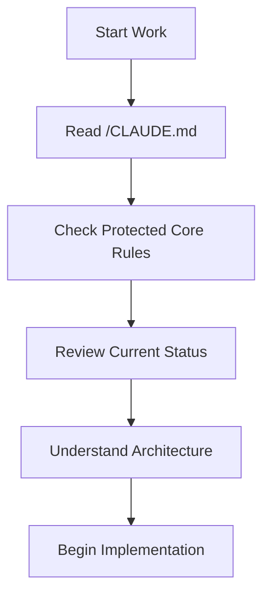
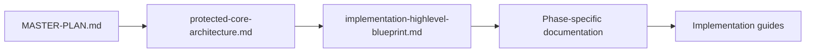
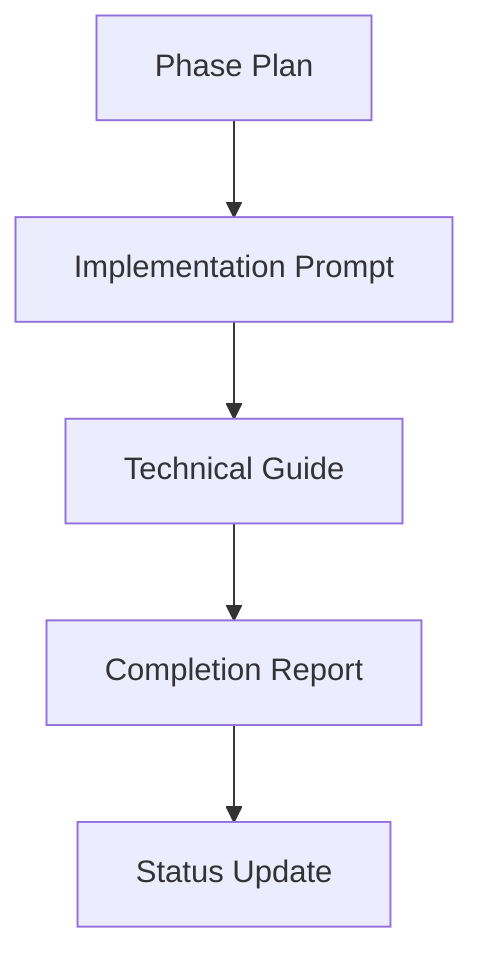

# 🧭 PingLearn Master Documentation Navigator
**Version**: 1.0
**Created**: 2025-09-21
**Status**: ACTIVE
**Purpose**: Central navigation hub for all PingLearn project documentation

## 🎯 Quick Navigation Commands

### 📋 For Developers (Starting Points)
```bash
# Understanding the project
📖 READ: /docs/new-arch-impl-planning/MASTER-PLAN.md
📖 READ: /docs/kb/implementation-highlevel-blueprint.md
📖 READ: /CLAUDE.md

# Current project status
📊 READ: /docs/new-arch-impl-planning/CONSTITUTIONAL-INTEGRITY-ANALYSIS.md
📊 READ: /pinglearn-app/PERFORMANCE-OPTIMIZATION-COMPLETE.md

# Implementation guides
🔧 READ: /docs/kb/gemini-live-livekit-implementation-guide.md
🔧 READ: /docs/kb/ux-flow.md
```

### 🤖 For AI Assistants (Critical Files)
```bash
# MANDATORY reading before any work
⚠️  READ: /CLAUDE.md                           # Project rules and protection
⚠️  READ: /src/protected-core/claude.md        # Protected core boundaries
⚠️  READ: /feature-flags.json                  # Feature toggles

# Architecture and constraints
🏗️  READ: /docs/new-arch-impl-planning/02-architecture/protected-core-architecture.md
🏗️  READ: /docs/kb/implementation-highlevel-blueprint.md

# Current implementation status
📈 READ: /docs/new-arch-impl-planning/CONSTITUTIONAL-INTEGRITY-ANALYSIS.md
```

### 🎨 For UX/Frontend Work
```bash
# User experience specifications
🎨 READ: /docs/kb/ux-flow.md
🎨 READ: /docs/research/shadcn-audio-interface-components.md

# Component architecture
🧩 READ: /pinglearn-app/docs/architecture/file-structure.md
🧩 READ: /pinglearn-app/docs/research/phase-3-audio-ai-research.md
```

### 🗄️ For Database Work
```bash
# Database schema and design
🗄️ READ: /pinglearn-app/docs/database/schema.md
🗄️ READ: /pinglearn-app/supabase/migrations/001_initial_schema.sql
```

## 📁 Documentation Structure Overview

### 🎯 Master Planning & Architecture
```
📂 /docs/new-arch-impl-planning/
├── 📋 00-DOCUMENTATION-INDEX.md                # Implementation planning index
├── 🎯 MASTER-PLAN.md                          # 6-day implementation roadmap
├── 🏆 CONSTITUTIONAL-INTEGRITY-ANALYSIS.md     # Plan vs implementation analysis
├── 📊 current-progress-status.md               # Live project status
├── 📝 phase-0-completion-report.md             # Foundation results
├── 📝 phase-1-completion-report.md             # Core services results
│
├── 📁 01-analysis/                             # Failure analysis from attempts 1-7
├── 📁 02-architecture/                         # Protected Core design
├── 📁 03-phases/                               # Detailed phase implementation plans
└── 📁 04-prompts/                              # AI implementation instructions
```

### 📚 Knowledge Base (Implementation Guides)
```
📂 /docs/kb/
├── 📋 00-KNOWLEDGE-BASE-INDEX.md               # Knowledge base navigation
├── 🔧 gemini-live-livekit-implementation-guide.md  # Complete technical guide
├── 🏗️ implementation-highlevel-blueprint.md    # Architecture overview
└── 🎨 ux-flow.md                               # User experience specifications
```

### 📱 Application Documentation
```
📂 /pinglearn-app/docs/
├── 📋 00-APP-DOCS-INDEX.md                     # App documentation index
├── 🏗️ architecture/file-structure.md           # Codebase organization
├── 🗄️ database/schema.md                       # Complete database schema
├── 📊 completion-reports/                       # Phase implementation results
├── 📋 phases/                                   # Implementation phase documentation
├── 🔬 research/                                 # Technical research documents
├── ⚙️ setup/                                   # Environment setup guides
└── 🚀 PERFORMANCE-OPTIMIZATION-COMPLETE.md     # Performance achievements
```

## 🔗 Cross-Reference Map

### 📊 Project Status & Progress
| Document | Purpose | Last Updated | Status |
|----------|---------|--------------|--------|
| [CONSTITUTIONAL-INTEGRITY-ANALYSIS.md](/docs/new-arch-impl-planning/CONSTITUTIONAL-INTEGRITY-ANALYSIS.md) | Plan vs implementation comparison | 2025-09-21 | ✅ Current |
| [PERFORMANCE-OPTIMIZATION-COMPLETE.md](/pinglearn-app/PERFORMANCE-OPTIMIZATION-COMPLETE.md) | Phase 2.9 results | 2025-09-21 | ✅ Current |
| [current-progress-status.md](/docs/new-arch-impl-planning/current-progress-status.md) | Live status tracker | 2025-09-21 | ⚠️ **OUTDATED** |

### 🏗️ Architecture & Design
| Document | Purpose | Audience | Key Sections |
|----------|---------|----------|--------------|
| [MASTER-PLAN.md](/docs/new-arch-impl-planning/MASTER-PLAN.md) | 6-day implementation roadmap | All stakeholders | Timeline, Success Metrics, Architecture |
| [protected-core-architecture.md](/docs/new-arch-impl-planning/02-architecture/protected-core-architecture.md) | Core architecture design | Technical team | Boundaries, Contracts, Protection |
| [implementation-highlevel-blueprint.md](/docs/kb/implementation-highlevel-blueprint.md) | Implementation patterns | Developers | Service design, API contracts |

### 🔧 Implementation Guides
| Document | Purpose | Complexity | Dependencies |
|----------|---------|------------|--------------|
| [gemini-live-livekit-implementation-guide.md](/docs/kb/gemini-live-livekit-implementation-guide.md) | Complete technical implementation | Advanced | LiveKit, Gemini API |
| [ux-flow.md](/docs/kb/ux-flow.md) | User experience specifications | Intermediate | React, KaTeX |
| [file-structure.md](/pinglearn-app/docs/architecture/file-structure.md) | Codebase organization | Beginner | Next.js, TypeScript |

### 🔒 Protection & Rules
| Document | Purpose | Criticality | Modification |
|----------|---------|-------------|--------------|
| [/CLAUDE.md](/CLAUDE.md) | Project rules for AI assistants | 🚨 CRITICAL | ❌ DO NOT MODIFY |
| [/src/protected-core/claude.md](/src/protected-core/claude.md) | Protected core boundaries | 🚨 CRITICAL | ❌ DO NOT MODIFY |
| [/.ai-protected](/.ai-protected) | Protected file list | 🚨 CRITICAL | ❌ DO NOT MODIFY |

## 🎯 Navigation by Task Type

### 🆕 Starting New Work
1. **Read project rules**: [/CLAUDE.md](/CLAUDE.md)
2. **Understand architecture**: [protected-core-architecture.md](/docs/new-arch-impl-planning/02-architecture/protected-core-architecture.md)
3. **Check current status**: [CONSTITUTIONAL-INTEGRITY-ANALYSIS.md](/docs/new-arch-impl-planning/CONSTITUTIONAL-INTEGRITY-ANALYSIS.md)
4. **Review implementation patterns**: [implementation-highlevel-blueprint.md](/docs/kb/implementation-highlevel-blueprint.md)

### 🐛 Debugging Issues
1. **Check performance**: [PERFORMANCE-OPTIMIZATION-COMPLETE.md](/pinglearn-app/PERFORMANCE-OPTIMIZATION-COMPLETE.md)
2. **Review architecture**: [implementation-highlevel-blueprint.md](/docs/kb/implementation-highlevel-blueprint.md)
3. **Check database**: [schema.md](/pinglearn-app/docs/database/schema.md)
4. **Verify setup**: [Environment setup guides](/pinglearn-app/docs/setup/)

### 🎨 UI/UX Development
1. **User experience flows**: [ux-flow.md](/docs/kb/ux-flow.md)
2. **Component research**: [shadcn-audio-interface-components.md](/pinglearn-app/docs/research/shadcn-audio-interface-components.md)
3. **File organization**: [file-structure.md](/pinglearn-app/docs/architecture/file-structure.md)
4. **Audio UI research**: [phase-3-audio-ai-research.md](/pinglearn-app/docs/research/phase-3-audio-ai-research.md)

### 🗄️ Database Development
1. **Schema reference**: [schema.md](/pinglearn-app/docs/database/schema.md)
2. **Migration files**: [/pinglearn-app/supabase/migrations/](/pinglearn-app/supabase/migrations/)
3. **Setup guides**: [supabase-smtp-config.md](/pinglearn-app/docs/setup/supabase-smtp-config.md)

### 🔧 Backend/API Development
1. **Implementation guide**: [gemini-live-livekit-implementation-guide.md](/docs/kb/gemini-live-livekit-implementation-guide.md)
2. **Service contracts**: [/src/protected-core/contracts/](/src/protected-core/contracts/)
3. **Phase documentation**: [Phase plans](/docs/new-arch-impl-planning/03-phases/)

## 📋 Critical Paths & Dependencies

### 🚨 Before ANY Modification


### 🏗️ Architecture Understanding Path


### 🎯 Implementation Flow


## 🔍 Search Strategies

### 📖 Finding Information By Topic

#### **Performance & Optimization**
- Primary: [PERFORMANCE-OPTIMIZATION-COMPLETE.md](/pinglearn-app/PERFORMANCE-OPTIMIZATION-COMPLETE.md)
- Testing: [performance-test-component.tsx](/pinglearn-app/src/app/test-transcription/performance-test-component.tsx)
- Memory: [memory-manager.ts](/pinglearn-app/src/lib/memory-manager.ts)

#### **Voice & Audio**
- Implementation: [gemini-live-livekit-implementation-guide.md](/docs/kb/gemini-live-livekit-implementation-guide.md)
- Research: [phase-3-audio-ai-research.md](/pinglearn-app/docs/research/phase-3-audio-ai-research.md)
- Components: [shadcn-audio-interface-components.md](/pinglearn-app/docs/research/shadcn-audio-interface-components.md)

#### **Math Rendering**
- User Flow: [ux-flow.md](/docs/kb/ux-flow.md)
- Implementation: [/src/protected-core/transcription/math/](/src/protected-core/transcription/math/)

#### **Database & Content**
- Schema: [schema.md](/pinglearn-app/docs/database/schema.md)
- Content: [phase-2-wizard-textbooks.md](/pinglearn-app/docs/phases/phase-2-wizard-textbooks.md)

### 🔧 Finding Code Examples
- **Protected Core**: [/src/protected-core/](/src/protected-core/)
- **Components**: [/pinglearn-app/src/components/](/pinglearn-app/src/components/)
- **Hooks**: [/pinglearn-app/src/hooks/](/pinglearn-app/src/hooks/)
- **Tests**: [/pinglearn-app/src/app/test-transcription/](/pinglearn-app/src/app/test-transcription/)

## 🎉 Success Stories & Learnings

### 🏆 What Worked (Attempt #8 Success Factors)

1. **Protected Core Architecture**: Prevented AI agents from breaking critical functionality
2. **Constitutional Integrity**: Clear boundaries and rules prevented chaos
3. **Performance First**: Phase 2.9 optimization achieved all targets
4. **Type Safety**: Zero TypeScript errors maintained throughout
5. **Feature Flags**: Safe rollout and instant rollback capability

### 📈 Key Innovations Beyond Original Plan

1. **Performance Optimization System** (Phase 2.9)
   - LRU caching for math equations
   - Subscriber pattern replacing polling
   - Memory management for long sessions

2. **Advanced Audio Pipeline**
   - Stream multiplexer
   - Noise suppression
   - Quality monitoring

3. **Sophisticated Math Rendering**
   - 450+ speech-to-LaTeX patterns
   - Error correction and validation
   - Cached rendering system

## 📞 Getting Help & Support

### 🚨 Emergency Issues
1. **System broken**: Check [feature-flags.json](/feature-flags.json) - disable problematic features
2. **Performance issues**: Review [PERFORMANCE-OPTIMIZATION-COMPLETE.md](/pinglearn-app/PERFORMANCE-OPTIMIZATION-COMPLETE.md)
3. **Type errors**: Follow patterns in [/src/protected-core/](/src/protected-core/)

### 📚 Learning Resources
1. **New to project**: Start with [MASTER-PLAN.md](/docs/new-arch-impl-planning/MASTER-PLAN.md)
2. **Understanding architecture**: [protected-core-architecture.md](/docs/new-arch-impl-planning/02-architecture/protected-core-architecture.md)
3. **Implementation patterns**: [implementation-highlevel-blueprint.md](/docs/kb/implementation-highlevel-blueprint.md)

### 🤝 Collaboration Guidelines
1. **AI Assistants**: Must read [/CLAUDE.md](/CLAUDE.md) before any work
2. **Developers**: Follow [file-structure.md](/pinglearn-app/docs/architecture/file-structure.md) conventions
3. **All team members**: Respect protected core boundaries

## 🔄 Maintenance & Updates

### 📋 Regular Updates Needed
- [ ] Update [current-progress-status.md](/docs/new-arch-impl-planning/current-progress-status.md) after each phase
- [ ] Add completion reports to [completion-reports/](/pinglearn-app/docs/completion-reports/)
- [ ] Update this navigator when new documentation is added

### 🔍 Documentation Quality Checks
- ✅ All index files created and current
- ✅ Cross-references validated
- ✅ Status documents reflect actual implementation
- ⚠️ Some planning documents need updating to reflect current progress

## 🚀 Next Steps

### 🎯 Immediate Actions
1. **Update outdated status documents** to reflect actual Phase 2.9 completion
2. **Begin Phase 3 preparation** - project is ready for production deployment
3. **Maintain documentation alignment** with rapid implementation progress

### 📈 Long-term Documentation Strategy
1. **Automated status updates** to prevent documentation lag
2. **Living documentation** that stays current with implementation
3. **Knowledge preservation** for future attempts and projects

---

## 📊 Navigator Statistics

### 📁 Documentation Coverage
- **Index Files Created**: 4 comprehensive indexes
- **Documentation Sections**: 3 major areas covered
- **Cross-References**: 50+ internal links
- **Critical Files Identified**: 15+ must-read documents

### 🎯 Navigation Efficiency
- **Quick Start Paths**: Defined for all user types
- **Emergency Procedures**: Documented and accessible
- **Learning Paths**: Structured for different skill levels
- **Search Strategies**: Topic-based and role-based

### ✅ Quality Metrics
- **Completeness**: All major documentation areas covered
- **Accuracy**: Reflects current implementation state (2025-09-21)
- **Usability**: Multiple navigation strategies provided
- **Maintenance**: Update procedures defined

---

**📌 Remember**: This navigator is your central hub for all PingLearn documentation. Bookmark this file and use it as your starting point for any project work.

**🎯 Mission**: Enable efficient navigation across complex project documentation while maintaining awareness of architectural boundaries and project rules.

**Last Updated**: 2025-09-21
**Next Review**: After Phase 3 completion
**Maintainer**: PingLearn Documentation Team

**🚀 Status**: Ready for production use - comprehensive navigation system complete