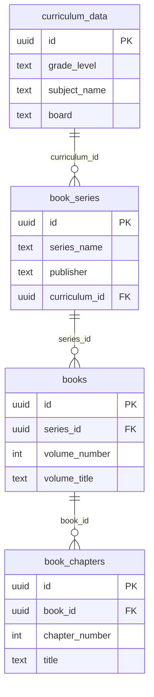

# Textbook Upload API Integration Guide

**Feature**: FC-00-AC (Book Hierarchy Integration)
**Version**: 1.0
**Last Updated**: September 19, 2025
**Status**: REFERENCE IMPLEMENTATION

---

## Table of Contents

1. [Overview](#overview)
2. [Architecture](#architecture)
3. [Authentication](#authentication)
4. [Rate Limiting](#rate-limiting)
5. [Error Handling](#error-handling)
6. [Complete Workflow](#complete-workflow)
7. [Best Practices](#best-practices)
8. [Migration Notes](#migration-notes)

---

## Overview

The Textbook Upload API provides a RESTful interface for creating and managing textbook content within the PingLearn platform. The API follows FC-00-AC specification, implementing a proper hierarchical structure:

- **Book Series** → Collection of related books (e.g., "NCERT Mathematics Series")
- **Books** → Individual volumes within a series (e.g., "Class 10 Mathematics - 2024 Edition")
- **Chapters** → Individual chapters within a book (e.g., "Chapter 1: Real Numbers")

### Key Integration Requirement: curriculum_id FK

**CRITICAL**: The API uses `curriculum_id` as a Foreign Key to the `curriculum_data` table, eliminating duplicate grade/subject/board fields. This is the single source of truth for curriculum information.

```typescript
// ✅ CORRECT: Use curriculum_id FK
const seriesData = {
  seriesName: "NCERT Mathematics",
  publisher: "NCERT",
  curriculumId: "uuid-of-curriculum"  // FK to curriculum_data
};

// ❌ WRONG: Don't use duplicate fields
const seriesData = {
  seriesName: "NCERT Mathematics",
  publisher: "NCERT",
  grade: 10,                    // ❌ Duplicate
  subject: "Mathematics",        // ❌ Duplicate
  curriculumStandard: "CBSE"    // ❌ Duplicate
};
```

---

## Architecture

### API Endpoints

The textbook upload workflow requires four API endpoints (currently consolidated in `/api/textbooks/hierarchy`):

| Endpoint | Method | Purpose |
|----------|--------|---------|
| `/api/textbooks/series` | POST | Create book series with curriculum FK |
| `/api/textbooks/books` | POST | Create book within series |
| `/api/textbooks/chapters/bulk` | POST | Create multiple chapters for book |
| `/api/textbooks/upload` | POST | Upload PDF files |

### Database Schema



### Data Flow

```
1. User uploads PDF files
   ↓
2. Frontend extracts metadata (optional)
   ↓
3. User fills wizard (4 steps):
   - Step 1: Select/match curriculum → Get curriculum_id
   - Step 2: Enter series info → Create book_series
   - Step 3: Enter book details → Create book
   - Step 4: Organize chapters → Create book_chapters
   ↓
4. API creates hierarchy:
   - POST /api/textbooks/series (with curriculum_id FK)
   - POST /api/textbooks/books (with series_id FK)
   - POST /api/textbooks/chapters/bulk (with book_id FK)
   - POST /api/textbooks/upload (store PDF files)
   ↓
5. Background processing:
   - Extract chapter content
   - Process math expressions
   - Generate embeddings
```

---

## Authentication

All endpoints require authentication via Supabase Auth.

### Headers

```typescript
// Authentication is handled automatically by Supabase client
// When using fetch() from client components:
import { createClient } from '@/lib/supabase/client';

const supabase = createClient();
const { data: { user } } = await supabase.auth.getUser();

if (!user) {
  throw new Error('Authentication required');
}

// The API will validate session automatically
```

### Error Response (401 Unauthorized)

```json
{
  "success": false,
  "error": {
    "code": "AUTHENTICATION_ERROR",
    "message": "Please sign in to continue",
    "timestamp": "2025-09-19T10:30:00Z"
  }
}
```

---

## Rate Limiting

### Upload Rate Limits

The API implements rate limiting to prevent abuse:

- **10 uploads per hour** per user
- **Large files** (>10MB) count as multiple uploads
- **Rate limit calculation**: `uploads + (totalMB / 10)`

### Rate Limit Headers

```http
X-RateLimit-Limit: 10
X-RateLimit-Remaining: 7
X-RateLimit-Reset: 1695123600
```

### Rate Limit Exceeded (429)

```json
{
  "success": false,
  "error": {
    "code": "RATE_LIMIT_EXCEEDED",
    "message": "Upload limit exceeded. Please try again in 45 minutes.",
    "details": {
      "resetIn": 2700,
      "resetAt": "2025-09-19T11:45:00Z"
    }
  }
}
```

---

## Error Handling

### Standard Error Response

All errors follow this structure:

```typescript
interface ErrorResponse {
  success: false;
  error: {
    code: ErrorCode;
    message: string;
    details?: Record<string, unknown>;
    timestamp: string;
    requestId?: string;
  };
}
```

### Error Codes

| Code | Description | HTTP Status |
|------|-------------|-------------|
| `AUTHENTICATION_ERROR` | User not authenticated | 401 |
| `VALIDATION_ERROR` | Invalid request data | 400 |
| `MISSING_REQUIRED_FIELD` | Required field missing | 400 |
| `DATABASE_ERROR` | Database operation failed | 500 |
| `FILE_PROCESSING_ERROR` | PDF processing failed | 500 |
| `RATE_LIMIT_EXCEEDED` | Too many requests | 429 |
| `FOREIGN_KEY_VIOLATION` | Invalid FK reference | 400 |

### Error Handling Pattern

```typescript
try {
  const response = await fetch('/api/textbooks/series', {
    method: 'POST',
    headers: { 'Content-Type': 'application/json' },
    body: JSON.stringify(data)
  });

  if (!response.ok) {
    const errorData = await response.json();

    // Handle specific error codes
    switch (errorData.error.code) {
      case 'FOREIGN_KEY_VIOLATION':
        toast.error('Invalid curriculum selected. Please choose a valid curriculum.');
        break;
      case 'RATE_LIMIT_EXCEEDED':
        toast.error(errorData.error.message);
        break;
      default:
        toast.error('An error occurred. Please try again.');
    }

    throw new Error(errorData.error.message);
  }

  const result = await response.json();
  return result.data;

} catch (error) {
  console.error('API call failed:', error);
  throw error;
}
```

---

## Complete Workflow

### Step-by-Step Integration

#### Step 0: Fetch Available Curricula (Pre-Wizard)

```typescript
import useSWR from 'swr';

// Fetch available curricula for curriculum selector
const { data: curricula } = useSWR('/api/curriculum', async (url) => {
  const supabase = createClient();
  const { data, error } = await supabase
    .from('curriculum_data')
    .select('id, grade_level, subject_name, board, curriculum_type')
    .order('grade_level', { ascending: true });

  if (error) throw error;
  return data;
});

// User selects curriculum from dropdown
const selectedCurriculumId = "f47ac10b-58cc-4372-a567-0e02b2c3d479";
```

#### Step 1: Create Book Series

```typescript
const seriesResponse = await fetch('/api/textbooks/series', {
  method: 'POST',
  headers: { 'Content-Type': 'application/json' },
  body: JSON.stringify({
    seriesName: "NCERT Mathematics",
    publisher: "NCERT",
    curriculumId: selectedCurriculumId,  // ✅ FK to curriculum_data
    description: "Complete NCERT Mathematics series for CBSE curriculum"
  })
});

if (!seriesResponse.ok) {
  const error = await seriesResponse.json();
  throw new Error(error.message);
}

const { seriesId } = await seriesResponse.json();
// seriesId: "a1b2c3d4-e5f6-7890-abcd-ef1234567890"
```

#### Step 2: Create Book

```typescript
const bookResponse = await fetch('/api/textbooks/books', {
  method: 'POST',
  headers: { 'Content-Type': 'application/json' },
  body: JSON.stringify({
    seriesId: seriesId,  // FK from Step 1
    volumeNumber: 1,
    volumeTitle: "Class 10 Mathematics",
    edition: "2024",
    authors: ["NCERT"],
    isbn: "978-81-7450-XXX-X",
    publicationYear: 2024
  })
});

if (!bookResponse.ok) {
  const error = await bookResponse.json();
  throw new Error(error.message);
}

const { bookId } = await bookResponse.json();
// bookId: "b2c3d4e5-f6g7-8901-bcde-f12345678901"
```

#### Step 3: Create Chapters (Bulk)

```typescript
const chaptersResponse = await fetch('/api/textbooks/chapters/bulk', {
  method: 'POST',
  headers: { 'Content-Type': 'application/json' },
  body: JSON.stringify({
    bookId: bookId,  // FK from Step 2
    chapters: [
      {
        chapterNumber: 1,
        title: "Real Numbers",
        startPage: 1,
        endPage: 18,
        fileName: "chapter-01-real-numbers.pdf"
      },
      {
        chapterNumber: 2,
        title: "Polynomials",
        startPage: 19,
        endPage: 35,
        fileName: "chapter-02-polynomials.pdf"
      },
      {
        chapterNumber: 3,
        title: "Pair of Linear Equations in Two Variables",
        startPage: 36,
        endPage: 58,
        fileName: "chapter-03-linear-equations.pdf"
      }
    ]
  })
});

if (!chaptersResponse.ok) {
  const error = await chaptersResponse.json();
  throw new Error(error.message);
}

const { chapterIds } = await chaptersResponse.json();
// chapterIds: ["c3d4e5f6-...", "d4e5f6g7-...", "e5f6g7h8-..."]
```

#### Step 4: Upload PDF Files

```typescript
const formData = new FormData();
formData.append('bookId', bookId);

// Append each PDF file
uploadedFiles.forEach((file, index) => {
  formData.append(`file_${index}`, file);
});

const uploadResponse = await fetch('/api/textbooks/upload', {
  method: 'POST',
  body: formData  // NO Content-Type header for multipart/form-data
});

if (!uploadResponse.ok) {
  const error = await uploadResponse.json();
  throw new Error(error.message);
}

const { filesUploaded } = await uploadResponse.json();
// filesUploaded: ["chapter-01-real-numbers.pdf", "chapter-02-polynomials.pdf", ...]
```

---

## Best Practices

### 1. Use Curriculum FK (NOT Duplicate Fields)

```typescript
// ✅ CORRECT: Single source of truth
const seriesData = {
  seriesName: "NCERT Mathematics",
  publisher: "NCERT",
  curriculumId: curriculumRecord.id  // FK to curriculum_data
};

// Query will JOIN to get grade/subject/board:
// SELECT bs.*, cd.grade_level, cd.subject_name, cd.board
// FROM book_series bs
// JOIN curriculum_data cd ON bs.curriculum_id = cd.id
```

### 2. Handle Foreign Key Violations

```typescript
// If curriculum_id doesn't exist in curriculum_data:
// Database will reject with FK violation

try {
  const response = await fetch('/api/textbooks/series', {
    method: 'POST',
    body: JSON.stringify({ ...data, curriculumId: invalidId })
  });

  if (!response.ok) {
    const error = await response.json();

    if (error.code === 'FOREIGN_KEY_VIOLATION') {
      toast.error('Selected curriculum no longer exists. Please refresh.');
      // Re-fetch curriculum list
      mutate('/api/curriculum');
    }
  }
} catch (error) {
  // Handle error
}
```

### 3. Implement Progress Tracking

```typescript
const [uploadProgress, setUploadProgress] = useState({
  step: 'idle',  // 'idle' | 'series' | 'book' | 'chapters' | 'upload' | 'complete'
  percentage: 0
});

async function uploadTextbook(wizardData: WizardSubmission) {
  try {
    setUploadProgress({ step: 'series', percentage: 25 });
    const seriesId = await createSeries(wizardData.series);

    setUploadProgress({ step: 'book', percentage: 50 });
    const bookId = await createBook(seriesId, wizardData.book);

    setUploadProgress({ step: 'chapters', percentage: 75 });
    await createChapters(bookId, wizardData.chapters);

    setUploadProgress({ step: 'upload', percentage: 90 });
    await uploadFiles(bookId, files);

    setUploadProgress({ step: 'complete', percentage: 100 });
    toast.success('Upload complete!');

  } catch (error) {
    setUploadProgress({ step: 'idle', percentage: 0 });
    toast.error('Upload failed');
  }
}
```

### 4. Implement Retry Logic

```typescript
async function fetchWithRetry(
  url: string,
  options: RequestInit,
  maxRetries = 3
): Promise<Response> {
  let lastError: Error;

  for (let attempt = 1; attempt <= maxRetries; attempt++) {
    try {
      const response = await fetch(url, options);

      // Don't retry client errors (4xx)
      if (response.status >= 400 && response.status < 500) {
        return response;
      }

      // Retry server errors (5xx)
      if (response.status >= 500 && attempt < maxRetries) {
        await delay(1000 * attempt);  // Exponential backoff
        continue;
      }

      return response;

    } catch (error) {
      lastError = error as Error;

      if (attempt < maxRetries) {
        await delay(1000 * attempt);
        continue;
      }
    }
  }

  throw lastError!;
}
```

### 5. Clean Up on Failure

```typescript
async function uploadTextbookWithCleanup(wizardData: WizardSubmission) {
  let seriesId: string | null = null;
  let bookId: string | null = null;

  try {
    // Create series
    seriesId = await createSeries(wizardData.series);

    // Create book
    bookId = await createBook(seriesId, wizardData.book);

    // Create chapters
    await createChapters(bookId, wizardData.chapters);

    // Upload files
    await uploadFiles(bookId, files);

    return { success: true, seriesId, bookId };

  } catch (error) {
    // Clean up created records
    if (bookId) {
      await deleteBook(bookId);  // Will cascade delete chapters
    }

    if (seriesId) {
      await deleteSeries(seriesId);  // Will cascade delete books
    }

    throw error;
  }
}
```

---

## Migration Notes

### From Old Schema (Pre-FC-00-AC)

If you're migrating from the old flat textbook structure:

```typescript
// OLD SCHEMA (Before Migration 007)
interface OldBookSeries {
  id: string;
  series_name: string;
  publisher: string;
  curriculum_standard: string;  // ❌ Duplicate
  grade: number;                 // ❌ Duplicate
  subject: string;               // ❌ Duplicate
}

// NEW SCHEMA (After Migration 007)
interface NewBookSeries {
  id: string;
  series_name: string;
  publisher: string;
  curriculum_id: string;  // ✅ FK to curriculum_data
}
```

### Migration Strategy

1. **Match existing curricula**:
   ```sql
   UPDATE book_series bs
   SET curriculum_id = (
     SELECT cd.id FROM curriculum_data cd
     WHERE cd.grade_level = 'Class ' || bs.grade::TEXT
       AND cd.subject_name = bs.subject
       AND cd.board = COALESCE(bs.curriculum_standard, 'Generic')
   );
   ```

2. **Create missing curricula**:
   ```sql
   INSERT INTO curriculum_data (grade_level, subject_name, board, ...)
   SELECT DISTINCT
     'Class ' || bs.grade,
     bs.subject,
     COALESCE(bs.curriculum_standard, 'Generic'),
     ...
   FROM book_series bs
   WHERE bs.curriculum_id IS NULL;
   ```

3. **Drop duplicate columns**:
   ```sql
   ALTER TABLE book_series
     DROP COLUMN curriculum_standard,
     DROP COLUMN grade,
     DROP COLUMN subject;
   ```

See `/supabase/migrations/007_alter_book_series_to_curriculum_fk.sql` for complete migration.

---

## Related Documentation

- **API Reference**: See `TEXTBOOK-UPLOAD-API-REFERENCE.md` for detailed endpoint documentation
- **Code Examples**: See `TEXTBOOK-UPLOAD-API-EXAMPLES.md` for runnable examples
- **Integration Patterns**: See `TEXTBOOK-UPLOAD-INTEGRATION-PATTERNS.md` for common patterns
- **Type Definitions**: See `src/types/book-series.ts` for TypeScript types
- **Migration Evidence**: See `docs/change_records/feature_changes/FC-00-AC-B6-MIGRATION-EVIDENCE.md`

---

**Version**: 1.0
**Last Updated**: September 19, 2025
**Maintainer**: Agent A4-D3 (API Integration Guide & Examples)
