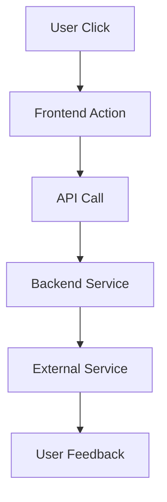

# Protected Core Change Implementation Workflow

**Version**: 2.0
**Created**: 2025-09-22
**Lessons Learned From**: PC-005 Implementation Gap Analysis

## Overview

This workflow ensures comprehensive change analysis to prevent incomplete implementations like PC-005, where the frontend WebRTC integration was missed during research phase.

## Critical Failure Analysis from PC-005

### What Went Wrong
1. **Incomplete End-to-End Analysis**: Focused on Python agent without tracing complete user journey
2. **Assumption-Based Planning**: Assumed frontend WebRTC existed without verification
3. **Missing Integration Mapping**: Did not identify all integration points and dependencies
4. **Insufficient Impact Analysis**: Did not analyze downstream effects on user experience

### Root Cause
**Inadequate Research Phase**: The research focused on the immediate component (Python agent) without comprehensive system-wide impact analysis.

## Phase 1: Pre-Research Setup (5 minutes)

### 1.1 Change Scope Definition
```markdown
## Change Scope Boundaries
- **Primary Component**: [What you're directly changing]
- **Secondary Components**: [What might be affected]
- **User Journey Impact**: [How this affects end-to-end user experience]
- **Integration Points**: [What other systems connect to this]
```

### 1.2 Research Questions Framework
Before starting, define these questions:
1. What is the complete end-to-end user journey this change affects?
2. What are ALL the integration points and dependencies?
3. What assumptions am I making about existing functionality?
4. What would a user expect to happen after this change?
5. What could break if I only implement this change?

## Phase 2: Comprehensive Research (30-45 minutes)

### 2.1 End-to-End Flow Analysis ⭐ CRITICAL
**Tool**: Create flowchart from user action to final result

```markdown
## Complete User Journey Mapping
1. **User Action**: [What user clicks/does]
2. **Frontend Response**: [What UI responds]
3. **API Calls**: [What endpoints are called]
4. **Backend Processing**: [What services process]
5. **External Services**: [What third parties involved]
6. **Data Flow**: [How data moves through system]
7. **User Feedback**: [What user sees/hears as result]

## Gap Analysis
- [ ] Which steps exist and work?
- [ ] Which steps are missing?
- [ ] Which steps need modification?
```

### 2.2 Dependency Mapping
**Tool**: Create dependency matrix

```markdown
## Upstream Dependencies (What this change needs)
| Dependency | Status | Location | Risk |
|------------|--------|----------|------|
| Service A  | ✅ Exists | path/to/service | Low |
| API X      | ❌ Missing | needs creation | High |

## Downstream Dependencies (What needs this change)
| Dependent System | Impact | Requires Changes | Priority |
|------------------|--------|------------------|----------|
| Frontend UI      | High   | New integration  | Critical |
| Database         | Medium | Schema update    | Medium   |
```

### 2.3 Integration Point Verification
**For each integration point, verify:**

```bash
# Example verification commands
grep -r "ComponentName" src/  # Find all usages
find . -name "*.ts" -exec grep -l "ServiceName" {} \;  # Find integrations
npm list | grep package-name  # Verify dependencies
```

### 2.4 Assumption Validation ⭐ CRITICAL
**Systematically verify every assumption:**

```markdown
## Assumptions to Validate
- [ ] Frontend SDK X is already integrated
- [ ] Service Y is configured and working
- [ ] API Z endpoints exist and are tested
- [ ] User flow W is complete

## Validation Results
- **Assumption 1**: ❌ Frontend SDK NOT integrated - needs PC-006
- **Assumption 2**: ✅ Service is working
```

### 2.5 External Service Research
For any external services (LiveKit, Gemini, etc.):

```markdown
## External Service Integration Analysis
### Service: LiveKit
- **Documentation Version**: [Latest checked]
- **SDK Version**: [What we need vs what we have]
- **API Changes**: [Any breaking changes]
- **Authentication**: [How auth works]
- **Connection Flow**: [Step by step]
- **Error Handling**: [What can go wrong]
```

## Phase 3: Impact Analysis (15-20 minutes)

### 3.1 Upstream Impact Analysis
```markdown
## What This Change Depends On
| Component | Current State | Needed State | Action Required |
|-----------|---------------|--------------|-----------------|
| API Token Service | ✅ Working | No change | None |
| Frontend SDK | ❌ Missing | Must install | Create PC-006 |
```

### 3.2 Downstream Impact Analysis
```markdown
## What Will Be Affected By This Change
| Component | Impact Level | Type of Change | Risk Level |
|-----------|--------------|----------------|------------|
| User Experience | High | New functionality | Medium |
| Error Handling | Medium | New error cases | Low |
```

### 3.3 Cross-System Integration Analysis
```markdown
## Integration Flow Verification
### Current State
[Diagram of current integrations]

### Post-Change State
[Diagram of integrations after change]

### New Integration Requirements
- [ ] System A needs to connect to System B
- [ ] Protocol X needs to be implemented
- [ ] Data format Y needs to be supported
```

## Phase 4: Risk Assessment (10 minutes)

### 4.1 Implementation Risks
```markdown
## Technical Risks
- **Risk**: Frontend WebRTC integration missing
- **Probability**: High (verified in research)
- **Impact**: Critical (feature won't work)
- **Mitigation**: Create separate change record PC-006

## Integration Risks
- **Risk**: Version compatibility issues
- **Probability**: Medium
- **Impact**: Medium
- **Mitigation**: Version pinning and testing
```

### 4.2 User Experience Risks
```markdown
## UX Impact Assessment
- **Before Change**: [Current user experience]
- **After Partial Implementation**: [What happens if we only do this change]
- **After Complete Implementation**: [What full experience should be]
- **Gap Analysis**: [What's missing to complete the experience]
```

## Phase 5: Change Completeness Verification (10 minutes)

### 5.1 Completeness Checklist
```markdown
## Implementation Completeness Review
- [ ] End-to-end user journey can be completed
- [ ] All integration points are addressed
- [ ] No assumptions are left unvalidated
- [ ] All dependencies are met or planned
- [ ] Error cases are handled
- [ ] User feedback mechanisms work
```

### 5.2 Additional Change Records Needed
```markdown
## Dependencies for Complete Implementation
- **PC-006**: Frontend WebRTC Integration [REQUIRED FOR FUNCTIONALITY]
- **PC-007**: Error Handling Enhancement [NICE TO HAVE]
- **PC-008**: Monitoring Integration [OPERATIONAL REQUIREMENT]
```

## Phase 6: Change Record Creation (20 minutes)

Use the comprehensive template (see CHANGE_RECORD_TEMPLATE.md) and include:
- All research findings
- Complete dependency analysis
- Risk assessments
- Integration requirements
- Related change records needed

## Phase 7: Pre-Implementation Verification (5 minutes)

Before starting implementation:
```markdown
## Final Pre-Implementation Checklist
- [ ] All dependencies verified to exist or planned
- [ ] All assumptions validated
- [ ] Complete user journey mapped
- [ ] Integration points confirmed
- [ ] Risk mitigation planned
- [ ] Related change records identified
```

## Workflow Success Metrics

### Research Quality Indicators
- ✅ Zero assumptions left unvalidated
- ✅ Complete end-to-end flow documented
- ✅ All integration points mapped
- ✅ Dependencies verified or change records created

### Implementation Success Indicators
- ✅ User can complete full intended journey
- ✅ No surprises during testing
- ✅ All integration points work
- ✅ Error cases handled gracefully

## Tools and Commands

### Research Tools
```bash
# Dependency analysis
npm list
pip list
grep -r "pattern" src/

# Integration point discovery
find . -name "*.ts" -exec grep -l "ServiceName" {} \;
rg "import.*ServiceName" --type ts

# Flow verification
# Use browser dev tools to trace actual API calls
# Use network tab to verify endpoints exist
```

### Documentation Tools
```markdown
# Flow diagrams (use Mermaid syntax)


## Mandatory Review Points

Before submitting any change record:

1. **End-to-End Verification**: "Can a user complete the full intended journey after this change?"
2. **Integration Completeness**: "Are all integration points addressed?"
3. **Assumption Validation**: "Have I verified all assumptions?"
4. **Dependency Resolution**: "Are all dependencies met or planned?"
5. **Related Changes**: "Are there other change records needed for complete functionality?"

## Failure Prevention

### Red Flags (Stop and Research More)
- ❌ "I assume component X already works"
- ❌ "The user journey will be handled elsewhere"
- ❌ "Integration Y is probably already implemented"
- ❌ "This change is self-contained"

### Green Flags (Good to Proceed)
- ✅ "I have verified every assumption"
- ✅ "I can trace the complete user journey"
- ✅ "All integration points are documented and verified"
- ✅ "I know exactly what other changes are needed"

---

**Remember**: It's better to create multiple smaller, complete change records than one large, incomplete one.