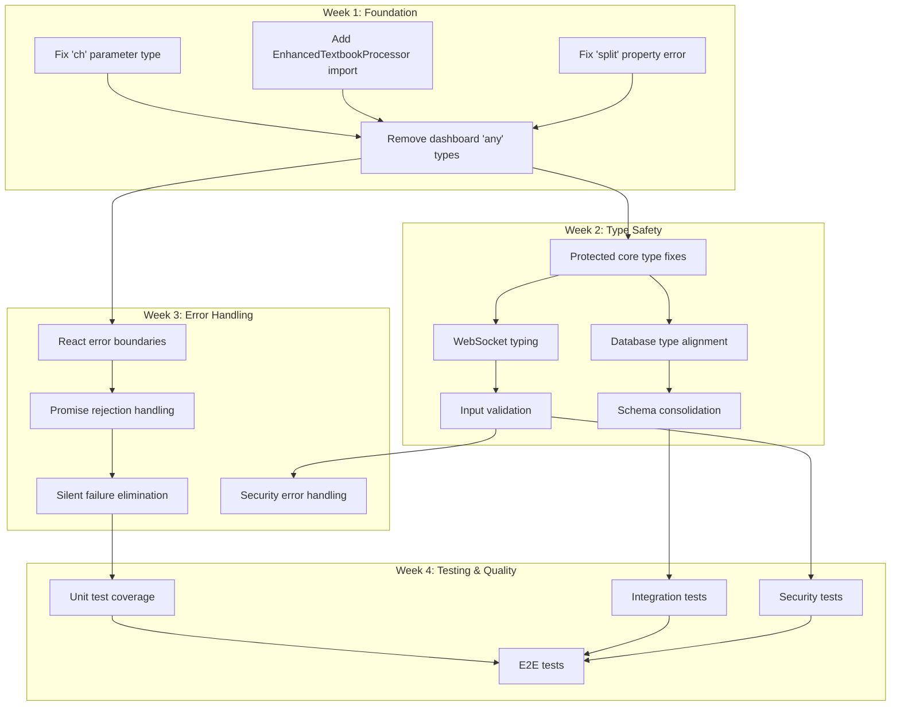

# PC-014 Story Dependency Graph

**Generated**: 2025-09-28 15:00 UTC
**Total Stories**: 53
**Critical Path Length**: 12 days

---

## 📊 Dependency Visualization



---

## 🔄 Parallel Execution Opportunities

### Can Execute Simultaneously (No Dependencies)
```yaml
parallel_track_1:  # TypeScript Track
  - TS-001
  - TS-002
  - TS-003

parallel_track_2:  # After Week 1
  - TS-005 (Protected Core)
  - ERR-001 (Error Boundaries)
  - SEC-002 (Session Tokens)

parallel_track_3:  # Architecture
  - ARCH-001 (Circular Dependencies)
  - ARCH-002 (Memory Leaks)
  - ARCH-003 (Performance)
```

---

## 🚫 Blocking Dependencies (Critical Path)

### Must Complete in Sequence
```
1. TS-001, TS-002, TS-003 → Unblock compilation (Day 1-2)
   ↓
2. TS-004 → Remove 'any' types from non-protected code (Day 3-4)
   ↓
3. TS-005 → Fix protected core types (Day 5-6)
   ↓
4. SEC-001 → Add input validation (Week 2, Day 1-2)
   ↓
5. ERR-003 → Eliminate silent failures (Week 3, Day 3-4)
   ↓
6. TEST-004 → Complete E2E testing (Week 4, Day 5-6)
```

---

## 📈 Story Execution Priority Matrix

| Priority | Stories | Reason | Timeline |
|----------|---------|--------|----------|
| **P0 - IMMEDIATE** | TS-001, TS-002, TS-003 | Blocks all builds | Day 1 |
| **P1 - CRITICAL** | TS-004, TS-005, SEC-001 | Security & type safety | Day 2-5 |
| **P2 - HIGH** | ERR-001, ERR-002, ERR-003 | User experience | Week 2 |
| **P3 - MEDIUM** | ARCH-001 to ARCH-008 | Technical debt | Week 3 |
| **P4 - STANDARD** | TEST-001 to TEST-006 | Quality assurance | Week 4 |

---

## 🔗 Cross-Story Dependencies

### TypeScript → Security
```yaml
TS-005 (Protected Core Types) enables:
  - SEC-001 (Input Validation)
  - SEC-003 (Database Queries)
  - SEC-004 (API Authentication)
```

### Security → Error Handling
```yaml
SEC-001 (Input Validation) enables:
  - ERR-004 (Validation Error Handling)
  - ERR-005 (Security Exception Handling)
```

### Error Handling → Testing
```yaml
ERR-003 (Silent Failure Elimination) enables:
  - TEST-001 (Unit Tests - need proper error handling)
  - TEST-002 (Integration Tests - need error boundaries)
```

### Architecture → Everything
```yaml
ARCH-004 (Database Schema Fix) affects:
  - TS-007 (Database Types)
  - SEC-003 (Query Security)
  - TEST-002 (Integration Tests)
```

---

## 🎯 Optimal Execution Strategy

### Day 1-2: Unblock Development
```bash
# Morning: Start all 3 compilation fixes in parallel
execute --parallel TS-001 TS-002 TS-003

# Afternoon: Verify compilation passes
npm run typecheck  # Must show 0 errors
```

### Day 3-7: Type Safety Sprint
```bash
# Remove 'any' types systematically
execute --sequential TS-004 TS-005 TS-006 TS-007
```

### Week 2: Security & Architecture
```bash
# Parallel execution of independent stories
execute --parallel SEC-001 SEC-002 ARCH-001 ARCH-002

# Sequential for dependent stories
execute --sequential SEC-001 → SEC-003 → SEC-004
```

### Week 3: Error Handling & Resilience
```bash
# Error boundaries first (can work in parallel)
execute --parallel ERR-001 ERR-002

# Then eliminate silent failures
execute --sequential ERR-003 → ERR-004 → ERR-005
```

### Week 4: Testing & Validation
```bash
# Parallel test creation
execute --parallel TEST-001 TEST-002 TEST-003

# Final integration
execute --sequential TEST-004 → TEST-005 → TEST-006
```

---

## ⚠️ Dependency Risks

### High-Risk Dependencies
1. **TS-001/002/003** - Everything blocked until these complete
2. **SEC-001** - Security validation affects multiple stories
3. **ARCH-004** - Database schema changes are high impact
4. **TEST-004** - Final validation gates everything

### Mitigation Strategies
- Start P0 stories immediately with best available agents
- Keep backup agents ready for critical path stories
- Pre-validate complex changes in isolated environment
- Maintain detailed checkpoints for rollback

---

## 📊 Resource Allocation

### Agent Assignment by Week
```yaml
Week 1:
  typescript-specialist: TS-001, TS-002, TS-003, TS-004
  code-optimizer: TS-005, TS-006

Week 2:
  security-engineer: SEC-001, SEC-002, SEC-003
  backend-architect: ARCH-001, ARCH-004
  typescript-specialist: TS-007 through TS-012

Week 3:
  frontend-developer: ERR-001, ERR-002
  backend-architect: ERR-003, ERR-004
  code-optimizer: ARCH-002, ARCH-003

Week 4:
  qa-engineer: TEST-001 through TEST-006
  All agents: Final integration testing
```

---

## 🚀 Execution Commands

### Start Critical Path
```bash
/orchestrate PC-014 --execute-critical-path
```

### Check Dependencies
```bash
/orchestrate dependencies --story TS-004
```

### Find Parallel Opportunities
```bash
/orchestrate parallel --available-now
```

### Visualize Progress
```bash
/orchestrate visualize --dependency-graph
```

---

**Status**: DEPENDENCY GRAPH COMPLETE
**Next Step**: Begin execution with P0 stories (TS-001, TS-002, TS-003)