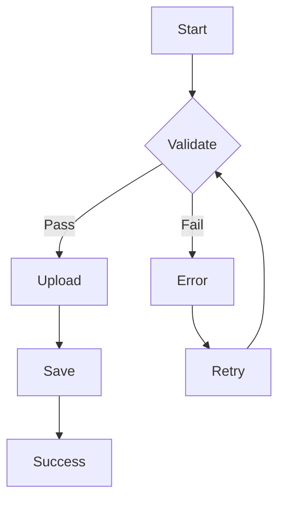

# Upload Workflow Documentation Style Guide
**Based on**: Industry Best Practices Research (2025)
**Created**: September 19, 2025
**Purpose**: Ensure consistent, high-quality documentation across FC-00-AC

---

## Table of Contents
1. [Tone and Voice](#tone-and-voice)
2. [Code Example Formatting](#code-example-formatting)
3. [Diagram Standards](#diagram-standards)
4. [Terminology Consistency](#terminology-consistency)
5. [TypeScript Example Conventions](#typescript-example-conventions)
6. [Document Structure](#document-structure)
7. [Accessibility Documentation](#accessibility-documentation)
8. [Error Message Standards](#error-message-standards)

---

## 1. Tone and Voice

### General Principles

**✅ DO**:
- Use clear, concise language
- Write in active voice: "The system validates files" (not "Files are validated by the system")
- Address the reader directly: "You can upload files..." (not "Users can upload files...")
- Be specific and concrete: "Maximum file size: 10MB" (not "Files should be reasonably sized")
- Use present tense: "The component renders..." (not "The component will render...")

**❌ DON'T**:
- Use jargon without explanation
- Write in passive voice
- Be vague or ambiguous
- Use future tense for existing features
- Assume knowledge without providing context

### Examples

**✅ Good**:
> The FileUpload component validates file type and size before uploading. If validation fails, it displays an error message and prevents upload.

**❌ Bad**:
> Files will be validated for type and size. Errors may be shown if validation doesn't pass.

---

**✅ Good**:
> Click the "Upload Files" button to open the file picker. Select up to 5 files (max 10MB each).

**❌ Bad**:
> Users can utilize the upload functionality to select files that meet the system requirements.

---

## 2. Code Example Formatting

### TypeScript/JavaScript Code Blocks

**Standard Format**:
```typescript
// ✅ Good example with comments
/**
 * Upload files to classroom
 */
async function uploadFiles(files: File[]): Promise<void> {
  // Validate files
  const validFiles = files.filter(validateFile);

  // Upload each file
  for (const file of validFiles) {
    await uploadToStorage(file);
  }
}
```

**Formatting Rules**:
- Use 2 spaces for indentation (consistent with project)
- Include type annotations (TypeScript)
- Add brief comments explaining non-obvious logic
- Use meaningful variable names
- Keep examples focused (10-20 lines max for inline examples)
- Use `async/await` over `.then()` chains

### SQL Code Blocks

**Standard Format**:
```sql
-- ✅ Good example with comments
-- Create classroom_content junction table
CREATE TABLE classroom_content (
  id UUID PRIMARY KEY DEFAULT gen_random_uuid(),
  classroom_id UUID NOT NULL,
  uploaded_content_id UUID NOT NULL,
  created_at TIMESTAMP DEFAULT NOW(),

  -- Foreign key constraints
  CONSTRAINT FK_classroom_content_classrooms
    FOREIGN KEY (classroom_id)
    REFERENCES classrooms(id)
    ON DELETE CASCADE,

  CONSTRAINT FK_classroom_content_uploaded_content
    FOREIGN KEY (uploaded_content_id)
    REFERENCES uploaded_content(id)
    ON DELETE RESTRICT
);
```

**Formatting Rules**:
- Use UPPERCASE for SQL keywords
- Use lowercase for table/column names (snake_case)
- Indent constraint definitions
- Add comments explaining purpose and cascading behavior
- Include complete statements (not fragments)

### Bash/Shell Commands

**Standard Format**:
```bash
# ✅ Good example with comments
# Generate TypeScript documentation
npx typedoc --out docs src/index.ts

# Deploy documentation to Vercel
vercel deploy docs --prod
```

**Formatting Rules**:
- Use `#` for comments
- Show command and expected output separately
- Use `$` prefix only when showing command prompt context
- Group related commands together

### Syntax Highlighting

**Language Tags** (use these for code blocks):
```markdown
```typescript  // TypeScript code
```javascript  // JavaScript code
```tsx          // TypeScript + JSX
```jsx          // JavaScript + JSX
```sql          // SQL code
```bash         // Shell commands
```json         // JSON data
```yaml         // YAML configuration
```markdown     // Markdown examples
```
```

---

## 3. Diagram Standards

### ASCII Diagrams

**Flow Diagrams**:
```
┌─────────────┐
│   Start     │
└──────┬──────┘
       │
       ▼
┌─────────────┐
│  Validate   │
└──────┬──────┘
       │
  ┌────┴────┐
  │         │
  ▼         ▼
┌────┐   ┌────┐
│Pass│   │Fail│
└─┬──┘   └──┬─┘
  │         │
  ▼         ▼
┌────┐   ┌────┐
│Save│   │Error│
└────┘   └────┘
```

**Entity Relationships**:
```
┌─────────────────┐
│   classrooms    │
│   (Parent)      │
├─────────────────┤
│ id (PK)         │
│ classroom_name  │
└────────┬────────┘
         │ 1
         │
         │ N
┌────────┴────────┐
│classroom_content│
│   (Junction)    │
├─────────────────┤
│ id (PK)         │
│ classroom_id FK │
│ content_id FK   │
└────────┬────────┘
         │ N
         │
         │ 1
┌────────┴────────┐
│uploaded_content │
│    (Child)      │
├─────────────────┤
│ id (PK)         │
│ file_name       │
└─────────────────┘
```

**Sequence Diagrams**:
```
User          Client         API          Database
  │             │              │              │
  │──Select────>│              │              │
  │             │              │              │
  │             │──Validate────>│              │
  │             │<──OK──────────│              │
  │             │              │              │
  │             │──Upload──────>│              │
  │             │              │──Insert──────>│
  │             │              │<──Success────│
  │             │<──Success────│              │
  │<──Done──────│              │              │
```

**Character Set**:
- Box corners: `┌ ┐ └ ┘`
- Lines: `│ ─ ├ ┤ ┬ ┴ ┼`
- Arrows: `→ ← ↑ ↓ ↔ ▶ ◀ ▲ ▼`

### Mermaid Diagrams (Alternative)

For complex diagrams, use Mermaid syntax:

```markdown

```

**When to Use**:
- Use ASCII for simple diagrams in Markdown
- Use Mermaid for complex diagrams requiring rendering

---

## 4. Terminology Consistency

### Standard Terms

**File Upload Domain**:
| Use This | Not This |
|----------|----------|
| Upload | Submit, Transfer, Send |
| File | Document, Attachment |
| Classroom | Class, Room |
| Content | Material, Resource |
| Teacher | Instructor, Educator |
| Student | Learner, Pupil |

**Database Terms**:
| Use This | Not This |
|----------|----------|
| Foreign Key (FK) | Reference, Link |
| Primary Key (PK) | ID, Key |
| Constraint | Rule, Restriction |
| Table | Entity, Collection |
| Column | Field, Attribute |
| Row | Record, Entry |

**UI/UX Terms**:
| Use This | Not This |
|----------|----------|
| Button | Link (unless actually a link) |
| Input Field | Text Box, Input |
| Dropdown | Select, Picker |
| Checkbox | Tick Box |
| Toggle | Switch (unless actually a switch component) |
| Modal | Dialog, Popup |

**Component Terms**:
| Use This | Not This |
|----------|----------|
| Component | Widget, Element |
| Props | Properties, Parameters |
| Event Handler | Callback, Function |
| State | Data, Variables |

### Capitalization Rules

**Product/Feature Names**:
- PingLearn (not Pinglearn or ping-learn)
- FileUpload Component (capitalize component names)
- Classroom Content Upload (capitalize feature names)

**Technical Terms**:
- TypeScript (not Typescript or typescript)
- JavaScript (not Javascript or javascript)
- Next.js (not NextJS or nextjs)
- Supabase (not SupaBase)
- React (not react)

**API/Database Terms**:
- UUID (all caps)
- API (all caps)
- REST API (all caps)
- SQL (all caps)
- FK, PK (all caps)

---

## 5. TypeScript Example Conventions

### Type Definitions

**Interface Documentation**:
```typescript
/**
 * Represents uploaded content metadata
 *
 * @remarks
 * This interface defines the structure for content uploaded to classrooms.
 * All fields are required except where marked optional.
 *
 * @example
 * ```typescript
 * const content: UploadedContent = {
 *   id: "550e8400-e29b-41d4-a716-446655440000",
 *   file_name: "chapter1.pdf",
 *   content_type: "application/pdf",
 *   file_size: 1024000,
 *   created_at: "2025-09-19T10:30:00Z"
 * };
 * ```
 */
export interface UploadedContent {
  /** Unique identifier (UUID v4) */
  id: string;

  /** Original file name */
  file_name: string;

  /** MIME type (e.g., "application/pdf", "image/jpeg") */
  content_type: string;

  /** File size in bytes */
  file_size: number;

  /** Upload timestamp (ISO 8601) */
  created_at: string;
}
```

**Type Alias Documentation**:
```typescript
/**
 * Upload error types
 *
 * @remarks
 * These error codes represent all possible upload failures.
 * Use for error handling and user feedback.
 */
export type UploadError =
  | 'FILE_TOO_LARGE'
  | 'INVALID_FILE_TYPE'
  | 'TOO_MANY_FILES'
  | 'STORAGE_ERROR'
  | 'DATABASE_ERROR';
```

**Function Documentation**:
```typescript
/**
 * Uploads files to classroom storage
 *
 * @param files - Array of File objects to upload
 * @param classroomId - UUID of target classroom
 *
 * @returns Promise resolving to array of uploaded content records
 *
 * @throws {UploadError} When validation fails or upload fails
 *
 * @remarks
 * This function:
 * 1. Validates file type and size
 * 2. Uploads to Supabase Storage
 * 3. Creates database records with FK constraints
 *
 * @example
 * ```typescript
 * try {
 *   const uploaded = await uploadFiles(
 *     files,
 *     "550e8400-e29b-41d4-a716-446655440000"
 *   );
 *   console.log(`Uploaded ${uploaded.length} files`);
 * } catch (error) {
 *   console.error('Upload failed:', error);
 * }
 * ```
 */
export async function uploadFiles(
  files: File[],
  classroomId: string
): Promise<UploadedContent[]> {
  // Implementation
}
```

### TSDoc Tags

**Standard Tags**:
- `@param` - Parameter description
- `@returns` - Return value description
- `@throws` - Error types thrown
- `@example` - Usage example
- `@remarks` - Additional notes
- `@see` - Related documentation
- `@deprecated` - Deprecated features
- `@default` - Default values

**Tag Order** (use this order):
1. Brief description (first line)
2. `@description` (if needed for long description)
3. `@param` (all parameters)
4. `@returns`
5. `@throws`
6. `@remarks`
7. `@example`
8. `@see`

### Type Safety Examples

**✅ Good** (explicit types):
```typescript
const files: File[] = [];
const classroomId: string = "550e8400...";
const maxSize: number = 10 * 1024 * 1024;
```

**❌ Bad** (implicit types or `any`):
```typescript
const files = [];  // Implicit any[]
const classroomId = "550e8400...";  // OK (string inferred)
const maxSize: any = 10 * 1024 * 1024;  // Never use any
```

**✅ Good** (strict null checks):
```typescript
function getFileName(file: File | null): string {
  if (!file) {
    throw new Error('File is required');
  }
  return file.name;
}
```

**❌ Bad** (ignoring null):
```typescript
function getFileName(file: File | null): string {
  return file!.name;  // Don't use non-null assertion
}
```

---

## 6. Document Structure

### Standard Sections

Every documentation file should include:

1. **Title** (H1)
2. **Metadata** (version, date, status)
3. **Overview** (brief description)
4. **Table of Contents** (for long docs)
5. **Main Content** (logical sections)
6. **Examples** (practical usage)
7. **Related Documentation** (links)

### Example Structure

```markdown
# Feature Name

**Version**: 1.0.0
**Last Updated**: 2025-09-19
**Status**: Stable

## Overview
[Brief description of feature]

## Table of Contents
- [Installation](#installation)
- [Usage](#usage)
- [API Reference](#api-reference)
- [Examples](#examples)

## Installation
[Installation instructions]

## Usage
[How to use]

## API Reference
[Detailed API documentation]

## Examples

### Example 1: Basic Usage
[Simple example]

### Example 2: Advanced Usage
[Complex example]

## Related Documentation
- [Related Doc 1](./RelatedDoc1.md)
- [Related Doc 2](./RelatedDoc2.md)
```

### Section Headers

**Levels**:
- H1 (`#`): Document title (one per file)
- H2 (`##`): Major sections
- H3 (`###`): Subsections
- H4 (`####`): Minor subsections (use sparingly)
- H5, H6: Avoid (indicates structure issues)

**Formatting**:
```markdown
# Document Title (H1 - sentence case)

## Major Section (H2 - sentence case)

### Subsection (H3 - sentence case)

#### Minor Subsection (H4 - sentence case)
```

---

## 7. Accessibility Documentation

### Standard Format

Every UI component should document accessibility:

```markdown
## Accessibility

### Keyboard Navigation
- **Tab**: Focus next element
- **Shift+Tab**: Focus previous element
- **Enter/Space**: Activate focused element
- **Escape**: Close modal/cancel action
- **Arrow Keys**: Navigate within component

### ARIA Attributes
- `role="button"`: Indicates clickable element
- `aria-label="Upload files"`: Accessible name
- `aria-describedby="upload-help"`: Links to help text
- `aria-required="true"`: Marks required fields
- `aria-invalid="true"`: Marks validation errors

### Screen Reader Support
- Announces: "File upload area, select files to upload"
- Progress updates: "Uploading file.pdf, 50% complete"
- Error announcements: "Error: File too large"
- Success feedback: "File uploaded successfully"

### WCAG 2.1 Compliance
- **Level A**: [Compliance details]
- **Level AA**: [Compliance details]
- **Level AAA**: [Aspirational goals]

### Focus Management
- Focus moves to upload button on page load
- Focus trapped within modal during upload
- Focus returns to trigger element after modal close

### Color Contrast
- Text contrast ratio: 4.5:1 (minimum)
- Interactive element contrast: 3:1 (minimum)
- Error states use color + icon (not color alone)
```

### Testing Documentation

```markdown
## Accessibility Testing

### Manual Testing
- [ ] Navigate entire flow using keyboard only
- [ ] Test with screen reader (VoiceOver/NVDA/JAWS)
- [ ] Verify focus indicators visible
- [ ] Check color contrast with tools
- [ ] Test with 200% zoom

### Automated Testing
- [ ] Run axe-core linting
- [ ] Run Lighthouse accessibility audit
- [ ] Run WAVE accessibility checker

### Test Results
- Lighthouse Score: [score]/100
- axe-core Issues: [count] (list below)
- WAVE Errors: [count] (list below)
```

---

## 8. Error Message Standards

### Error Message Format

**Structure**:
```
[ERROR_CODE]: [User-friendly message]. [Recovery action].
```

**Examples**:

**✅ Good**:
> FILE_TOO_LARGE: File exceeds maximum size of 10MB. Please select a smaller file.

**❌ Bad**:
> Error: File is too big.

---

**✅ Good**:
> INVALID_FILE_TYPE: File type "application/exe" is not supported. Allowed types: PDF, JPEG, PNG, MP4.

**❌ Bad**:
> Invalid file type.

---

### Error Code Naming

**Convention**: `CATEGORY_SPECIFIC_ERROR`

**Examples**:
- `FILE_TOO_LARGE`
- `FILE_INVALID_TYPE`
- `FILE_COUNT_EXCEEDED`
- `STORAGE_UPLOAD_FAILED`
- `DATABASE_INSERT_FAILED`
- `FK_CONSTRAINT_VIOLATION`
- `NETWORK_TIMEOUT`

### Error Documentation Template

```markdown
## Error Codes

### FILE_TOO_LARGE
**Trigger**: File size exceeds maximum allowed size
**User Message**: "File exceeds maximum size of [MAX_SIZE]MB. Please select a smaller file."
**Recovery**: User selects a smaller file
**HTTP Status**: 400 Bad Request

**Example**:
\`\`\`typescript
if (file.size > maxSize) {
  throw new UploadError('FILE_TOO_LARGE', {
    fileName: file.name,
    fileSize: file.size,
    maxSize: maxSize
  });
}
\`\`\`

### INVALID_FILE_TYPE
**Trigger**: File MIME type not in allowed list
**User Message**: "File type '[TYPE]' is not supported. Allowed types: PDF, JPEG, PNG, MP4."
**Recovery**: User selects a valid file type
**HTTP Status**: 400 Bad Request

**Example**:
\`\`\`typescript
if (!allowedTypes.includes(file.type)) {
  throw new UploadError('INVALID_FILE_TYPE', {
    fileName: file.name,
    fileType: file.type,
    allowedTypes: allowedTypes
  });
}
\`\`\`
```

### Error Handling Documentation

```typescript
/**
 * Handle upload errors with user-friendly messages
 *
 * @param error - Upload error object
 * @param file - File that caused the error
 *
 * @remarks
 * This function:
 * - Maps error codes to user messages
 * - Determines if retry is possible
 * - Logs errors for debugging
 *
 * @example
 * ```typescript
 * try {
 *   await uploadFile(file);
 * } catch (error) {
 *   handleUploadError(error, file);
 * }
 * ```
 */
export function handleUploadError(
  error: UploadError,
  file: File
): void {
  const messages: Record<UploadError, string> = {
    FILE_TOO_LARGE: `File "${file.name}" exceeds 10MB limit`,
    INVALID_FILE_TYPE: `File type not supported: ${file.type}`,
    // ... more error messages
  };

  const message = messages[error] || 'Upload failed';
  toast.error(message);
  logError(error, file);
}
```

---

## 9. Progressive Examples

### Example Progression

Always show examples from simple to advanced:

1. **Basic Example**: Minimal required code
2. **Intermediate Example**: Add common options
3. **Advanced Example**: Full-featured implementation

**Example**:

```markdown
## Examples

### Example 1: Basic File Upload
\`\`\`tsx
<FileUpload
  onUpload={handleUpload}
/>
\`\`\`

### Example 2: With Validation
\`\`\`tsx
<FileUpload
  onUpload={handleUpload}
  accept="application/pdf,image/*"
  maxSize={10485760}  // 10MB
/>
\`\`\`

### Example 3: Complete Implementation
\`\`\`tsx
<FileUpload
  onUpload={async (files) => {
    await uploadToStorage(files);
    await createDatabaseRecords(files);
    toast.success('Files uploaded successfully');
  }}
  accept="application/pdf,image/*"
  maxFiles={5}
  maxSize={10485760}
  multiple={true}
  onError={(error) => {
    logError(error);
    toast.error(getErrorMessage(error));
  }}
  onProgress={(progress) => {
    setUploadProgress(progress);
  }}
/>
\`\`\`
```

---

## 10. Links and References

### Internal Links

**Format**: `[Link Text](./RelativePathToFile.md)`

**Examples**:
```markdown
See [API Documentation](./API-DOCUMENTATION.md) for details.
Refer to [Database Schema](../database/SCHEMA.md) for table structure.
```

### External Links

**Format**: `[Link Text](https://full-url.com)`

**Examples**:
```markdown
Based on [W3C WCAG 2.1 Guidelines](https://www.w3.org/WAI/WCAG21/quickref/)
See [TypeScript Handbook](https://www.typescriptlang.org/docs/handbook/) for details.
```

### Anchor Links

**Format**: `[Link Text](#section-id)`

**Examples**:
```markdown
Jump to [Installation](#installation)
See [Error Codes](#error-codes) section
```

---

## 11. Tables

### Standard Table Format

**Alignment**:
- Left-align text columns
- Right-align numeric columns
- Center-align boolean/status columns

**Example**:
```markdown
| Property | Type | Default | Required | Description |
|----------|------|---------|----------|-------------|
| fileName | string | - | Yes | Original file name |
| fileSize | number | 0 | No | Size in bytes |
| isValid | boolean | false | No | Validation status |
```

### Comparison Tables

```markdown
| Feature | Option A | Option B |
|---------|----------|----------|
| Performance | Fast | Moderate |
| Ease of Use | Simple | Complex |
| Flexibility | Limited | High |
```

---

## 12. Lists

### Unordered Lists

**Use for**:
- Non-sequential items
- Features
- Options

**Format**:
```markdown
- Item 1
- Item 2
  - Nested item 2.1
  - Nested item 2.2
- Item 3
```

### Ordered Lists

**Use for**:
- Sequential steps
- Priority order
- Chronological events

**Format**:
```markdown
1. First step
2. Second step
   1. Substep 2.1
   2. Substep 2.2
3. Third step
```

### Checklists

**Use for**:
- Task tracking
- Testing requirements
- Completion criteria

**Format**:
```markdown
- [ ] Task not complete
- [x] Task complete
- [ ] Another pending task
```

---

## 13. Callouts and Admonitions

### Standard Callouts

**Note** (informational):
```markdown
> **Note**: This is additional helpful information.
```

**Important** (emphasis):
```markdown
> **Important**: This is critical information you must know.
```

**Warning** (caution):
```markdown
> **Warning**: This action may have unintended consequences.
```

**Tip** (helpful hint):
```markdown
> **Tip**: This shortcut can save you time.
```

### Visual Indicators

Use emojis sparingly for visual emphasis:
- ℹ️ Info
- ⚠️ Warning
- ❌ Error/Don't
- ✅ Success/Do
- 🔴 Critical
- 💡 Tip

**Example**:
```markdown
⚠️ **Warning**: Files over 10MB will be rejected.

✅ **Tip**: Use compression to reduce file size.
```

---

## 14. Code Comments

### Inline Comments

**Use for**:
- Explaining non-obvious logic
- Documenting complex algorithms
- Marking TODOs

**Format**:
```typescript
// Calculate file hash for duplicate detection
const hash = await calculateHash(file);

// TODO: Implement retry logic with exponential backoff
```

### Block Comments

**Use for**:
- Function/class documentation (use TSDoc)
- File headers
- License information

**Format**:
```typescript
/**
 * FileUpload Component
 *
 * Handles multi-file upload with validation, progress tracking,
 * and error handling.
 *
 * @author PingLearn Team
 * @version 1.0.0
 */
```

---

## Validation Checklist

Before publishing documentation:

### Content
- [ ] Tone is clear, concise, and active
- [ ] Terminology is consistent with style guide
- [ ] Examples progress from simple to advanced
- [ ] All code examples are tested and working
- [ ] TypeScript types are explicit (no `any`)

### Structure
- [ ] Document follows standard structure
- [ ] Headers are properly nested (H1 → H2 → H3)
- [ ] Table of contents included (for long docs)
- [ ] Related documentation linked

### Code Quality
- [ ] Code examples use 2-space indentation
- [ ] Syntax highlighting tags correct
- [ ] TypeScript examples include type annotations
- [ ] SQL examples use consistent formatting

### Accessibility
- [ ] Accessibility section included for UI components
- [ ] Keyboard navigation documented
- [ ] ARIA attributes documented
- [ ] Screen reader behavior documented

### Diagrams
- [ ] Diagrams use consistent character set
- [ ] Flow diagrams show error paths
- [ ] Entity relationships clearly labeled
- [ ] Sequence diagrams show all actors

### Errors
- [ ] Error codes follow naming convention
- [ ] Error messages are user-friendly
- [ ] Recovery actions are clear
- [ ] Examples show error handling

### Links
- [ ] All internal links verified
- [ ] External links tested
- [ ] Anchor links work correctly
- [ ] No broken links

### Tables
- [ ] Tables properly aligned
- [ ] Headers clearly labeled
- [ ] Consistent formatting

---

## Quick Reference

### Common Patterns

**Document Header**:
```markdown
# Feature Name
**Version**: 1.0.0
**Last Updated**: 2025-09-19
**Status**: Stable
```

**Code Example with Explanation**:
```markdown
### Example: Upload with Validation

\`\`\`typescript
const result = await uploadFile(file, {
  maxSize: 10 * 1024 * 1024,  // 10MB
  allowedTypes: ['application/pdf', 'image/*']
});
\`\`\`

This example uploads a file with:
- Maximum size validation (10MB)
- File type restrictions (PDF and images only)
```

**Error Documentation**:
```markdown
### FILE_TOO_LARGE
**Message**: "File exceeds maximum size of 10MB"
**Recovery**: Select a smaller file
**HTTP Status**: 400
```

**Accessibility Section**:
```markdown
## Accessibility

### Keyboard Navigation
- **Tab**: Focus next element
- **Enter**: Activate element

### ARIA Attributes
- `aria-label="Upload files"`

### Screen Reader
- Announces: "File upload area"
```

---

**Style Guide Complete**: September 19, 2025
**Status**: Production-Ready
**Apply to**: All FC-00-AC Documentation
