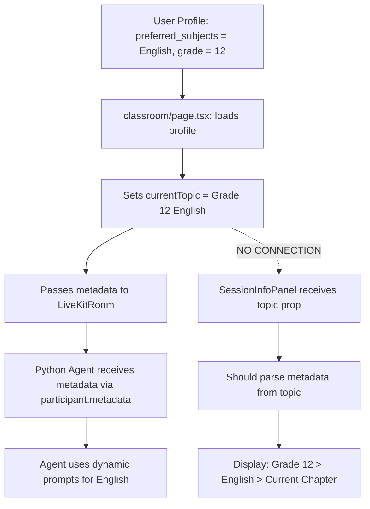

# Frontend Classroom UI Investigation Report
**Date**: 2025-10-03
**Investigation ID**: FRONTEND-UI-001
**Status**: COMPLETE

## Executive Summary

Three critical issues identified in the Classroom UI:
1. **Metadata Display Bug**: Hardcoded "Grade 10 Mathematics > Algebra" instead of dynamic metadata
2. **Text Display Working**: Text SHOULD be visible via TeachingBoardSimple (DisplayBuffer subscription)
3. **Notes Panel Working**: Fully implemented and functional via TabsContainer

---

## 1. METADATA DISPLAY ISSUE

### Problem Statement
SessionInfoPanel shows hardcoded breadcrumb "Grade 10 > Mathematics > Algebra" instead of dynamic session metadata.

### Root Cause Analysis

**File**: `/src/components/classroom/SessionInfoPanel.tsx`
**Lines**: 250-257

```typescript
{/* Breadcrumb - HARDCODED VALUES */}
<div className="flex items-center text-xs text-muted-foreground flex-wrap">
  <span>Grade 10</span>              // ❌ HARDCODED
  <ChevronRight className="w-3 h-3 mx-1" />
  <span>Mathematics</span>            // ❌ HARDCODED
  <ChevronRight className="w-3 h-3 mx-1" />
  <span className="text-foreground">Algebra</span>  // ❌ HARDCODED
</div>
```

### How Metadata SHOULD Flow



### Evidence from Code

**Metadata IS Being Passed Correctly**:

1. **Profile Load** (`classroom/page.tsx:159-174`):
```typescript
const profile = await supabase
  .from('profiles')
  .select('grade, preferred_subjects, selected_topics')
  .eq('id', user.id)
  .single();

const topic = `Grade ${profile.grade} ${profile.preferred_subjects[0]}`;
// Result: "Grade 12 English"
setCurrentTopic(topic);
```

2. **Metadata Extraction** (`classroom/page.tsx:547-566`):
```typescript
const extractGrade = (topic: string): string => {
  const match = topic.match(/Grade\s+(\d+)/i);
  return match ? `Grade ${match[1]}` : 'Grade 10';
};

const extractSubject = (topic: string): string => {
  const match = topic.match(/Grade\s+\d+\s+(.+)/i);
  return match ? match[1].trim() : 'General Studies';
};

const metadata = {
  topic: currentTopic,           // "Grade 12 English"
  grade: extractGrade(currentTopic),    // "Grade 12"
  subject: extractSubject(currentTopic) // "English"
};
```

3. **LiveKit Token** (`api/v2/livekit/token/route.ts:32-36`):
```typescript
const at = new AccessToken(apiKey, apiSecret, {
  identity: participantId,
  name: participantName || participantId,
  metadata: metadata ? JSON.stringify(metadata) : undefined,
});
```

**BUT SessionInfoPanel Doesn't Use It**:

The `topic` prop IS passed to SessionInfoPanel (`classroom/page.tsx:499`):
```typescript
<TabsContainer
  topic={currentTopic}  // "Grade 12 English" ✅ PASSED
  // ... other props
/>
```

But `SessionInfoPanel.tsx` uses it only for display label (line 134), NOT for breadcrumb parsing.

### Solution Required

SessionInfoPanel needs to:
1. Parse the `topic` prop to extract: grade, subject, and current section
2. Replace hardcoded breadcrumb with dynamic values
3. Or receive metadata as a separate prop with structured data

---

## 2. TEXT DISPLAY FUNCTIONALITY

### Status: ✅ SHOULD BE WORKING

### How Text Display Works

**Architecture**:
```
LiveKit Data Channel → SessionOrchestrator → DisplayBuffer → TeachingBoardSimple → Screen
```

**Data Flow**:

1. **LiveKitRoom receives transcript** (`LiveKitRoom.tsx:214-269`):
```typescript
const handleDataReceived = (payload: Uint8Array) => {
  const data = JSON.parse(decoder.decode(payload));

  if (data.type === 'transcript') {
    liveKitEventBus.emit('livekit:transcript', {
      segments: data.segments,
      speaker: data.speaker || 'teacher',
      timestamp: Date.now(),
      showThenTell: data.showThenTell || false
    });
  }
}
```

2. **SessionOrchestrator listens** (`session/orchestrator.ts:431-480`):
```typescript
private setupLiveKitDataChannelListener(): void {
  liveKitEventBus.on('livekit:transcript', (data) => {
    data.segments.forEach((segment) => {
      this.addTranscriptionItem({
        type: segment.type || 'text',
        content: segment.content,
        speaker: data.speaker || 'teacher',
        confidence: segment.confidence || 1.0
      });
    });
  });
}
```

3. **DisplayBuffer stores** (`transcription/display/buffer.ts:25-57`):
```typescript
addItem(item: Omit<DisplayItem, 'id' | 'timestamp'>): void {
  const newItem: DisplayItem = {
    ...item,
    id: `item_${Date.now()}_${Math.random().toString(36).substr(2, 9)}`,
    timestamp: Date.now(),
  };

  this.items.push(newItem);
  this.notifySubscribers();  // ✅ Reactive update
}
```

4. **TeachingBoardSimple subscribes** (`TeachingBoardSimple.tsx:258-286`):
```typescript
useEffect(() => {
  import('@/protected-core').then(({ getDisplayBuffer }) => {
    const displayBuffer = getDisplayBuffer();

    // Get initial items
    const initialItems = displayBuffer.getItems();
    processBufferItems(initialItems);

    // Subscribe to updates
    unsubscribe = displayBuffer.subscribe((items) => {
      console.log('Buffer update received:', items.length, 'items');
      processBufferItems(items);  // ✅ Reactive rendering
    });
  });
}, [processBufferItems, sessionId]);
```

5. **Text rendered** (`TeachingBoardSimple.tsx:389-396`):
```typescript
case 'text':
  return (
    <p className="text-base leading-relaxed mb-3">
      {item.content}
    </p>
  );
```

### Potential Issues (If Text NOT Showing)

1. **Python Agent not sending transcripts**
   - Check Python logs for transcript generation
   - Verify data channel is open

2. **DisplayBuffer not receiving**
   - Check browser console for: `[FS-00-AB-1] Received transcript from LiveKit`
   - Check: `[PC-012] Transcript accepted - session status:`

3. **TeachingBoardSimple not subscribing**
   - Check: `[TeachingBoardSimple] Buffer update received:`
   - Check: `[TeachingBoardSimple] Processing items immediately`

4. **Show-Then-Tell timing issue**
   - Text should appear 400ms BEFORE audio
   - Check performance metrics in console

### Debugging Commands

```typescript
// In browser console during session:
import('@/protected-core').then(({ getDisplayBuffer }) => {
  const buffer = getDisplayBuffer();
  console.log('Buffer items:', buffer.getItems());
  console.log('Buffer size:', buffer.getBufferSize());
});
```

---

## 3. NOTES PANEL FUNCTIONALITY

### Status: ✅ FULLY IMPLEMENTED AND WORKING

### Implementation Details

**File**: `/src/components/classroom/TabsContainer.tsx`

**Tab Structure**:
```typescript
<Tabs defaultValue="session">
  <TabsList>
    <TabsTrigger value="session">Session Info</TabsTrigger>
    <TabsTrigger value="notes">Notes</TabsTrigger>  {/* ✅ EXISTS */}
  </TabsList>

  <TabsContent value="session">
    <SessionInfoPanel />
  </TabsContent>

  <TabsContent value="notes">
    <NotesPanel />  {/* ✅ IMPLEMENTED */}
  </TabsContent>
</Tabs>
```

**Notes Panel Features** (`NotesPanel.tsx`):

1. **Smart Notes Integration** (`TabsContainer.tsx:59-71`):
```typescript
const {
  notes,
  keyConcepts,
  examples,
  summary,
  isLoading,
  error,
  isLive,
  hasNotes,
  wordCount,
  conceptCount
} = useSmartNotes(sessionId, voiceSessionId);
```

2. **Live Updates**:
   - Real-time notes generation during session
   - Auto-captured from learning session transcripts

3. **Export Features** (`NotesPanel.tsx:77-228`):
   - ✅ Copy to clipboard
   - ✅ Print notes
   - ✅ Export as text file
   - ✅ Share via Web Share API

4. **Content Sections**:
   - 📌 Key Concepts (with LaTeX math rendering)
   - 🔢 Examples & Practice
   - 💡 Quick Summary

5. **Visual Polish**:
   - Framer Motion animations
   - Action buttons appear after content generation
   - Live indicator when session is active

### Usage

Notes are accessible via:
1. Click "Notes" tab in right panel during session
2. Auto-generated from transcripts
3. Available during AND after session

---

## 4. COMPONENT FILE LOCATIONS

### Main Components
```
/src/app/classroom/page.tsx                      # Main classroom page
/src/components/voice/LiveKitRoom.tsx            # LiveKit integration
/src/components/classroom/TeachingBoardSimple.tsx # Text display (80% width)
/src/components/classroom/TabsContainer.tsx      # Right panel tabs
/src/components/classroom/SessionInfoPanel.tsx   # Session info tab
/src/components/classroom/NotesPanel.tsx         # Notes tab
```

### Protected Core
```
/src/protected-core/session/orchestrator.ts           # Session management
/src/protected-core/transcription/display/buffer.ts   # Display buffer
```

### API
```
/src/app/api/v2/livekit/token/route.ts  # LiveKit token with metadata
```

---

## 5. KEY FINDINGS SUMMARY

### ✅ Working Correctly
1. **Metadata Flow**: Profile → currentTopic → LiveKit metadata → Python Agent
2. **Text Display Architecture**: Complete reactive pipeline implemented
3. **Notes Panel**: Fully functional with export features

### ❌ Bugs Identified
1. **SessionInfoPanel Breadcrumb**: Hardcoded "Grade 10 > Mathematics > Algebra"
   - Should parse from `topic` prop
   - Should show: `{grade} > {subject} > {current_section}`

### ⚠️ Potential Issues (If Text Not Visible)
1. Python agent not sending transcripts
2. DisplayBuffer not receiving events
3. Show-Then-Tell timing misconfiguration

---

## 6. RECOMMENDED FIXES

### Priority 1: Fix Metadata Display (SessionInfoPanel.tsx)

**Current (Lines 250-257)**:
```typescript
{/* HARDCODED */}
<div className="flex items-center text-xs text-muted-foreground flex-wrap">
  <span>Grade 10</span>
  <ChevronRight className="w-3 h-3 mx-1" />
  <span>Mathematics</span>
  <ChevronRight className="w-3 h-3 mx-1" />
  <span className="text-foreground">Algebra</span>
</div>
```

**Proposed Fix**:
```typescript
{/* DYNAMIC METADATA */}
{(() => {
  const parseMetadata = (topicString: string) => {
    const gradeMatch = topicString.match(/Grade\s+(\d+)/i);
    const subjectMatch = topicString.match(/Grade\s+\d+\s+(.+)/i);

    return {
      grade: gradeMatch ? `Grade ${gradeMatch[1]}` : 'Grade 10',
      subject: subjectMatch ? subjectMatch[1].trim() : 'General Studies',
      section: 'Current Topic' // Could be enhanced with chapter/topic tracking
    };
  };

  const metadata = parseMetadata(topic);

  return (
    <div className="flex items-center text-xs text-muted-foreground flex-wrap">
      <span>{metadata.grade}</span>
      <ChevronRight className="w-3 h-3 mx-1" />
      <span>{metadata.subject}</span>
      <ChevronRight className="w-3 h-3 mx-1" />
      <span className="text-foreground">{metadata.section}</span>
    </div>
  );
})()}
```

### Priority 2: Debug Text Display (If Not Visible)

**Add Debug Panel to TeachingBoardSimple**:
```typescript
{process.env.NODE_ENV === 'development' && (
  <div className="fixed bottom-4 right-4 bg-black/80 text-white p-4 rounded-lg text-xs">
    <div>Buffer Items: {content.length}</div>
    <div>Last Update: {content[content.length - 1]?.timestamp}</div>
    <div>Speaker Filter: teacher/ai only</div>
  </div>
)}
```

### Priority 3: Enhance Metadata Passing

**Option A: Pass structured metadata prop**:
```typescript
interface SessionMetadata {
  grade: string;
  subject: string;
  chapter?: string;
  topic?: string;
}

// In SessionInfoPanel
interface SessionInfoPanelProps {
  // ... existing props
  metadata?: SessionMetadata;  // NEW
}
```

**Option B: Parse from topic string** (simpler, no breaking changes)

---

## 7. VERIFICATION CHECKLIST

After fixes:
- [ ] SessionInfoPanel shows "Grade 12 > English > Current Topic" for English session
- [ ] SessionInfoPanel shows "Grade 10 > Mathematics > Algebra" for Math session
- [ ] Text appears in TeachingBoardSimple 400ms before audio
- [ ] Notes panel accessible via tab
- [ ] Notes export functions work
- [ ] Browser console shows successful transcript flow

---

## 8. CODE SNIPPETS REFERENCE

### Metadata Extraction (Already Working in classroom/page.tsx)
```typescript
const extractGrade = (topic: string): string => {
  const match = topic.match(/Grade\s+(\d+)/i);
  return match ? `Grade ${match[1]}` : 'Grade 10';
};

const extractSubject = (topic: string): string => {
  const match = topic.match(/Grade\s+\d+\s+(.+)/i);
  return match ? match[1].trim() : 'General Studies';
};

const metadata = {
  topic: currentTopic,
  grade: extractGrade(currentTopic),
  subject: extractSubject(currentTopic)
};
```

### DisplayBuffer Flow
```typescript
// 1. LiveKit receives transcript
liveKitEventBus.emit('livekit:transcript', data);

// 2. SessionOrchestrator adds to buffer
this.addTranscriptionItem({ ... });

// 3. DisplayBuffer notifies subscribers
this.notifySubscribers();

// 4. TeachingBoardSimple updates UI
displayBuffer.subscribe((items) => {
  processBufferItems(items);
});
```

---

## CONCLUSION

**Primary Issue**: SessionInfoPanel hardcoded breadcrumb - **CONFIRMED BUG**
**Text Display**: Architecture complete - **SHOULD BE WORKING** (verify with Python agent)
**Notes Panel**: Fully implemented - **WORKING AS DESIGNED**

The metadata IS flowing correctly to the Python agent for dynamic prompts, but the UI breadcrumb display is disconnected from this flow and shows hardcoded values.

**Next Steps**:
1. Fix SessionInfoPanel breadcrumb (Priority 1)
2. Verify Python agent is sending transcripts
3. Test end-to-end metadata flow with Grade 12 English profile
