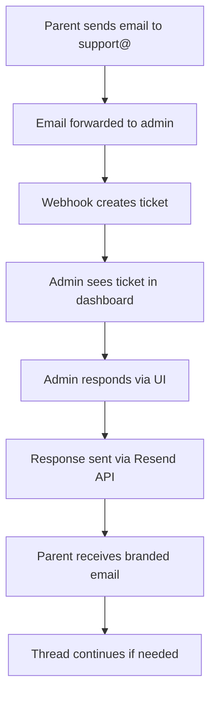
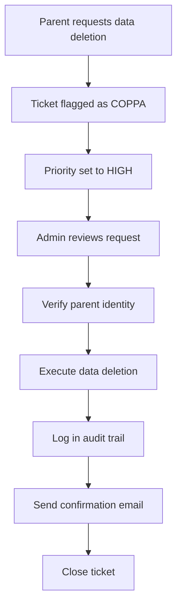

# Phase 5: Support & Communication System

**Priority Level**: 1.5 - Operational Essentials  
**Duration**: 4-5 days  
**Dependencies**: Phase 3 (AI Classroom) completion  
**Compliance**: COPPA/FERPA required  

## Executive Summary

Implement a privacy-compliant support system that handles parent communications, support tickets, and data requests while maintaining professional branding and COPPA/FERPA compliance. This phase bridges the gap between MVP functionality and full regulatory compliance.

## Problem Statement

### Current Issues
1. **Email replies from personal accounts** look unprofessional (uudhya@icloud.com)
2. **No tracking mechanism** for support requests
3. **COPPA requires responsive parent communication** (24-48 hour SLA)
4. **Data deletion requests** have no formal workflow
5. **No audit trail** for compliance documentation

### Business Impact
- **Legal Risk**: $51,744 per child for COPPA violations
- **Trust Issue**: Parents seeing personal email addresses
- **Scale Problem**: Manual email management unsustainable past 100 users
- **Compliance Gap**: No documented request handling

## Solution Architecture

### Three-Tier Implementation

#### Tier 1: Email Management (Day 1-2)
Professional email handling with branded responses

#### Tier 2: Support Ticketing (Day 2-3)
Structured ticket system with tracking and SLAs

#### Tier 3: Compliance Automation (Day 4-5)
Automated workflows for privacy requests

## Technical Design

### Database Schema

```sql
-- Support tickets table
CREATE TABLE support_tickets (
  id UUID PRIMARY KEY DEFAULT gen_random_uuid(),
  ticket_number TEXT UNIQUE NOT NULL, -- PING-2024-001
  
  -- Request details
  requester_email TEXT NOT NULL,
  requester_name TEXT,
  requester_type TEXT CHECK (requester_type IN ('parent', 'student', 'teacher', 'other')),
  
  -- Ticket data
  subject TEXT NOT NULL,
  description TEXT NOT NULL,
  priority TEXT DEFAULT 'normal' CHECK (priority IN ('urgent', 'high', 'normal', 'low')),
  category TEXT CHECK (category IN ('technical', 'account', 'privacy', 'billing', 'general')),
  status TEXT DEFAULT 'open' CHECK (status IN ('open', 'pending', 'resolved', 'closed')),
  
  -- Compliance fields
  is_coppa_request BOOLEAN DEFAULT FALSE,
  is_ferpa_request BOOLEAN DEFAULT FALSE,
  data_deletion_requested BOOLEAN DEFAULT FALSE,
  
  -- Assignment
  assigned_to TEXT, -- For future multi-agent support
  
  -- Timestamps
  created_at TIMESTAMPTZ DEFAULT NOW(),
  updated_at TIMESTAMPTZ DEFAULT NOW(),
  resolved_at TIMESTAMPTZ,
  first_response_at TIMESTAMPTZ,
  
  -- Metrics
  response_time_hours DECIMAL,
  resolution_time_hours DECIMAL
);

-- Ticket responses table
CREATE TABLE ticket_responses (
  id UUID PRIMARY KEY DEFAULT gen_random_uuid(),
  ticket_id UUID REFERENCES support_tickets(id) ON DELETE CASCADE,
  
  -- Response data
  from_email TEXT NOT NULL,
  message TEXT NOT NULL,
  is_internal_note BOOLEAN DEFAULT FALSE,
  
  -- Attachments
  attachments JSONB DEFAULT '[]'::jsonb,
  
  created_at TIMESTAMPTZ DEFAULT NOW()
);

-- Email templates table
CREATE TABLE email_templates (
  id UUID PRIMARY KEY DEFAULT gen_random_uuid(),
  template_key TEXT UNIQUE NOT NULL,
  template_name TEXT NOT NULL,
  subject TEXT NOT NULL,
  html_body TEXT NOT NULL,
  text_body TEXT NOT NULL,
  variables JSONB DEFAULT '[]'::jsonb, -- Expected variables
  category TEXT,
  is_active BOOLEAN DEFAULT TRUE,
  created_at TIMESTAMPTZ DEFAULT NOW(),
  updated_at TIMESTAMPTZ DEFAULT NOW()
);

-- Audit log for compliance
CREATE TABLE support_audit_log (
  id UUID PRIMARY KEY DEFAULT gen_random_uuid(),
  ticket_id UUID REFERENCES support_tickets(id),
  action TEXT NOT NULL,
  performed_by TEXT NOT NULL,
  details JSONB,
  created_at TIMESTAMPTZ DEFAULT NOW()
);

-- Indexes for performance
CREATE INDEX idx_tickets_status ON support_tickets(status);
CREATE INDEX idx_tickets_requester ON support_tickets(requester_email);
CREATE INDEX idx_tickets_created ON support_tickets(created_at DESC);
CREATE INDEX idx_tickets_coppa ON support_tickets(is_coppa_request) WHERE is_coppa_request = TRUE;
```

### API Routes Structure

```typescript
// /app/api/support/
├── tickets/
│   ├── route.ts          // GET (list), POST (create)
│   └── [id]/
│       ├── route.ts      // GET, PATCH, DELETE
│       └── respond/
│           └── route.ts  // POST (add response)
├── templates/
│   └── route.ts          // GET templates
├── stats/
│   └── route.ts          // GET metrics
└── webhooks/
    └── incoming-email/
        └── route.ts      // POST (email to ticket)
```

## Implementation Phases

### Phase 5.1: Email Integration (Day 1)

**Goal**: Professional email responses via Resend API

**Tasks**:
1. ✅ Configure Resend with pinglearn.app domain (COMPLETE)
2. ✅ Set up email forwarding for support@ addresses (COMPLETE)
3. Create email service wrapper
4. Implement template system
5. Test branded email sending

**Deliverables**:
- Email service with Resend integration
- 5 core email templates
- Branded response capability

### Phase 5.2: Basic Ticket System (Day 2)

**Goal**: Web interface for managing support requests

**Tasks**:
1. Create ticket dashboard UI
2. Implement ticket creation flow
3. Add response interface
4. Connect email sending
5. Basic search and filtering

**Deliverables**:
- `/admin/support` dashboard
- Ticket management interface
- Response tracking

### Phase 5.3: Email-to-Ticket Bridge (Day 3)

**Goal**: Automatic ticket creation from emails

**Tasks**:
1. Implement webhook endpoint
2. Parse incoming emails
3. Auto-create tickets
4. Thread email conversations
5. Handle attachments

**Deliverables**:
- Email webhook handler
- Automatic ticket generation
- Conversation threading

### Phase 5.4: Compliance Features (Day 4)

**Goal**: COPPA/FERPA request handling

**Tasks**:
1. Create privacy request forms
2. Implement data export functionality
3. Add data deletion workflows
4. Build audit logging
5. Generate compliance reports

**Deliverables**:
- Privacy request dashboard
- Data export/deletion tools
- Audit trail system

### Phase 5.5: Automation & Polish (Day 5)

**Goal**: Reduce manual work with smart automation

**Tasks**:
1. Auto-categorization rules
2. Priority detection
3. Response templates
4. SLA monitoring
5. Analytics dashboard

**Deliverables**:
- Automated routing
- SLA alerts
- Support metrics dashboard

## Component Architecture

### Core Components

```typescript
// /components/support/
├── ticket-list.tsx       // Main ticket list view
├── ticket-detail.tsx     // Individual ticket view
├── ticket-form.tsx       // New ticket creation
├── response-editor.tsx   // Rich text response editor
├── template-picker.tsx   // Quick template selection
├── priority-badge.tsx    // Visual priority indicators
├── sla-timer.tsx         // Response time tracking
└── audit-trail.tsx       // Compliance audit view
```

### Service Layer

```typescript
// /lib/services/support/
├── ticket.service.ts     // Ticket CRUD operations
├── email.service.ts      // Resend integration
├── template.service.ts   // Template management
├── audit.service.ts      // Compliance logging
└── metrics.service.ts    // Analytics and reporting
```

## User Flows

### Parent Support Request Flow



### Data Deletion Request Flow



## Email Templates

### Core Templates Required

1. **Welcome/First Response**
   - Acknowledges receipt
   - Sets expectations
   - Provides ticket number

2. **Data Request Acknowledgment**
   - Confirms privacy request
   - Outlines verification process
   - States timeline (45 days max)

3. **Issue Resolution**
   - Confirms problem solved
   - Requests feedback
   - Provides follow-up options

4. **Account Verification**
   - For sensitive requests
   - Identity confirmation
   - Security notice

5. **Escalation Notice**
   - Complex issue acknowledgment
   - Extended timeline notice
   - Alternative contact options

## Compliance Requirements

### COPPA Compliance
- **Response Time**: 24-48 hours for parent requests
- **Data Access**: Provide all child data upon request
- **Deletion Rights**: Complete data removal capability
- **Audit Trail**: Document all privacy-related actions

### FERPA Compliance
- **Educational Records**: 45-day response window
- **Access Control**: Verify parent/eligible student identity
- **Disclosure Tracking**: Log all data sharing
- **Retention Policies**: Define and enforce data lifecycle

## Success Metrics

### Operational Metrics
- **First Response Time**: < 2 hours (urgent), < 6 hours (normal)
- **Resolution Time**: < 24 hours (technical), < 72 hours (general)
- **Ticket Backlog**: < 10 open tickets at any time
- **Customer Satisfaction**: > 85% positive feedback

### Compliance Metrics
- **Privacy Request SLA**: 100% within legal timeframe
- **Audit Completeness**: All actions logged
- **Data Breach Count**: Zero tolerance
- **Documentation Coverage**: 100% of privacy requests

## Technical Stack

- **Frontend**: Next.js, React, shadcn/ui components
- **Backend**: Next.js API routes, Supabase
- **Email**: Resend API for sending
- **Database**: PostgreSQL via Supabase
- **Authentication**: Supabase Auth with RLS
- **File Storage**: Supabase Storage for attachments
- **Monitoring**: Vercel Analytics

## Security Considerations

### Data Protection
- All ticket data encrypted at rest
- TLS for all communications
- PII redaction in logs
- Secure attachment handling

### Access Control
- Admin-only access to support dashboard
- RLS policies for data isolation
- Session-based authentication
- IP allowlisting for admin panel (optional)

## Cost Analysis

### Initial Setup (One-time)
- Development time: 5 days
- Domain setup: Complete (pinglearn.app)
- Email service: Resend free tier (3,000 emails/month)

### Ongoing Costs (Monthly)
- **Months 1-3**: $0 (free tiers sufficient)
- **Months 4-6**: ~$20/month (Resend paid tier)
- **Months 7-12**: ~$50/month (scale adjustments)

### ROI Calculation
- **Time Saved**: 10 hours/week on support
- **Risk Mitigation**: Avoid $51,744 COPPA fines
- **Trust Building**: Professional communication
- **Scalability**: Handle 10x user growth

## Risk Mitigation

### Technical Risks
- **Email Delivery**: Monitor bounce rates, maintain < 4%
- **System Downtime**: Implement status page
- **Data Loss**: Regular backups, audit trails

### Compliance Risks
- **SLA Violations**: Automated alerts for aging tickets
- **Privacy Breaches**: Encryption, access controls
- **Documentation Gaps**: Comprehensive audit logging

## Testing Strategy

### Unit Tests
- Email service functions
- Ticket CRUD operations
- Template rendering
- Compliance workflows

### Integration Tests
- Email-to-ticket flow
- Response sending
- Attachment handling
- Audit logging

### E2E Tests
- Complete support workflow
- Privacy request handling
- Dashboard interactions
- Search and filtering

## Rollout Plan

### Week 1: Foundation
- Day 1-2: Email integration
- Day 3-4: Basic ticket system
- Day 5: Initial testing

### Week 2: Enhancement
- Day 1-2: Email-to-ticket bridge
- Day 3-4: Compliance features
- Day 5: Automation setup

### Week 3: Launch
- Day 1-2: Final testing
- Day 3: Soft launch to beta users
- Day 4-5: Monitor and adjust

## Future Enhancements (Post-Phase 5)

### Phase 5.1+ (Optional)
- AI-powered auto-responses
- Chatbot integration
- Video support sessions
- Multi-language support

### Phase 5.2+ (Scale)
- Multi-agent support teams
- Advanced analytics
- Customer portal
- Knowledge base integration

## Acceptance Criteria

### Must Have
- ✅ Branded email responses from support@pinglearn.app
- ✅ Ticket tracking system with unique IDs
- ✅ Parent request handling within 48 hours
- ✅ Data deletion capability with audit trail
- ✅ Basic analytics dashboard

### Should Have
- ✅ Email-to-ticket automation
- ✅ Response templates
- ✅ Priority-based routing
- ✅ SLA monitoring

### Nice to Have
- ⏳ AI categorization
- ⏳ Chatbot deflection
- ⏳ Sentiment analysis
- ⏳ Predictive routing

## Conclusion

Phase 5 transforms PingLearn from a functional MVP into a professionally operated educational platform. By implementing this support system, we achieve COPPA compliance, build parent trust, and create sustainable operations for scaling from 100 to 10,000+ users.

---

**Document Version**: 1.0  
**Created**: September 19, 2025  
**Author**: Technical Lead  
**Status**: Ready for Implementation