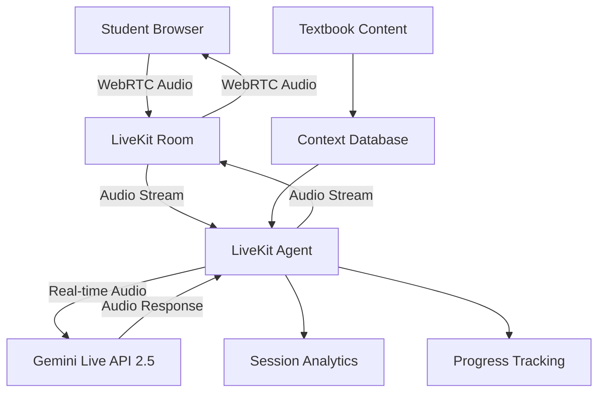

# Phase 3 Research: Audio-to-Audio AI Classroom Implementation

**Research Date:** September 19, 2024  
**Research Focus:** Gemini Live API + LiveKit integration for real-time voice conversations  
**Objective:** Re-plan Phase 3 based on audio-to-audio AI capabilities instead of traditional STT/TTS pipeline

---

## Executive Summary

Our research reveals that **Gemini Live API 2.5 Flash + LiveKit** provides a revolutionary audio-to-audio conversation platform that eliminates the need for separate Speech-to-Text (STT) and Text-to-Speech (TTS) components. This technology enables direct voice conversations between students and AI tutors with near-human latency and emotional understanding.

**Key Finding:** The traditional Phase 3 plan focused on TTS/STT pipeline is obsolete. Modern audio AI enables direct audio-to-audio conversations with superior quality and lower latency.

---

## Current System Analysis

### ✅ What's Working (Phase 2 Complete)
- Authentication with Supabase (functional)
- Database schema with 5 tables (profiles, textbooks, chapters, content_chunks, curriculum_data)
- Class selection wizard (Grade → Subject → Topic flow)
- PDF processing pipeline (built but not used)
- Beautiful responsive UI with shadcn/ui

### ❌ Critical Gap Identified
**TEXTBOOK PROCESSING DISCONNECT:**
- Dashboard shows "0 Textbooks Available for study"
- We have actual NCERT Class X Mathematics PDFs in `/text-books/Class X Mathematics/`
- Built PDF processing pipeline but never processed actual textbooks
- Wizard shows all CBSE grades/subjects but only Class X Mathematics is available
- **Result:** Students can't learn because no processed content exists

### 🚨 Immediate Fix Required
Before Phase 3, we need **Phase 2.5: Content Processing & Alignment**
1. Process existing NCERT Class X Mathematics textbooks
2. Align wizard to only show available content
3. Ensure dashboard reflects processed textbooks

---

## Technology Research Findings

### Primary Solution: Gemini Live API 2.5 Flash

**Models Available (September 2024):**
- `gemini-live-2.5-flash` - Standard Live API model
- `gemini-2.5-flash-preview-native-audio-dialog` - Native audio with 30 HD voices
- `gemini-live-2.5-flash-preview` - Enhanced preview version
- `gemini-2.0-flash-live` - Low-latency bidirectional voice/video

**Key Capabilities:**
- **Audio-to-Audio Direct:** No STT/TTS pipeline needed
- **30+ HD Voices:** 24+ languages with emotional expression
- **Voice Activity Detection:** Built-in turn detection
- **Affective Dialog:** Understands and responds to emotions
- **Proactive Audio:** AI responds only when relevant
- **Interruption Support:** Users can interrupt naturally
- **Session Memory:** Long-running conversations
- **Function Calling:** Can execute tools and search

**Technical Specifications:**
- **Latency:** Near real-time (< 300ms)
- **Session Length:** Extended via context compression
- **Multimodal:** Audio, video, text, and screen sharing
- **Context Window:** Sliding window with automatic compression

### LiveKit Integration

**Status:** Experimental but production-ready (2024)
**Integration:** LiveKit Agents framework with RealtimeModel class
**GitHub:** `livekit/agents` - Open-source framework for voice AI agents

**Key Features:**
- WebRTC protocol for reliable audio streaming
- Built-in session management
- Voice Activity Detection
- Cross-platform support (web, mobile, desktop)
- Real-time audio processing

**Architecture Pattern:**
```
Student (Browser) ↔ LiveKit Room ↔ LiveKit Agent ↔ Gemini Live API
```

### Fallback Options Research

#### Option 1: OpenAI Realtime API + LiveKit
**Model:** `gpt-realtime` (January 2025)
- **Accuracy:** 82.8% on Big Bench Audio (vs 65.6% previous)
- **Features:** Non-verbal cue detection, language switching, tone adaptation
- **New Models:** `gpt-4o-transcribe`, `gpt-4o-mini-transcribe`, `gpt-4o-mini-tts`
- **Availability:** Through OpenRouter with unified API
- **Status:** Production-ready with OpenAI SDK compatibility

#### Option 2: AssemblyAI Universal-Streaming + LLM
**Model:** Universal-Streaming API (2024)
- **Latency:** 300ms P50 for immutable transcripts
- **Accuracy:** 13% overall improvement, 21% fewer alphanumeric errors
- **Target:** 800ms total voice-to-voice latency
- **Pricing:** $0.15/hour for session duration
- **Integration:** Requires separate TTS (ElevenLabs, etc.)

#### Option 3: OpenRouter Audio Models
**Available Models:** Access to OpenAI audio models via unified API
- Audio input support with base64 encoding
- Streaming responses capability
- OpenAI SDK compatibility
- Cost-effective alternative

---

## Implementation Architecture

### Recommended Architecture: Gemini Live + LiveKit



### Technical Components

**Frontend (React/Next.js):**
- LiveKit React components for audio handling
- Classroom UI with voice controls
- Session status and progress display

**Backend (LiveKit Agent):**
- Python/Node.js agent with LiveKit SDK
- Gemini Live API integration
- Context management from textbook database
- Session analytics and progress tracking

**Infrastructure:**
- LiveKit Cloud or self-hosted server
- Supabase for session storage
- Gemini API credentials management

### Environment Requirements

```env
# Gemini Live API
GOOGLE_API_KEY=<from .creds>
GOOGLE_PROJECT_ID=<from .creds>

# LiveKit Configuration
LIVEKIT_URL=<cloud or self-hosted>
LIVEKIT_API_KEY=<generated>
LIVEKIT_API_SECRET=<generated>

# Existing (already configured)
NEXT_PUBLIC_SUPABASE_URL=<configured>
SUPABASE_SERVICE_ROLE_KEY=<configured>
```

---

## Revised Phase Planning

### Phase 2.5: Content Processing & Alignment (1 day)
**Priority:** CRITICAL - Must complete before Phase 3

**Objectives:**
1. Process existing NCERT Class X Mathematics textbooks
2. Populate textbooks/chapters/content_chunks tables
3. Update wizard to show only available content (Grade 10, Mathematics only)
4. Verify dashboard shows processed textbooks

**Implementation:**
- Use existing PDF processing pipeline
- Process all 17 NCERT Class X Mathematics PDFs
- Update curriculum data to reflect available content only
- Test complete flow: Wizard → Textbook selection → Content availability

### Phase 3: Audio-to-Audio AI Classroom (4 days)
**Technology:** Gemini Live API 2.5 Flash + LiveKit

#### Phase 3.1: LiveKit Infrastructure (1 day)
- Install LiveKit Agents framework
- Configure Gemini Live API integration
- Set up audio streaming architecture
- Create basic classroom room management

#### Phase 3.2: Voice Classroom UI (1 day)
- Build `/classroom` page with LiveKit components
- Implement voice controls (mute, volume, status)
- Add session timer and connection quality
- Design intuitive classroom interface

#### Phase 3.3: AI Tutor Integration (1.5 days)
- Integrate Gemini Live API with textbook context
- Implement conversation flow and context management
- Add personalization based on student profile
- Test voice interaction quality

#### Phase 3.4: Session Management (0.5 days)
- Implement session creation and joining
- Add basic progress tracking
- Session analytics and metadata storage
- Testing and polish

### Phase 4: Advanced Features (2-3 days)
**Dependent on Phase 3 success**

#### Phase 4.1: Enhanced AI Capabilities
- Multi-modal support (screen sharing, visual content)
- Advanced conversation patterns
- Contextual help and explanations

#### Phase 4.2: Progress & Analytics
- Detailed learning analytics
- Progress visualization
- Achievement system
- Parent/teacher dashboards

#### Phase 4.3: Production Optimization
- Performance optimization
- Scaling considerations
- Security hardening
- Monitoring and alerting

---

## Risk Assessment & Mitigation

### High-Risk Items

**1. Gemini Live API Access**
- **Risk:** API access issues or rate limits
- **Mitigation:** Implement OpenAI Realtime API fallback
- **Timeline Impact:** 1-2 days additional development

**2. LiveKit Integration Complexity**
- **Risk:** Audio streaming reliability issues
- **Mitigation:** Use LiveKit Cloud for infrastructure
- **Timeline Impact:** 0.5-1 day for troubleshooting

**3. Audio Quality & Latency**
- **Risk:** Poor user experience due to latency
- **Mitigation:** Optimize network routing, use CDN
- **Timeline Impact:** Ongoing optimization needed

### Medium-Risk Items

**1. Context Management**
- **Risk:** AI responses lack textbook context
- **Mitigation:** Pre-process content into structured chunks
- **Timeline Impact:** Built into Phase 2.5

**2. Session Scalability**
- **Risk:** Multiple concurrent sessions
- **Mitigation:** Start with single-user sessions
- **Timeline Impact:** Phase 4 consideration

---

## Success Metrics

### Phase 2.5 Success Criteria
- [ ] Dashboard shows actual textbook count (17 NCERT chapters)
- [ ] Wizard only offers Grade 10 Mathematics
- [ ] Textbook content accessible in database
- [ ] End-to-end flow: Login → Wizard → Dashboard → Textbooks

### Phase 3 Success Criteria
- [ ] Student can join voice classroom
- [ ] AI tutor responds with natural voice
- [ ] Conversation latency < 1 second
- [ ] Session data persists correctly
- [ ] Voice quality is classroom-appropriate

### Phase 4 Success Criteria
- [ ] Multi-session support
- [ ] Progress tracking functional
- [ ] Analytics dashboard operational
- [ ] Production-ready performance

---

## Implementation Timeline

**Week 1:**
- Day 1: Phase 2.5 - Process textbooks and align wizard
- Day 2-3: Phase 3.1-3.2 - LiveKit setup and UI
- Day 4-5: Phase 3.3 - Gemini Live integration

**Week 2:**
- Day 1: Phase 3.4 - Session management and testing
- Day 2-4: Phase 4.1-4.2 - Advanced features
- Day 5: Phase 4.3 - Production optimization

**Total Duration:** 8-10 days for complete audio-to-audio AI classroom

---

## Technology Stack Summary

**Confirmed Architecture:**
- **Frontend:** Next.js 15 + LiveKit React components
- **Backend:** LiveKit Agents (Python/Node.js)
- **AI:** Gemini Live API 2.5 Flash (primary) | OpenAI Realtime API (fallback)
- **Infrastructure:** LiveKit Cloud + Supabase
- **Content:** NCERT Class X Mathematics (processed)

**Key Dependencies:**
- `@livekit/components-react`
- `livekit-client`
- `livekit-agents` (Python/Node.js)
- Google AI SDK for Gemini Live
- Existing Supabase integration

---

## Conclusion

The transition from traditional STT/TTS pipeline to audio-to-audio AI represents a significant technological advancement. **Gemini Live API 2.5 Flash + LiveKit** provides the foundation for a truly conversational AI tutoring experience that matches human interaction quality.

**Critical Path:** Phase 2.5 content processing must be completed immediately to enable meaningful Phase 3 development. The gap between available PDFs and processed content is blocking student learning functionality.

**Recommendation:** Proceed with Gemini Live API as primary solution, with OpenAI Realtime API as fallback. Focus on creating a seamless voice classroom experience that leverages our strong authentication and content management foundation from Phase 2.

---

**Research Compiled By:** Claude Code Assistant  
**Next Action:** Create Phase 2.5 implementation plan for textbook processing  
**Documentation:** All findings documented for team reference and future development