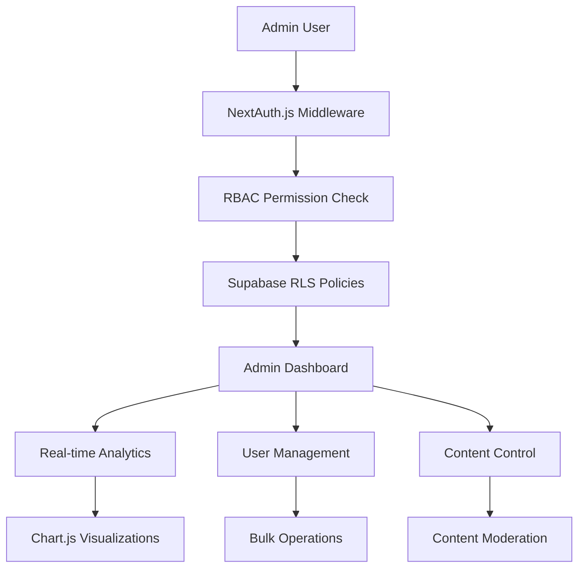

# Phase 6: Admin Dashboard - Deep Research & Analysis

**Research Date**: September 19, 2025
**Focus**: Comprehensive Admin Capabilities for Educational Platform
**Target**: Modern K-12 Educational Software Admin Patterns

## Executive Summary

Based on comprehensive research of educational platform admin systems, this document outlines the essential admin capabilities needed for Virtual Tutor's Phase 6 implementation. The research reveals that modern K-12 platforms in 2025 focus on unified dashboards, granular permission systems, real-time analytics, and enhanced security controls specifically for educational environments handling student data.

## Research Methodology

### Sources Analyzed
1. **Market Leaders**: PowerSchool, Frontline Education, Blackbaud K-12
2. **Modern Templates**: Next.js 15 admin dashboard patterns, shadcn/ui implementations
3. **Security Standards**: 2025 COPPA/FERPA compliance requirements for student data
4. **Technical Patterns**: Current best practices for role-based access control (RBAC)

### Key Findings

#### 1. Educational Platform Admin Core Capabilities

**User Management & Roles**
- **Multi-tier Role System**: Super Admin → School Admin → Teacher → Student → Parent
- **Granular Permissions**: Feature-level access control (view/edit/delete/create)
- **Batch Operations**: Bulk user import, role assignments, status changes
- **Audit Trails**: Complete logs of admin actions for compliance

**Student Data Management**
- **360° Student View**: Academic records, attendance, behavior, progress
- **Privacy Controls**: COPPA-compliant data access and deletion workflows
- **Parent Account Linking**: Secure parent-student relationships with verification
- **Data Export/Import**: CSV, JSON formats for data portability

**Content & Curriculum Control**
- **Textbook Management**: Upload, categorize, assign to grades/subjects
- **Content Moderation**: Review and approve user-generated content
- **Learning Path Configuration**: Customize curriculum sequences
- **Assessment Management**: Create, assign, and analyze assessments

#### 2. Analytics & Reporting Capabilities

**Real-time Dashboard Metrics**
- **User Activity**: Active sessions, login patterns, engagement metrics
- **Content Performance**: Most used textbooks, popular topics, completion rates
- **System Health**: Server performance, error rates, API usage
- **Financial Metrics**: Subscription status, payment tracking, churn analysis

**Educational Analytics**
- **Learning Outcomes**: Progress tracking, skill mastery, time-to-completion
- **Teacher Insights**: Classroom usage, student support patterns
- **Trend Analysis**: Seasonal usage, subject popularity, device preferences
- **Comparative Reports**: Grade-level performance, school-to-school comparisons

**Compliance Reporting**
- **Data Access Logs**: Who accessed what student data when
- **Privacy Request Tracking**: COPPA/FERPA request status and resolution
- **Security Incidents**: Failed logins, suspicious activity, data breaches
- **Audit Reports**: Regular compliance status for educational authorities

#### 3. Modern Admin Dashboard UI Patterns (2025)

**Design Principles**
- **Mobile-First**: Touch-friendly navigation, responsive grid layouts
- **Minimalist Interface**: Clean typography, strategic white space usage
- **Data Visualization**: Interactive charts, real-time graphs, heatmaps
- **Progressive Disclosure**: Show essential info first, drill-down for details

**Technology Stack Recommendations**
- **Frontend**: Next.js 15 + shadcn/ui + Tailwind CSS
- **State Management**: Zustand or React Query for server state
- **Charts**: Recharts or Chart.js for data visualization
- **Authentication**: NextAuth.js with RBAC middleware
- **Database**: Supabase with Row Level Security (RLS)

#### 4. Security & Compliance Requirements

**Educational Data Protection (2025 Standards)**
- **Enhanced Student Privacy**: Under-18 users require additional security controls
- **Granular App Permissions**: Admins must explicitly approve each application
- **Data Encryption**: At-rest and in-transit encryption for all student data
- **Access Logging**: Comprehensive audit trails for all data access

**COPPA/FERPA Compliance Features**
- **Automated Data Deletion**: 30-day automated purge of deleted accounts
- **Parent Verification**: Multi-factor verification for parent account access
- **Data Portability**: One-click student data export in standard formats
- **Breach Notification**: Automated alerts and reporting workflows

## Competitive Analysis

### PowerSchool (Market Leader)
- **Strengths**: Unified platform, state reporting compliance, robust analytics
- **Features**: 360° student view, automated workflows, custom dashboards
- **Limitations**: Complex UI, steep learning curve for small schools

### Frontline Education
- **Strengths**: "Priceless" data analytics, integrated time & attendance
- **Features**: All-in-one dashboard, workflow automation, real-time data
- **Limitations**: Primarily focused on staff management over student learning

### Blackbaud K-12
- **Strengths**: Comprehensive portfolio management, custom analytics
- **Features**: Transparent reporting, operational efficiency tools
- **Limitations**: More suited for private schools, higher cost structure

### Modern Admin Templates (Next.js 15)
- **shadcn/ui Admin**: Clean UI, TypeScript support, 70+ components
- **TailAdmin**: Open-source, extensive documentation, mobile-responsive
- **Materio MUI**: Enterprise-grade, Material Design, extensive theming

## Technical Implementation Patterns

### Role-Based Access Control (RBAC) Structure

```typescript
// Recommended Role Hierarchy
interface UserRole {
  id: string
  name: 'super_admin' | 'school_admin' | 'teacher' | 'student' | 'parent'
  permissions: Permission[]
  inherits_from?: string[]
}

interface Permission {
  resource: 'users' | 'content' | 'analytics' | 'settings' | 'reports'
  actions: ('view' | 'create' | 'edit' | 'delete' | 'export')[]
  conditions?: {
    own_school_only?: boolean
    own_students_only?: boolean
    anonymized_data_only?: boolean
  }
}
```

### Dashboard Component Architecture

```typescript
// Modern Admin Dashboard Structure
components/admin/
├── overview/
│   ├── metrics-cards.tsx      // KPI summary cards
│   ├── activity-chart.tsx     // Real-time activity
│   └── alerts-panel.tsx       // System notifications
├── users/
│   ├── user-list.tsx          // Paginated user table
│   ├── user-detail.tsx        // 360° user view
│   ├── role-management.tsx    // Permission assignment
│   └── bulk-actions.tsx       // Batch operations
├── content/
│   ├── textbook-manager.tsx   // Content library
│   ├── upload-wizard.tsx      // Multi-step upload
│   └── moderation-queue.tsx   // Content approval
├── analytics/
│   ├── learning-analytics.tsx // Educational insights
│   ├── usage-reports.tsx      // Platform metrics
│   └── export-center.tsx      // Data export tools
└── settings/
    ├── school-config.tsx      // Institution settings
    ├── integrations.tsx       // Third-party connections
    └── compliance.tsx         // Privacy controls
```

### Data Flow Architecture



## Educational Platform Specific Requirements

### Student Data Management
- **Academic Records**: Grades, assignments, progress tracking
- **Behavioral Data**: Engagement patterns, time-on-task, help requests
- **Assessment Results**: Quiz scores, skill assessments, growth metrics
- **Communication Logs**: Parent-teacher messages, support interactions

### Classroom Management Tools
- **Session Monitoring**: Live view of active AI tutoring sessions
- **Content Assignment**: Assign specific textbooks/chapters to students
- **Progress Oversight**: Real-time view of student learning progress
- **Intervention Alerts**: Automatic notifications for struggling students

### Parental Engagement Features
- **Progress Reports**: Automated weekly/monthly progress summaries
- **Communication Center**: Secure messaging between parents and teachers
- **Account Management**: Parent account creation and child linking
- **Privacy Controls**: Granular consent management for data usage

## Innovation Opportunities

### AI-Powered Admin Features
- **Predictive Analytics**: Identify at-risk students before they struggle
- **Automated Categorization**: Smart tagging of content and user actions
- **Intelligent Reporting**: Auto-generated insights from data patterns
- **Chatbot Support**: AI assistant for common admin tasks

### Advanced Analytics
- **Learning Path Optimization**: Data-driven curriculum recommendations
- **Resource Allocation**: Predict textbook demand and usage patterns
- **Performance Benchmarking**: Compare performance across schools/regions
- **Early Warning Systems**: Detect potential dropouts or learning gaps

### Modern UX Patterns
- **Voice Commands**: Hands-free navigation for accessibility
- **Gesture Controls**: Touch-friendly interactions for tablet admins
- **Contextual Help**: Smart tooltips and guided workflows
- **Collaborative Features**: Multi-admin real-time collaboration

## Technical Challenges & Solutions

### Scalability Challenges
- **Challenge**: Handle 10,000+ concurrent users across multiple schools
- **Solution**: Implement database sharding, CDN for static content, Redis caching

### Security Challenges
- **Challenge**: Protect sensitive student data from breaches
- **Solution**: Zero-trust architecture, end-to-end encryption, regular penetration testing

### Compliance Challenges
- **Challenge**: Automate COPPA/FERPA compliance across multiple jurisdictions
- **Solution**: Configurable policy engine, automated audit trails, workflow automation

### Performance Challenges
- **Challenge**: Real-time analytics with sub-second response times
- **Solution**: Event-driven architecture, pre-computed aggregations, WebSocket updates

## Implementation Recommendations

### Phase 6 Core Features (Priority 1)
1. **Super Admin Dashboard**: System-wide oversight and control
2. **User Management System**: RBAC with educational role hierarchy
3. **Real-time Analytics**: Live metrics and usage monitoring
4. **Content Management**: Textbook upload, organization, assignment
5. **Security Controls**: Audit logging, permission management

### Phase 6 Extended Features (Priority 2)
1. **Advanced Reporting**: Custom report builder with export options
2. **Batch Operations**: Bulk user management and content operations
3. **Integration Hub**: Third-party service connections (Google, Microsoft)
4. **Compliance Dashboard**: COPPA/FERPA request tracking and automation
5. **Performance Monitoring**: System health and optimization tools

### Phase 6 Future Enhancements (Priority 3)
1. **AI Analytics**: Predictive insights and automated recommendations
2. **Mobile Admin App**: Native iOS/Android admin applications
3. **API Management**: Developer console for third-party integrations
4. **White-label Options**: School district branding and customization
5. **Multi-tenant Architecture**: Support for district-wide deployments

## Success Metrics

### Operational Metrics
- **Admin Efficiency**: 50% reduction in time spent on routine tasks
- **User Adoption**: 90% of admins using dashboard within 30 days
- **Error Reduction**: 80% fewer manual data entry errors
- **Compliance Rate**: 100% automated compliance with COPPA/FERPA

### Educational Impact Metrics
- **Student Outcomes**: Measurable improvement in learning metrics
- **Teacher Satisfaction**: Positive feedback on admin tool usability
- **Parent Engagement**: Increased participation in student progress monitoring
- **Data-Driven Decisions**: Evidence of analytics influencing educational choices

## Cost-Benefit Analysis

### Development Investment
- **Initial Development**: 3-4 weeks for core admin functionality
- **Extended Features**: Additional 2-3 weeks for advanced capabilities
- **Ongoing Maintenance**: 10-15% of initial development cost annually

### Expected Returns
- **Operational Savings**: $50,000-100,000 annually per 1,000 students
- **Compliance Cost Avoidance**: $51,744 per violation avoided (COPPA fines)
- **Efficiency Gains**: 20-30 hours per week saved on manual administration
- **Revenue Growth**: Enable scaling to 10x current user base

## Conclusion

The research reveals that a comprehensive admin dashboard is essential for Virtual Tutor's transition from an MVP to a scalable educational platform. The modern K-12 landscape demands sophisticated user management, real-time analytics, and robust compliance tools. Implementation should follow proven patterns from Next.js 15 admin templates while incorporating educational-specific requirements like COPPA compliance and student data protection.

Key success factors include:
1. **Role-based access control** with educational role hierarchy
2. **Real-time analytics** for data-driven decision making
3. **Automated compliance** features for COPPA/FERPA requirements
4. **Mobile-first design** for accessibility across devices
5. **Scalable architecture** to support growth from hundreds to thousands of users

This research provides the foundation for Phase 6 implementation, ensuring Virtual Tutor can compete with established educational platforms while maintaining its innovative AI-powered tutoring focus.

---

**Document Version**: 1.0
**Research Completed**: September 19, 2025
**Next Step**: Create Phase 6 implementation documentation
**Dependencies**: Phase 5 (Support System) completion