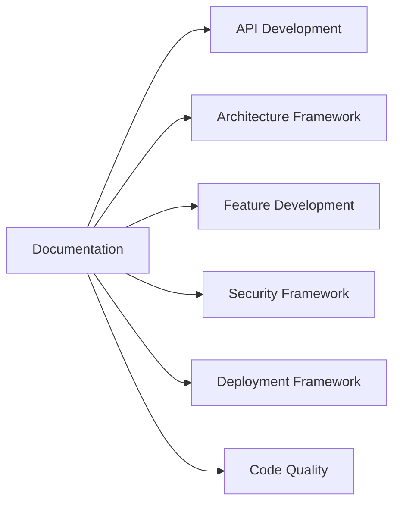

# Documentation Framework

## Overview
The Documentation Framework provides comprehensive guidance for creating maintainable, user-friendly technical documentation that enhances developer experience and project sustainability. It covers documentation-as-code practices, automated generation, and interactive documentation aligned with AI-DLC principles for 50-80% productivity gains.

## Framework Components

### 1. AI Context (`documentation-prompt.md`)
- Specialized technical writing expertise context
- Integration points with other AI-DLC frameworks
- Context-aware guidance for different documentation types and audiences
- 6-day development cycle approach

### 2. Development Checklist (`documentation-checklist.md`)
- **Phase 1**: Documentation planning and architecture (Days 1-2)
- **Phase 2**: Core documentation creation (Days 3-4)
- **Phase 3**: Interactive content and examples (Day 5)
- **Phase 4**: Deployment and optimization (Day 6)

### 3. Documentation Templates (`documentation-template.md`)
- OpenAPI/Swagger API documentation
- Comprehensive README templates
- User guide and tutorial formats
- Docusaurus static site configuration
- CI/CD pipeline for documentation automation

## Key Features

### Documentation-as-Code
- **Version Control**: Documentation lives alongside code
- **Automated Generation**: API docs generated from code
- **Review Process**: Documentation changes go through PR review
- **Continuous Integration**: Automated testing and deployment

### Multi-Audience Support
- **Developers**: API references, architecture docs, contributing guides
- **End Users**: Tutorials, feature guides, troubleshooting
- **Operations**: Deployment guides, runbooks, monitoring procedures
- **Compliance**: Security procedures, audit documentation

### Interactive Experience
- **Live Examples**: Runnable code snippets and API calls
- **Search Integration**: Full-text search with faceted filtering
- **Responsive Design**: Mobile-friendly documentation
- **Feedback Systems**: User ratings and improvement suggestions

## Integration Points



## Quick Start

### 1. Documentation Setup
```bash
# Initialize documentation site
npx create-docusaurus@latest docs classic
cd docs

# Install additional plugins
npm install @docusaurus/plugin-content-docs
npm install docusaurus-plugin-openapi-docs
```

### 2. API Documentation
```yaml
# Use OpenAPI template for comprehensive API docs
openapi: 3.0.3
info:
  title: Your API
  version: 1.0.0
  description: |
    Comprehensive API documentation with examples.
```

### 3. Content Creation
```markdown
# Use structured templates for consistency
## Overview
## Quick Start
## Detailed Guides
## API Reference
## Troubleshooting
```

## Success Metrics

### Coverage Targets
- **API Documentation**: 100% endpoint coverage with examples
- **Code Documentation**: 90% inline documentation coverage
- **User Guides**: 100% feature coverage with tutorials
- **Operational Docs**: Complete deployment and maintenance guides

### Quality Metrics
- **Accuracy**: <5% documentation defects in user feedback
- **Usability**: >90% user satisfaction on documentation usefulness
- **Findability**: <30 seconds average time to find information
- **Maintenance**: 80% automated documentation updates

### Automation Metrics
- **Build Time**: <5 minutes for complete documentation rebuild
- **Link Validation**: 100% internal link validation coverage
- **Test Coverage**: All code examples tested and validated
- **Deployment**: Automated deployment on every main branch update

## Best Practices

### Content Strategy
1. **User-Centric Design**: Structure content around user goals
2. **Progressive Disclosure**: Start simple, provide deep-dive options
3. **Consistent Voice**: Maintain consistent tone and terminology
4. **Visual Hierarchy**: Use headings, lists, and formatting effectively

### Technical Implementation
```javascript
// Automated API documentation generation
const swaggerJsdoc = require('swagger-jsdoc');

const options = {
  definition: {
    openapi: '3.0.0',
    info: {
      title: 'API Documentation',
      version: '1.0.0',
    },
  },
  apis: ['./routes/*.js'], // paths to files containing OpenAPI definitions
};

const specs = swaggerJsdoc(options);
```

### Documentation Testing
```bash
# Test all code examples
npm run test:docs

# Validate links
npm run lint:links

# Check accessibility
npm run a11y:docs
```

## Common Patterns

### API Documentation Structure
```
/api-docs
├── overview.md           # API introduction and concepts
├── authentication.md    # Auth methods and examples
├── endpoints/           # Individual endpoint documentation
│   ├── users.md
│   ├── orders.md
│   └── webhooks.md
├── sdks/               # SDK documentation and examples
├── errors.md           # Error codes and troubleshooting
└── changelog.md        # API version history
```

### User Guide Structure
```
/user-guides
├── getting-started.md   # Onboarding and first steps
├── tutorials/          # Step-by-step guides
│   ├── basic-setup.md
│   ├── advanced-config.md
│   └── integrations.md
├── features/           # Feature-specific documentation
├── troubleshooting.md  # Common issues and solutions
└── faq.md             # Frequently asked questions
```

### Developer Documentation
```
/developer-docs
├── architecture.md      # System design and patterns
├── setup/              # Development environment
├── contributing.md     # Contribution guidelines
├── testing.md          # Testing procedures
├── deployment.md       # Deployment procedures
└── apis/              # Internal API documentation
```

## Automation Workflows

### Documentation Generation
```yaml
# GitHub Actions workflow for docs
name: Documentation
on:
  push:
    branches: [main]
    paths: ['docs/**', 'api-spec.yaml']

jobs:
  build-deploy:
    runs-on: ubuntu-latest
    steps:
      - uses: actions/checkout@v3
      - name: Generate API docs
        run: npx redoc-cli build api-spec.yaml
      - name: Build documentation
        run: npm run build
      - name: Deploy to GitHub Pages
        uses: peaceiris/actions-gh-pages@v3
```

### Content Validation
```javascript
// Automated content validation
const validateDocumentation = async () => {
  // Check for broken links
  await checkLinks('./docs');
  
  // Validate code examples
  await testCodeExamples('./docs');
  
  // Check accessibility
  await checkAccessibility('./build');
  
  // Validate API examples
  await validateAPIExamples('./api-spec.yaml');
};
```

### Analytics and Feedback
```javascript
// Documentation analytics setup
const analytics = {
  // Track page views and user journeys
  pageViews: true,
  userFlow: true,
  
  // Collect user feedback
  feedback: {
    enabled: true,
    questions: [
      'Was this page helpful?',
      'What could be improved?'
    ]
  },
  
  // Monitor search queries
  search: {
    tracking: true,
    popularQueries: true,
    zeroResults: true
  }
};
```

## Tools and Technologies

### Documentation Platforms
- **Static Site Generators**: Docusaurus, GitBook, MkDocs, Hugo
- **API Documentation**: Swagger/OpenAPI, Postman, Insomnia
- **Collaborative**: Notion, Confluence, GitBook
- **Hosting**: GitHub Pages, Netlify, Vercel, AWS S3

### Content Creation Tools
- **Diagramming**: Mermaid, PlantUML, Lucidchart, draw.io
- **Screenshots**: CloudApp, Snagit, LightShot
- **Video**: Loom, OBS Studio, Camtasia
- **Interactive**: CodePen, JSFiddle, Observable

### Quality Assurance
```bash
# Link checking
npx broken-link-checker http://localhost:3000

# Accessibility testing
npx pa11y-ci http://localhost:3000

# Performance testing
npx lighthouse-ci http://localhost:3000

# Content linting
npx alex docs/**/*.md
npx write-good docs/**/*.md
```

## Maintenance Strategy

### Regular Reviews
- **Quarterly**: Comprehensive content audit and user feedback review
- **Monthly**: Link validation and broken content fixes
- **Weekly**: New feature documentation updates
- **Daily**: Automated testing and deployment monitoring

### Content Lifecycle
1. **Planning**: Identify documentation needs
2. **Creation**: Write and review content
3. **Publication**: Deploy and announce updates
4. **Maintenance**: Regular updates and improvements
5. **Archival**: Remove or update outdated content

### Metrics Tracking
```javascript
// Documentation health metrics
const metrics = {
  coverage: {
    api: '100%',
    features: '95%',
    codebase: '90%'
  },
  quality: {
    brokenLinks: 0,
    userSatisfaction: '4.5/5',
    timeToFind: '25 seconds'
  },
  usage: {
    pageViews: 10000,
    searchQueries: 1500,
    feedbackResponses: 200
  }
};
```

## Framework Evolution

### Version History
- **v1.0**: Basic documentation templates and workflows
- **v1.1**: Interactive examples and API documentation
- **v1.2**: Automated testing and validation
- **v2.0**: AI-assisted content generation

### Roadmap
- [ ] AI-powered content suggestions
- [ ] Advanced analytics and user journey mapping
- [ ] Multi-language documentation support
- [ ] Integrated community contributions

This framework enables teams to create and maintain high-quality documentation efficiently while ensuring consistency, accuracy, and excellent user experience across all documentation touchpoints.