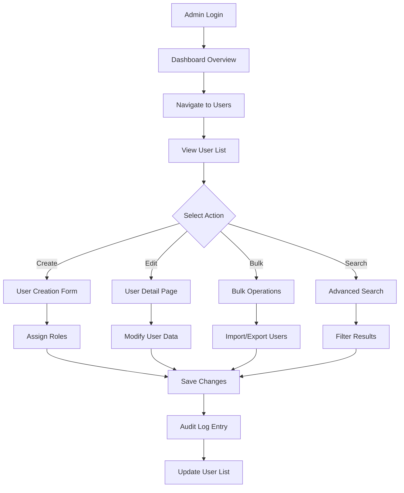
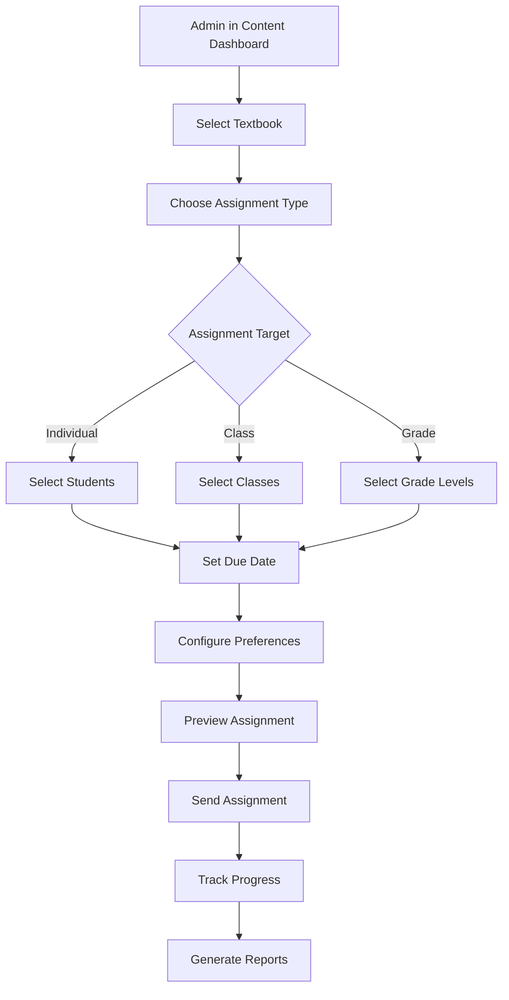

# Phase 6: Admin Dashboard & User Management System

**Priority Level**: 2 - Enhancement Features
**Duration**: 3-4 days
**Dependencies**: Phase 5 (Support System) completion
**Compliance**: COPPA/FERPA enhanced controls

## Executive Summary

Implement a comprehensive admin dashboard that transforms Virtual Tutor from a basic tutoring platform into a fully-managed educational system. This phase enables administrative oversight, user management, content control, and real-time analytics essential for scaling from hundreds to thousands of users while maintaining educational compliance and operational efficiency.

## Problem Statement

### Current Limitations
1. **No Administrative Oversight**: Unable to monitor platform usage, user behavior, or system health
2. **Manual User Management**: No tools for bulk user operations, role assignments, or account management
3. **Content Control Gap**: No system for managing textbook assignments, content moderation, or curriculum control
4. **Analytics Void**: Limited insights into learning outcomes, usage patterns, or platform performance
5. **Scalability Bottleneck**: Manual processes cannot support growth beyond current user base

### Business Impact
- **Operational Inefficiency**: 20-30 hours weekly spent on manual administration
- **Compliance Risk**: Limited audit trails for COPPA/FERPA requirements
- **Growth Constraint**: Cannot scale to district-level deployments without admin tools
- **Data Blindness**: Missing insights that could improve educational outcomes
- **Competitive Disadvantage**: Lack of enterprise features compared to established platforms

## Solution Architecture

### Multi-Tier Admin Hierarchy

```
Super Admin (Platform Level)
    ├── School Admin (Institution Level)
    │   ├── Teacher (Classroom Level)
    │   ├── Student (Learner Level)
    │   └── Parent (Guardian Level)
    └── Support Agent (Service Level)
```

### Core Admin Capabilities

#### 1. User Management System
- **Role-Based Access Control (RBAC)**: Granular permissions for each user type
- **Bulk Operations**: Import/export users, batch role assignments, mass communications
- **Account Lifecycle**: Creation, activation, suspension, deletion with audit trails
- **Parent-Student Linking**: Secure verification and relationship management

#### 2. Content Management Dashboard
- **Textbook Administration**: Upload, categorize, assign to grades/subjects/classes
- **Content Moderation**: Review and approve user-generated content and interactions
- **Curriculum Control**: Configure learning paths, prerequisites, and assessments
- **Usage Analytics**: Track content engagement, completion rates, effectiveness

#### 3. Real-Time Analytics Platform
- **Live Monitoring**: Active sessions, concurrent users, system performance
- **Educational Insights**: Learning outcomes, progress patterns, intervention needs
- **Operational Metrics**: Platform usage, feature adoption, error rates
- **Compliance Reporting**: Data access logs, privacy requests, security incidents

#### 4. Administrative Controls
- **System Configuration**: Platform settings, feature flags, integration management
- **Security Center**: Permission management, audit logs, breach detection
- **Communication Hub**: Announcements, notifications, emergency broadcasts
- **Support Integration**: Ticket management, escalation workflows, knowledge base

## Technical Design

### Database Schema Extensions

```sql
-- Admin roles and permissions
CREATE TABLE admin_roles (
  id UUID PRIMARY KEY DEFAULT gen_random_uuid(),
  name TEXT NOT NULL UNIQUE,
  description TEXT,
  permissions JSONB NOT NULL DEFAULT '[]'::jsonb,
  hierarchy_level INTEGER NOT NULL,
  created_at TIMESTAMPTZ DEFAULT NOW()
);

-- User role assignments
CREATE TABLE user_role_assignments (
  id UUID PRIMARY KEY DEFAULT gen_random_uuid(),
  user_id UUID REFERENCES auth.users(id) ON DELETE CASCADE,
  role_id UUID REFERENCES admin_roles(id) ON DELETE CASCADE,
  assigned_by UUID REFERENCES auth.users(id),
  scope_type TEXT CHECK (scope_type IN ('global', 'school', 'class', 'student')),
  scope_id TEXT, -- Could reference school_id, class_id, student_id
  created_at TIMESTAMPTZ DEFAULT NOW(),
  expires_at TIMESTAMPTZ,
  UNIQUE(user_id, role_id, scope_type, scope_id)
);

-- Admin activity logs
CREATE TABLE admin_activity_logs (
  id UUID PRIMARY KEY DEFAULT gen_random_uuid(),
  admin_user_id UUID REFERENCES auth.users(id),
  action TEXT NOT NULL,
  resource_type TEXT NOT NULL,
  resource_id TEXT,
  details JSONB DEFAULT '{}'::jsonb,
  ip_address TEXT,
  user_agent TEXT,
  created_at TIMESTAMPTZ DEFAULT NOW()
);

-- Content assignments
CREATE TABLE content_assignments (
  id UUID PRIMARY KEY DEFAULT gen_random_uuid(),
  textbook_id UUID REFERENCES textbooks(id) ON DELETE CASCADE,
  assigned_to_type TEXT CHECK (assigned_to_type IN ('user', 'class', 'grade', 'school')),
  assigned_to_id TEXT NOT NULL,
  assigned_by UUID REFERENCES auth.users(id),
  due_date TIMESTAMPTZ,
  status TEXT DEFAULT 'active' CHECK (status IN ('active', 'completed', 'overdue', 'cancelled')),
  created_at TIMESTAMPTZ DEFAULT NOW()
);

-- System metrics cache
CREATE TABLE platform_metrics (
  id UUID PRIMARY KEY DEFAULT gen_random_uuid(),
  metric_type TEXT NOT NULL,
  metric_key TEXT NOT NULL,
  metric_value DECIMAL,
  metadata JSONB DEFAULT '{}'::jsonb,
  recorded_at TIMESTAMPTZ DEFAULT NOW(),
  UNIQUE(metric_type, metric_key, recorded_at)
);

-- Performance indexes
CREATE INDEX idx_activity_logs_admin ON admin_activity_logs(admin_user_id, created_at DESC);
CREATE INDEX idx_role_assignments_user ON user_role_assignments(user_id);
CREATE INDEX idx_content_assignments_assigned ON content_assignments(assigned_to_type, assigned_to_id);
CREATE INDEX idx_metrics_type_time ON platform_metrics(metric_type, recorded_at DESC);
```

### API Routes Structure

```typescript
// /app/api/admin/
├── users/
│   ├── route.ts              // GET (list), POST (create)
│   ├── [id]/
│   │   ├── route.ts          // GET, PATCH, DELETE
│   │   ├── roles/
│   │   │   └── route.ts      // GET, POST, DELETE roles
│   │   └── activity/
│   │       └── route.ts      // GET user activity logs
│   ├── bulk/
│   │   ├── import/
│   │   │   └── route.ts      // POST bulk user import
│   │   └── export/
│   │       └── route.ts      // GET user data export
│   └── search/
│       └── route.ts          // GET advanced user search
├── content/
│   ├── textbooks/
│   │   ├── route.ts          // GET (list), POST (create)
│   │   ├── [id]/
│   │   │   ├── route.ts      // GET, PATCH, DELETE
│   │   │   ├── assign/
│   │   │   │   └── route.ts  // POST assign to users/classes
│   │   │   └── analytics/
│   │   │       └── route.ts  // GET usage analytics
│   │   └── bulk/
│   │       └── route.ts      // POST bulk operations
│   └── assignments/
│       ├── route.ts          // GET (list), POST (create)
│       └── [id]/
│           └── route.ts      // GET, PATCH, DELETE
├── analytics/
│   ├── overview/
│   │   └── route.ts          // GET dashboard metrics
│   ├── users/
│   │   └── route.ts          // GET user analytics
│   ├── content/
│   │   └── route.ts          // GET content analytics
│   ├── performance/
│   │   └── route.ts          // GET system performance
│   └── export/
│       └── route.ts          // GET/POST report generation
├── system/
│   ├── settings/
│   │   └── route.ts          // GET, PATCH platform settings
│   ├── health/
│   │   └── route.ts          // GET system health check
│   ├── logs/
│   │   └── route.ts          // GET system and admin logs
│   └── notifications/
│       └── route.ts          // GET, POST system notifications
└── security/
    ├── permissions/
    │   └── route.ts          // GET, POST permission checks
    ├── audit/
    │   └── route.ts          // GET audit trails
    └── compliance/
        └── route.ts          // GET compliance reports
```

## Implementation Phases

### Phase 6.1: Core Admin Framework (Day 1)

**Goal**: Establish RBAC system and basic admin dashboard

**Tasks**:
1. Implement role-based access control system
2. Create admin dashboard layout and navigation
3. Build user management interface
4. Add admin authentication and session management
5. Implement basic audit logging

**Deliverables**:
- RBAC middleware and database schema
- Admin dashboard shell with navigation
- Basic user list and detail views
- Admin login flow with role verification

### Phase 6.2: User Management System (Day 2)

**Goal**: Complete user administration capabilities

**Tasks**:
1. Build comprehensive user management interface
2. Implement bulk operations (import/export)
3. Create role assignment and permission management
4. Add user search and filtering capabilities
5. Implement parent-student account linking

**Deliverables**:
- Full-featured user management dashboard
- CSV import/export functionality
- Advanced search and filtering
- Role assignment interface

### Phase 6.3: Content Management Dashboard (Day 3)

**Goal**: Enable content administration and assignment

**Tasks**:
1. Create textbook management interface
2. Implement content assignment workflows
3. Build content analytics and usage tracking
4. Add bulk content operations
5. Create content moderation tools

**Deliverables**:
- Content management dashboard
- Assignment creation and tracking
- Usage analytics visualization
- Bulk content operations

### Phase 6.4: Analytics & Reporting (Day 4)

**Goal**: Provide comprehensive platform insights

**Tasks**:
1. Build real-time analytics dashboard
2. Implement educational outcome tracking
3. Create custom report builder
4. Add performance monitoring tools
5. Build compliance reporting system

**Deliverables**:
- Live analytics dashboard
- Educational metrics tracking
- Custom report generation
- Performance monitoring tools

## Component Architecture

### Admin Dashboard Components

```typescript
// /components/admin/
├── layout/
│   ├── admin-shell.tsx       // Main admin layout
│   ├── admin-sidebar.tsx     // Navigation sidebar
│   ├── admin-header.tsx      // Top navigation bar
│   └── breadcrumb-nav.tsx    // Breadcrumb navigation
├── overview/
│   ├── metrics-grid.tsx      // KPI summary cards
│   ├── activity-timeline.tsx // Recent activity feed
│   ├── usage-chart.tsx       // Platform usage trends
│   └── alerts-panel.tsx      // System alerts/notifications
├── users/
│   ├── user-table.tsx        // Paginated user list
│   ├── user-detail.tsx       // User profile and edit
│   ├── user-form.tsx         // Create/edit user form
│   ├── role-manager.tsx      // Role assignment interface
│   ├── bulk-import.tsx       // CSV import wizard
│   └── user-search.tsx       // Advanced search interface
├── content/
│   ├── textbook-manager.tsx  // Content library interface
│   ├── assignment-creator.tsx // Content assignment wizard
│   ├── content-analytics.tsx // Usage and performance metrics
│   ├── upload-interface.tsx  // File upload with progress
│   └── moderation-queue.tsx  // Content approval workflow
├── analytics/
│   ├── dashboard-overview.tsx // Main analytics dashboard
│   ├── learning-metrics.tsx  // Educational outcome charts
│   ├── usage-reports.tsx     // Platform usage analysis
│   ├── performance-monitor.tsx // System performance
│   └── report-builder.tsx    // Custom report creation
├── security/
│   ├── audit-log.tsx         // Activity audit interface
│   ├── permission-matrix.tsx // Permission visualization
│   ├── compliance-status.tsx // COPPA/FERPA compliance
│   └── security-alerts.tsx   // Security incident tracking
└── shared/
    ├── data-table.tsx        // Reusable data table
    ├── chart-components.tsx  // Chart library wrappers
    ├── export-button.tsx     // Data export functionality
    └── confirmation-modal.tsx // Action confirmation dialogs
```

### Service Layer Architecture

```typescript
// /lib/services/admin/
├── user-management.service.ts  // User CRUD and role management
├── content-management.service.ts // Content operations and assignments
├── analytics.service.ts        // Data aggregation and metrics
├── audit.service.ts           // Activity logging and compliance
├── notification.service.ts    // System notifications and alerts
├── export.service.ts          // Data export and reporting
└── security.service.ts        // Permission checks and validation
```

## User Flows

### Admin User Management Flow



### Content Assignment Flow



## Role-Based Access Control (RBAC)

### Permission Structure

```typescript
interface AdminPermission {
  resource: 'users' | 'content' | 'analytics' | 'settings' | 'security'
  action: 'view' | 'create' | 'edit' | 'delete' | 'assign' | 'export'
  scope: 'global' | 'school' | 'class' | 'own'
  conditions?: {
    require_approval?: boolean
    audit_required?: boolean
    time_restricted?: boolean
  }
}

// Example role definitions
const ADMIN_ROLES = {
  super_admin: {
    name: 'Super Administrator',
    permissions: [
      { resource: '*', action: '*', scope: 'global' }
    ]
  },
  school_admin: {
    name: 'School Administrator',
    permissions: [
      { resource: 'users', action: ['view', 'create', 'edit'], scope: 'school' },
      { resource: 'content', action: ['view', 'assign'], scope: 'school' },
      { resource: 'analytics', action: ['view', 'export'], scope: 'school' }
    ]
  },
  teacher: {
    name: 'Teacher',
    permissions: [
      { resource: 'users', action: ['view'], scope: 'class' },
      { resource: 'content', action: ['view', 'assign'], scope: 'class' },
      { resource: 'analytics', action: ['view'], scope: 'class' }
    ]
  }
}
```

### Security Middleware

```typescript
// /middleware/admin-auth.ts
export function requireAdminRole(requiredRole: string, requiredPermission?: string) {
  return async (req: Request, context: any) => {
    const session = await auth()

    if (!session?.user) {
      return Response.redirect('/admin/login')
    }

    const userRoles = await getUserRoles(session.user.id)
    const hasRequiredRole = userRoles.some(role =>
      role.hierarchy_level >= getRoleLevel(requiredRole)
    )

    if (!hasRequiredRole) {
      return Response.json({ error: 'Insufficient permissions' }, { status: 403 })
    }

    if (requiredPermission && !await hasPermission(session.user.id, requiredPermission)) {
      return Response.json({ error: 'Action not permitted' }, { status: 403 })
    }

    return NextResponse.next()
  }
}
```

## Analytics & Metrics

### Real-Time Dashboard Metrics

**User Activity Metrics**
- Active sessions (current)
- Daily/weekly/monthly active users
- User growth trends
- Login success/failure rates
- Session duration averages

**Educational Performance Metrics**
- Learning outcome improvements
- Content completion rates
- Time-to-mastery tracking
- Help request frequency
- Assessment score trends

**System Performance Metrics**
- API response times
- Database query performance
- Error rates and types
- Resource utilization
- Uptime monitoring

**Business Metrics**
- User acquisition costs
- Retention rates by cohort
- Feature adoption rates
- Support ticket volumes
- Revenue attribution

### Custom Report Builder

```typescript
interface ReportConfiguration {
  title: string
  description?: string
  filters: {
    date_range: { start: Date; end: Date }
    user_types?: string[]
    schools?: string[]
    grades?: string[]
    subjects?: string[]
  }
  metrics: {
    name: string
    aggregation: 'sum' | 'avg' | 'count' | 'min' | 'max'
    field: string
  }[]
  groupBy?: string[]
  sortBy?: { field: string; direction: 'asc' | 'desc' }
  format: 'table' | 'chart' | 'export'
}
```

## Security & Compliance

### Enhanced Educational Data Protection

**COPPA Compliance Features**
- Parental consent tracking and management
- Automated data retention and deletion policies
- Child-safe communication channels
- Granular privacy controls per child
- Audit trails for all child data access

**FERPA Compliance Features**
- Educational record classification
- Directory information controls
- Access logging for academic data
- Consent management for data sharing
- Secure data transfer protocols

### Security Controls

**Access Control**
- Multi-factor authentication for admin accounts
- Session timeout and concurrent session limits
- IP allowlisting for admin panel access
- Role-based permission enforcement
- Regular access reviews and deprovisioning

**Data Protection**
- End-to-end encryption for sensitive data
- Database-level encryption at rest
- Secure API communication (TLS 1.3)
- PII tokenization for non-essential systems
- Regular security penetration testing

## Testing Strategy

### Unit Tests
- RBAC permission logic
- User management operations
- Content assignment workflows
- Analytics calculations
- Data export/import functions

### Integration Tests
- Admin authentication flow
- Database operation sequences
- API endpoint security
- Third-party service integration
- Email notification delivery

### E2E Tests
- Complete admin workflows
- Multi-role permission scenarios
- Bulk operation execution
- Report generation processes
- Security boundary testing

### Security Tests
- Permission bypass attempts
- SQL injection prevention
- Cross-site scripting (XSS) protection
- Authentication bypass testing
- Data access boundary validation

## Performance Optimization

### Database Optimization
- Indexed queries for admin operations
- Materialized views for analytics
- Connection pooling for concurrent users
- Query result caching
- Database partitioning for large datasets

### Frontend Optimization
- Lazy loading for large datasets
- Virtual scrolling for user lists
- Progressive data fetching
- Chart rendering optimization
- Responsive image loading

### API Optimization
- Request/response compression
- API rate limiting and throttling
- Caching layer for frequently accessed data
- Background processing for bulk operations
- Optimistic UI updates

## Deployment & Monitoring

### Infrastructure Requirements
- Load balancer for admin traffic
- Dedicated admin database connections
- Redis cache for session management
- File storage for bulk imports/exports
- Monitoring and alerting systems

### Monitoring Setup
- Real-time performance dashboards
- Error tracking and alerting
- Security incident detection
- Capacity planning metrics
- User experience monitoring

### Backup & Recovery
- Daily automated database backups
- Configuration and settings backup
- Disaster recovery procedures
- Data retention policy enforcement
- Point-in-time recovery capabilities

## Success Metrics

### Operational Efficiency
- **Admin Task Time**: 70% reduction in routine administration time
- **User Onboarding**: 90% faster new user setup and configuration
- **Error Reduction**: 85% fewer manual data entry errors
- **Automation Rate**: 80% of routine tasks automated

### User Experience
- **Admin Satisfaction**: >85% positive feedback on admin tools usability
- **Feature Adoption**: >90% of admins using core features within 30 days
- **Support Reduction**: 60% fewer admin-related support tickets
- **Training Time**: 50% reduction in admin onboarding time

### Educational Impact
- **Data-Driven Decisions**: Measurable increase in analytics-informed choices
- **Student Outcomes**: Improved learning metrics through better oversight
- **Teacher Efficiency**: Reduced administrative burden on educators
- **Parent Engagement**: Increased participation through better communication tools

## Cost Analysis

### Development Investment
- **Core Development**: 3-4 weeks at current velocity
- **Testing & QA**: 1 week comprehensive testing
- **Documentation**: 0.5 weeks user guides and admin documentation
- **Total**: ~4.5 weeks development effort

### Infrastructure Costs
- **Additional Hosting**: $50-100/month for admin-specific resources
- **Monitoring Tools**: $30-50/month for enhanced monitoring
- **Security Tools**: $40-60/month for admin security features
- **Total**: $120-210/month incremental costs

### ROI Calculation
- **Time Savings**: 20-30 hours/week × $50/hour = $1,000-1,500/week saved
- **Compliance Cost Avoidance**: $51,744 potential COPPA fine avoidance
- **Growth Enablement**: Support 10x user growth without proportional admin overhead
- **Payback Period**: 2-3 months based on time savings alone

## Risk Mitigation

### Technical Risks
- **Performance Impact**: Load testing and optimization before launch
- **Security Vulnerabilities**: Comprehensive security audit and penetration testing
- **Data Corruption**: Extensive backup and recovery procedures
- **Integration Failures**: Gradual rollout with fallback procedures

### Operational Risks
- **Admin Training**: Comprehensive documentation and hands-on training
- **Change Management**: Phased rollout with user feedback integration
- **Compliance Gaps**: Legal review of all compliance-related features
- **User Resistance**: Involving key admins in design and testing phases

## Future Enhancements (Post-Phase 6)

### Advanced Analytics (Phase 6.1)
- Predictive analytics for student outcomes
- AI-powered insights and recommendations
- Advanced data visualization options
- Custom dashboard creation tools

### Integration Platform (Phase 6.2)
- Google Classroom integration
- Microsoft Teams for Education connectivity
- Third-party LMS synchronization
- SSO provider integrations

### Mobile Admin App (Phase 6.3)
- Native iOS and Android applications
- Offline capability for essential functions
- Push notifications for critical alerts
- Simplified mobile-first interfaces

### Enterprise Features (Phase 6.4)
- Multi-tenant architecture for districts
- White-label customization options
- Advanced reporting and BI tools
- API management and developer console

## Acceptance Criteria

### Must Have (Phase 6 Core)
- ✅ Role-based access control with educational hierarchy
- ✅ User management with bulk operations
- ✅ Content assignment and tracking system
- ✅ Real-time analytics dashboard
- ✅ Audit logging for compliance

### Should Have (Phase 6 Extended)
- ✅ Advanced reporting and export capabilities
- ✅ Security monitoring and alerts
- ✅ Parent-student account management
- ✅ Performance monitoring tools
- ✅ Automated compliance reporting

### Nice to Have (Future Phases)
- ⏳ AI-powered insights and recommendations
- ⏳ Mobile admin applications
- ⏳ Third-party integrations
- ⏳ Custom dashboard creation
- ⏳ Multi-tenant enterprise features

## Conclusion

Phase 6 represents a critical evolution for Virtual Tutor, transforming it from a functional tutoring platform into a comprehensive educational management system. The admin dashboard provides the oversight, control, and insights necessary to scale operations, ensure compliance, and deliver measurable educational outcomes.

Key benefits include:
- **Operational Excellence**: Streamlined administration with 70% time savings
- **Compliance Assurance**: Automated COPPA/FERPA compliance with comprehensive audit trails
- **Scalability Foundation**: Support growth from hundreds to thousands of users
- **Data-Driven Insights**: Real-time analytics enabling informed educational decisions
- **Competitive Positioning**: Enterprise-grade features comparable to established platforms

This implementation positions Virtual Tutor for successful scaling while maintaining its core mission of personalized AI-powered education.

---

**Document Version**: 1.0
**Created**: September 19, 2025
**Author**: Technical Lead
**Status**: Ready for Implementation
**Dependencies**: [Phase 5 Support System](./phase-5-support-system.md)
**Research Foundation**: [Admin Dashboard Research](../research/phase-6-admin-dashboard-research.md)