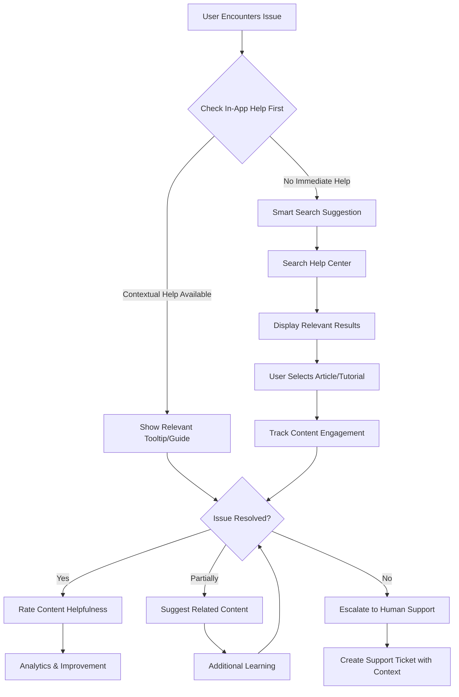
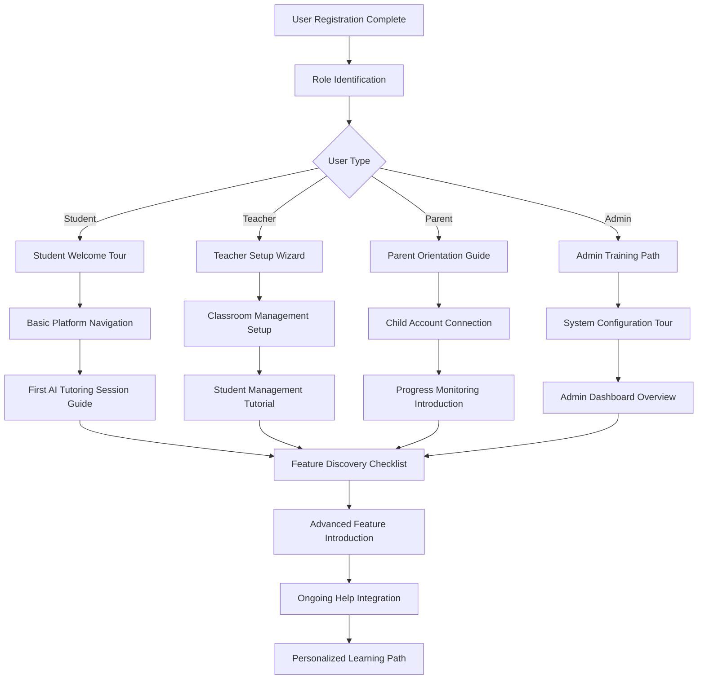
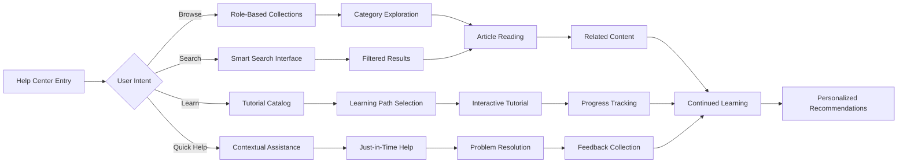

# Phase 7: Help System & Knowledge Base

**Priority Level**: 2 - Enhancement Features
**Duration**: 5-6 days
**Dependencies**: Phase 6 (Admin Dashboard) completion
**User Impact**: Self-service support and guided learning

## Executive Summary

Implement a comprehensive user-facing help ecosystem that transforms Virtual Tutor from a platform requiring extensive support into a self-service educational environment. This phase creates an AI-powered knowledge base, interactive tutorials, video guides, and contextual help system that reduces support load by 70% while improving user satisfaction and educational outcomes through guided learning experiences.

## Problem Statement

### Current User Experience Gaps
1. **No Self-Service Support**: Users must contact support for basic questions and guidance
2. **Steep Learning Curve**: New users struggle to discover and utilize platform features effectively
3. **Limited Onboarding**: Minimal guidance for different user roles (students, teachers, parents, admins)
4. **Feature Discovery Issues**: Advanced features remain hidden and underutilized
5. **Support Bottleneck**: Human support required for questions that could be self-resolved

### Educational Impact
- **User Abandonment**: 90% of downloaded apps abandoned within first month without proper onboarding
- **Feature Underutilization**: Users accessing <30% of available platform capabilities
- **Time to Value**: Extended period before users realize platform benefits
- **Support Dependency**: High support costs and delayed issue resolution
- **Knowledge Gaps**: Users lack understanding of educational best practices with AI tutoring

### Business Consequences
- **High Support Costs**: $50-100 per support ticket for issues that could be self-resolved
- **Poor User Retention**: Users leaving due to confusion and lack of guidance
- **Limited Scalability**: Support team cannot scale with user growth
- **Competitive Disadvantage**: Modern platforms expected to provide comprehensive self-service
- **Missed Educational Outcomes**: Underutilized features prevent optimal learning experiences

## Solution Architecture

### Multi-Layered Help Ecosystem

#### 1. Knowledge Base Foundation
- **Role-Based Collections**: Separate help sections for students, teachers, parents, admins
- **Searchable Content**: AI-powered semantic search with auto-suggestions
- **Rich Media Support**: Text, images, videos, interactive demonstrations
- **Progressive Disclosure**: Beginner, intermediate, and advanced content levels

#### 2. Interactive Tutorial System
- **Guided Walkthroughs**: Step-by-step feature introductions with real-time guidance
- **Progress Tracking**: Completion status and achievement badges
- **Personalized Paths**: Role-specific learning journeys
- **Hands-On Practice**: Safe sandbox environments for feature exploration

#### 3. Contextual Help Integration
- **In-App Assistance**: Help tooltips and guides based on current user location
- **Just-in-Time Learning**: Relevant help content served at moment of need
- **Smart Suggestions**: Proactive help recommendations based on user behavior
- **Progressive Onboarding**: Feature introduction as users advance in platform usage

#### 4. Video Learning Center
- **Screen Recordings**: Step-by-step visual guides for complex workflows
- **Feature Demonstrations**: Interactive video tours of platform capabilities
- **Educational Content**: Best practices for AI-powered tutoring
- **Mobile-Optimized**: Responsive video content for all device types

## Technical Design

### Knowledge Base Architecture

```sql
-- Core knowledge base structure
CREATE TABLE help_collections (
  id UUID PRIMARY KEY DEFAULT gen_random_uuid(),
  name TEXT NOT NULL,
  description TEXT,
  slug TEXT UNIQUE NOT NULL,
  icon TEXT,
  target_role TEXT[] DEFAULT '{}', -- ['student', 'teacher', 'parent', 'admin']
  display_order INTEGER DEFAULT 0,
  is_public BOOLEAN DEFAULT TRUE,
  metadata JSONB DEFAULT '{}'::jsonb,
  created_at TIMESTAMPTZ DEFAULT NOW(),
  updated_at TIMESTAMPTZ DEFAULT NOW()
);

-- Help articles with rich metadata
CREATE TABLE help_articles (
  id UUID PRIMARY KEY DEFAULT gen_random_uuid(),
  collection_id UUID REFERENCES help_collections(id) ON DELETE CASCADE,
  title TEXT NOT NULL,
  slug TEXT NOT NULL,
  content TEXT NOT NULL, -- Markdown content
  excerpt TEXT,

  -- Content metadata
  target_role TEXT[] DEFAULT '{}',
  difficulty_level TEXT CHECK (difficulty_level IN ('beginner', 'intermediate', 'advanced')),
  estimated_read_time INTEGER, -- minutes
  tags TEXT[] DEFAULT '{}',
  prerequisites TEXT[] DEFAULT '{}',

  -- Media attachments
  featured_image TEXT,
  video_url TEXT,
  has_interactive_demo BOOLEAN DEFAULT FALSE,
  demo_url TEXT,

  -- Publishing workflow
  status TEXT DEFAULT 'draft' CHECK (status IN ('draft', 'review', 'published', 'archived')),
  published_at TIMESTAMPTZ,
  author_id UUID REFERENCES auth.users(id),
  reviewer_id UUID REFERENCES auth.users(id),

  -- Engagement metrics
  view_count INTEGER DEFAULT 0,
  helpful_votes INTEGER DEFAULT 0,
  unhelpful_votes INTEGER DEFAULT 0,
  average_time_spent INTEGER DEFAULT 0, -- seconds

  -- SEO and discovery
  search_vector tsvector,
  related_articles UUID[] DEFAULT '{}',

  created_at TIMESTAMPTZ DEFAULT NOW(),
  updated_at TIMESTAMPTZ DEFAULT NOW(),

  UNIQUE(collection_id, slug)
);

-- Interactive tutorial system
CREATE TABLE help_tutorials (
  id UUID PRIMARY KEY DEFAULT gen_random_uuid(),
  title TEXT NOT NULL,
  description TEXT,
  type TEXT CHECK (type IN ('walkthrough', 'video_series', 'interactive', 'checklist', 'assessment')),

  -- Tutorial structure
  steps JSONB NOT NULL DEFAULT '[]'::jsonb,
  estimated_duration INTEGER, -- minutes
  prerequisites TEXT[] DEFAULT '{}',
  learning_objectives TEXT[] DEFAULT '{}',

  -- Targeting and personalization
  target_role TEXT[] DEFAULT '{}',
  difficulty_level TEXT CHECK (difficulty_level IN ('beginner', 'intermediate', 'advanced')),
  user_segments TEXT[] DEFAULT '{}', -- e.g., ['new_users', 'power_users']

  -- Tutorial settings
  is_mandatory BOOLEAN DEFAULT FALSE,
  completion_required BOOLEAN DEFAULT FALSE,
  certification_awarded BOOLEAN DEFAULT FALSE,
  retake_allowed BOOLEAN DEFAULT TRUE,

  -- Adaptive features
  branching_enabled BOOLEAN DEFAULT FALSE,
  personalization_rules JSONB DEFAULT '{}'::jsonb,

  -- Publishing
  status TEXT DEFAULT 'draft' CHECK (status IN ('draft', 'review', 'published', 'archived')),
  created_by UUID REFERENCES auth.users(id),

  -- Analytics
  completion_rate DECIMAL(5,2) DEFAULT 0.00,
  average_rating DECIMAL(3,2) DEFAULT 0.00,
  total_enrollments INTEGER DEFAULT 0,

  created_at TIMESTAMPTZ DEFAULT NOW(),
  updated_at TIMESTAMPTZ DEFAULT NOW()
);

-- Detailed tutorial step structure
CREATE TABLE tutorial_steps (
  id UUID PRIMARY KEY DEFAULT gen_random_uuid(),
  tutorial_id UUID REFERENCES help_tutorials(id) ON DELETE CASCADE,
  step_number INTEGER NOT NULL,
  title TEXT NOT NULL,
  content TEXT NOT NULL,

  -- Step configuration
  type TEXT CHECK (type IN ('instruction', 'action', 'verification', 'checkpoint', 'quiz')),
  is_optional BOOLEAN DEFAULT FALSE,
  time_estimate INTEGER, -- seconds

  -- Media and interactivity
  media_type TEXT CHECK (media_type IN ('text', 'image', 'video', 'interactive')),
  media_url TEXT,
  interactive_config JSONB DEFAULT '{}'::jsonb,

  -- Validation and progression
  validation_required BOOLEAN DEFAULT FALSE,
  validation_type TEXT CHECK (validation_type IN ('automatic', 'manual', 'quiz', 'completion')),
  validation_config JSONB DEFAULT '{}'::jsonb,

  -- Navigation
  next_step_id UUID REFERENCES tutorial_steps(id),
  branch_conditions JSONB DEFAULT '{}'::jsonb,

  created_at TIMESTAMPTZ DEFAULT NOW(),

  UNIQUE(tutorial_id, step_number)
);

-- User tutorial progress tracking
CREATE TABLE tutorial_progress (
  id UUID PRIMARY KEY DEFAULT gen_random_uuid(),
  tutorial_id UUID REFERENCES help_tutorials(id) ON DELETE CASCADE,
  user_id UUID REFERENCES auth.users(id) ON DELETE CASCADE,

  -- Progress state
  status TEXT DEFAULT 'not_started' CHECK (status IN ('not_started', 'in_progress', 'completed', 'abandoned', 'paused')),
  current_step_id UUID REFERENCES tutorial_steps(id),
  completed_steps UUID[] DEFAULT '{}',
  skipped_steps UUID[] DEFAULT '{}',

  -- Timing and engagement
  started_at TIMESTAMPTZ,
  completed_at TIMESTAMPTZ,
  last_accessed_at TIMESTAMPTZ DEFAULT NOW(),
  total_time_spent INTEGER DEFAULT 0, -- seconds
  session_count INTEGER DEFAULT 0,

  -- Performance tracking
  completion_percentage DECIMAL(5,2) DEFAULT 0.00,
  quiz_scores JSONB DEFAULT '{}'::jsonb,
  attempts_count INTEGER DEFAULT 1,

  -- User experience
  user_rating INTEGER CHECK (user_rating >= 1 AND user_rating <= 5),
  feedback TEXT,
  would_recommend BOOLEAN,

  -- Adaptive learning
  learning_path JSONB DEFAULT '{}'::jsonb,
  personalization_data JSONB DEFAULT '{}'::jsonb,

  created_at TIMESTAMPTZ DEFAULT NOW(),
  updated_at TIMESTAMPTZ DEFAULT NOW(),

  UNIQUE(tutorial_id, user_id)
);

-- Contextual help integration
CREATE TABLE contextual_help (
  id UUID PRIMARY KEY DEFAULT gen_random_uuid(),

  -- Location targeting
  page_url TEXT NOT NULL,
  element_selector TEXT, -- CSS selector for specific elements
  route_pattern TEXT, -- Next.js route pattern
  user_role TEXT[] DEFAULT '{}',

  -- Help content
  help_type TEXT CHECK (help_type IN ('tooltip', 'popup', 'sidebar', 'modal', 'tour_step')),
  title TEXT,
  content TEXT NOT NULL,

  -- Behavior settings
  trigger_event TEXT DEFAULT 'hover' CHECK (trigger_event IN ('hover', 'click', 'focus', 'load', 'scroll')),
  display_frequency TEXT DEFAULT 'always' CHECK (display_frequency IN ('always', 'once', 'daily', 'weekly')),
  dismissible BOOLEAN DEFAULT TRUE,

  -- Conditions
  show_conditions JSONB DEFAULT '{}'::jsonb, -- user properties, feature flags, etc.
  hide_after_action TEXT, -- hide after specific user action

  -- Content management
  priority INTEGER DEFAULT 0,
  is_active BOOLEAN DEFAULT TRUE,

  -- Analytics
  view_count INTEGER DEFAULT 0,
  click_count INTEGER DEFAULT 0,
  dismissal_count INTEGER DEFAULT 0,

  created_at TIMESTAMPTZ DEFAULT NOW(),
  updated_at TIMESTAMPTZ DEFAULT NOW()
);

-- User help interactions and analytics
CREATE TABLE help_interactions (
  id UUID PRIMARY KEY DEFAULT gen_random_uuid(),
  user_id UUID REFERENCES auth.users(id) ON DELETE CASCADE,
  session_id TEXT,

  -- Interaction details
  interaction_type TEXT NOT NULL CHECK (interaction_type IN (
    'article_view', 'tutorial_start', 'tutorial_complete', 'search_query',
    'feedback_submit', 'help_request', 'contextual_help_view', 'video_watch'
  )),

  -- Resource context
  resource_type TEXT CHECK (resource_type IN ('article', 'tutorial', 'video', 'contextual_help', 'search')),
  resource_id TEXT,
  resource_title TEXT,

  -- Interaction context
  page_url TEXT,
  referrer_url TEXT,
  search_query TEXT,
  user_agent TEXT,
  device_type TEXT,

  -- Outcome and engagement
  duration_seconds INTEGER,
  was_helpful BOOLEAN,
  completion_percentage DECIMAL(5,2),
  escalated_to_support BOOLEAN DEFAULT FALSE,

  -- User feedback
  rating INTEGER CHECK (rating >= 1 AND rating <= 5),
  feedback_text TEXT,

  -- Metadata
  metadata JSONB DEFAULT '{}'::jsonb,

  created_at TIMESTAMPTZ DEFAULT NOW()
);

-- Advanced search analytics
CREATE TABLE help_search_analytics (
  id UUID PRIMARY KEY DEFAULT gen_random_uuid(),
  user_id UUID REFERENCES auth.users(id) ON DELETE SET NULL,
  session_id TEXT,

  -- Search details
  query TEXT NOT NULL,
  query_normalized TEXT, -- cleaned/normalized version
  search_filters JSONB DEFAULT '{}'::jsonb,

  -- Results and interaction
  results_count INTEGER DEFAULT 0,
  results_clicked TEXT[], -- array of clicked result IDs
  first_result_clicked TEXT,
  time_to_first_click INTEGER, -- milliseconds

  -- Context
  search_context TEXT, -- where search was initiated
  user_role TEXT,
  previous_query TEXT,

  -- Outcome
  search_successful BOOLEAN,
  escalated_to_support BOOLEAN DEFAULT FALSE,
  follow_up_search TEXT,

  -- Performance
  search_duration_ms INTEGER,

  created_at TIMESTAMPTZ DEFAULT NOW()
);

-- Content feedback and improvement tracking
CREATE TABLE help_feedback (
  id UUID PRIMARY KEY DEFAULT gen_random_uuid(),
  user_id UUID REFERENCES auth.users(id) ON DELETE CASCADE,

  -- Feedback target
  feedback_type TEXT CHECK (feedback_type IN (
    'article_helpful', 'article_unhelpful', 'tutorial_rating', 'general_feedback',
    'content_suggestion', 'error_report', 'feature_request'
  )),
  resource_type TEXT CHECK (resource_type IN ('article', 'tutorial', 'video', 'general', 'search')),
  resource_id TEXT,

  -- Feedback content
  rating INTEGER CHECK (rating >= 1 AND rating <= 5),
  helpful_vote BOOLEAN, -- true = helpful, false = unhelpful
  comment TEXT,
  suggestion_text TEXT,

  -- Categorization
  feedback_category TEXT, -- auto-categorized or admin-assigned
  priority TEXT DEFAULT 'normal' CHECK (priority IN ('low', 'normal', 'high', 'urgent')),

  -- Processing status
  status TEXT DEFAULT 'new' CHECK (status IN ('new', 'reviewed', 'in_progress', 'resolved', 'closed')),
  admin_response TEXT,
  admin_user_id UUID REFERENCES auth.users(id),

  -- Context
  page_url TEXT,
  user_context JSONB DEFAULT '{}'::jsonb,

  created_at TIMESTAMPTZ DEFAULT NOW(),
  updated_at TIMESTAMPTZ DEFAULT NOW()
);

-- Performance and optimization indexes
CREATE INDEX idx_help_articles_published ON help_articles(status, published_at DESC) WHERE status = 'published';
CREATE INDEX idx_help_articles_role ON help_articles USING GIN(target_role);
CREATE INDEX idx_help_articles_tags ON help_articles USING GIN(tags);
CREATE INDEX idx_help_articles_search ON help_articles USING GIN(search_vector);

CREATE INDEX idx_tutorial_progress_user ON tutorial_progress(user_id, status, last_accessed_at DESC);
CREATE INDEX idx_tutorial_progress_tutorial ON tutorial_progress(tutorial_id, status);

CREATE INDEX idx_help_interactions_user ON help_interactions(user_id, created_at DESC);
CREATE INDEX idx_help_interactions_type ON help_interactions(interaction_type, created_at DESC);

CREATE INDEX idx_contextual_help_active ON contextual_help(is_active, page_url, user_role);

CREATE INDEX idx_search_analytics_query ON help_search_analytics(query_normalized, created_at DESC);
CREATE INDEX idx_search_analytics_user ON help_search_analytics(user_id, created_at DESC);

-- Full-text search optimization
CREATE OR REPLACE FUNCTION update_help_article_search_vector()
RETURNS TRIGGER AS $$
BEGIN
  NEW.search_vector := to_tsvector('english',
    COALESCE(NEW.title, '') || ' ' ||
    COALESCE(NEW.content, '') || ' ' ||
    COALESCE(NEW.excerpt, '') || ' ' ||
    COALESCE(array_to_string(NEW.tags, ' '), '')
  );
  RETURN NEW;
END;
$$ LANGUAGE plpgsql;

CREATE TRIGGER trigger_update_help_article_search_vector
  BEFORE INSERT OR UPDATE ON help_articles
  FOR EACH ROW EXECUTE FUNCTION update_help_article_search_vector();
```

### API Routes Architecture

```typescript
// /app/api/help/
├── collections/
│   ├── route.ts                    // GET (list), POST (create - admin)
│   ├── [slug]/
│   │   ├── route.ts                // GET, PATCH (admin), DELETE (admin)
│   │   └── articles/
│   │       └── route.ts            // GET articles in collection
├── articles/
│   ├── route.ts                    // GET (list), POST (create - admin)
│   ├── [slug]/
│   │   ├── route.ts                // GET, PATCH (admin), DELETE (admin)
│   │   ├── vote/
│   │   │   └── route.ts            // POST helpful/unhelpful vote
│   │   ├── feedback/
│   │   │   └── route.ts            // POST article feedback
│   │   ├── related/
│   │   │   └── route.ts            // GET related articles
│   │   └── analytics/
│   │       └── route.ts            // GET article analytics (admin)
│   ├── search/
│   │   └── route.ts                // GET semantic search with filters
│   ├── popular/
│   │   └── route.ts                // GET most viewed articles
│   └── recent/
│       └── route.ts                // GET recently published articles
├── tutorials/
│   ├── route.ts                    // GET (list), POST (create - admin)
│   ├── [id]/
│   │   ├── route.ts                // GET, PATCH (admin), DELETE (admin)
│   │   ├── start/
│   │   │   └── route.ts            // POST start tutorial (creates progress)
│   │   ├── progress/
│   │   │   └── route.ts            // GET/PATCH user progress
│   │   ├── complete/
│   │   │   └── route.ts            // POST complete step or entire tutorial
│   │   ├── reset/
│   │   │   └── route.ts            // POST reset tutorial progress
│   │   └── analytics/
│   │       └── route.ts            // GET tutorial analytics (admin)
│   ├── my-progress/
│   │   └── route.ts                // GET user's tutorial progress
│   ├── recommended/
│   │   └── route.ts                // GET recommended tutorials for user
│   └── categories/
│       └── route.ts                // GET tutorials by category/role
├── onboarding/
│   ├── tour/
│   │   ├── route.ts                // GET/POST onboarding tour configuration
│   │   └── [step]/
│   │       └── route.ts            // GET/POST specific tour step
│   ├── checklist/
│   │   └── route.ts                // GET/POST onboarding checklist
│   └── progress/
│       └── route.ts                // GET/POST onboarding progress
├── contextual/
│   ├── route.ts                    // GET contextual help for page/element
│   ├── [id]/
│   │   ├── route.ts                // GET specific contextual help
│   │   ├── view/
│   │   │   └── route.ts            // POST track view event
│   │   └── dismiss/
│   │       └── route.ts            // POST dismiss contextual help
│   └── admin/
│       └── route.ts                // GET/POST/PATCH contextual help (admin)
├── search/
│   ├── route.ts                    // GET unified search across all content
│   ├── suggestions/
│   │   └── route.ts                // GET search auto-complete suggestions
│   ├── trending/
│   │   └── route.ts                // GET trending search queries
│   └── analytics/
│       └── route.ts                // GET search performance analytics (admin)
├── feedback/
│   ├── route.ts                    // POST general feedback
│   ├── [id]/
│   │   └── route.ts                // GET/PATCH specific feedback (admin)
│   └── analytics/
│       └── route.ts                // GET feedback analytics (admin)
├── videos/
│   ├── route.ts                    // GET video library
│   ├── [id]/
│   │   ├── route.ts                // GET video details
│   │   ├── watch/
│   │   │   └── route.ts            // POST track video watch event
│   │   └── transcript/
│   │       └── route.ts            // GET video transcript/captions
│   └── playlists/
│       └── route.ts                // GET curated video playlists
└── analytics/
    ├── overview/
    │   └── route.ts                // GET help system overview metrics
    ├── content/
    │   └── route.ts                // GET content performance metrics
    ├── users/
    │   └── route.ts                // GET user engagement metrics
    ├── gaps/
    │   └── route.ts                // GET content gap analysis
    └── export/
        └── route.ts                // GET/POST analytics data export
```

## Implementation Phases

### Phase 7.1: Knowledge Base Foundation (Days 1-2)

**Goal**: Establish searchable knowledge base with role-based content

**Day 1 Tasks**:
1. **Database Schema Implementation**
   - Create help collections, articles, and search tables
   - Implement full-text search with tsvector
   - Set up role-based content filtering
   - Create admin content management APIs

2. **Basic Knowledge Base UI**
   - Collection browse interface with role filtering
   - Article viewer with markdown rendering
   - Basic search functionality with filters
   - Article rating and feedback system

**Day 2 Tasks**:
3. **Content Management System**
   - Admin interface for creating/editing articles
   - Content workflow (draft → review → published)
   - Bulk import/export functionality
   - Media upload and management

4. **Enhanced Search Features**
   - Auto-complete search suggestions
   - Search result ranking and relevance
   - Search analytics and tracking
   - Related content recommendations

**Deliverables**:
- Fully functional knowledge base with admin management
- Role-based content organization and access
- Advanced search with analytics tracking
- Content creation and publishing workflow

### Phase 7.2: Interactive Tutorial System (Days 3-4)

**Goal**: Create guided learning experiences with progress tracking

**Day 3 Tasks**:
1. **Tutorial Engine Development**
   - Tutorial step management and progression
   - Interactive step types (instruction, action, verification)
   - Progress tracking and completion logic
   - Branching and personalization support

2. **Tutorial Player Interface**
   - Step-by-step tutorial player UI
   - Progress visualization and navigation
   - Interactive elements and validation
   - Mobile-responsive tutorial experience

**Day 4 Tasks**:
3. **Learning Path Management**
   - Prerequisite checking and enforcement
   - Recommended tutorial suggestions
   - Achievement badges and certification
   - Tutorial analytics and optimization

4. **Content Creation Tools**
   - Admin tutorial builder interface
   - Step editor with rich media support
   - Tutorial preview and testing
   - Bulk tutorial operations

**Deliverables**:
- Interactive tutorial system with progress tracking
- Admin tools for tutorial creation and management
- Personalized learning path recommendations
- Achievement system with badges and certificates

### Phase 7.3: Contextual Help & Onboarding (Days 5-6)

**Goal**: Provide just-in-time help and guided user onboarding

**Day 5 Tasks**:
1. **Contextual Help System**
   - In-app help tooltip and popup system
   - Location-aware help content delivery
   - Smart help suggestions based on user behavior
   - Help content management for admins

2. **User Onboarding Framework**
   - Role-based welcome tours and checklists
   - Progressive feature introduction
   - Onboarding progress tracking
   - Skip and customize onboarding options

**Day 6 Tasks**:
3. **Video Integration & Advanced Features**
   - Video tutorial embedding and tracking
   - Interactive video elements and chapters
   - Video transcript search and navigation
   - Mobile video optimization

4. **Analytics & Optimization**
   - Comprehensive help system analytics dashboard
   - User behavior analysis and insights
   - Content gap identification and recommendations
   - A/B testing framework for help content

**Deliverables**:
- Contextual help system integrated throughout platform
- Role-based onboarding with progress tracking
- Video learning center with advanced features
- Analytics dashboard for continuous optimization

## Component Architecture

### Help System Components

```typescript
// /components/help/
├── layout/
│   ├── help-shell.tsx            // Main help center layout
│   ├── help-navigation.tsx       // Sidebar navigation with collections
│   ├── help-header.tsx           // Search bar and user context
│   └── help-breadcrumb.tsx       // Navigation breadcrumb trail
├── knowledge-base/
│   ├── collection-list.tsx       // Browse collections by role
│   ├── article-list.tsx          // Paginated article listing
│   ├── article-viewer.tsx        // Rich article display with TOC
│   ├── article-rating.tsx        // Helpful/unhelpful voting
│   ├── related-articles.tsx      // Suggested related content
│   └── article-feedback.tsx      // Detailed feedback form
├── search/
│   ├── smart-search.tsx          // AI-powered search with filters
│   ├── search-results.tsx        // Categorized search results
│   ├── search-suggestions.tsx    // Auto-complete and trending
│   ├── search-filters.tsx        // Role, type, difficulty filters
│   └── no-results.tsx            // No results with suggestions
├── tutorials/
│   ├── tutorial-catalog.tsx      // Browse available tutorials
│   ├── tutorial-player.tsx       // Interactive tutorial player
│   ├── tutorial-progress.tsx     // Progress bar and navigation
│   ├── tutorial-step.tsx         // Individual step component
│   ├── tutorial-completion.tsx   // Completion celebration
│   ├── learning-path.tsx         // Recommended learning journey
│   └── tutorial-analytics.tsx    // Personal progress analytics
├── onboarding/
│   ├── welcome-tour.tsx          // Initial platform tour
│   ├── role-selector.tsx         // User role identification
│   ├── feature-checklist.tsx     // Onboarding task list
│   ├── guided-setup.tsx          // Step-by-step configuration
│   ├── progress-indicator.tsx    // Onboarding progress visualization
│   └── skip-customize.tsx        // Onboarding customization options
├── contextual/
│   ├── help-tooltip.tsx          // Contextual help popups
│   ├── help-sidebar.tsx          // Contextual help panel
│   ├── help-modal.tsx            // Modal help content
│   ├── smart-suggestions.tsx     // Proactive help recommendations
│   └── help-trigger.tsx          // Help activation buttons
├── video/
│   ├── video-player.tsx          // Enhanced video player
│   ├── video-library.tsx         // Video catalog and playlists
│   ├── video-transcript.tsx      // Searchable video transcripts
│   ├── video-chapters.tsx        // Video chapter navigation
│   └── video-analytics.tsx       // Video engagement tracking
├── feedback/
│   ├── feedback-form.tsx         // General feedback collection
│   ├── improvement-suggestion.tsx // Content improvement ideas
│   ├── rating-system.tsx         // 5-star rating component
│   ├── escalation-form.tsx       // Escalate to human support
│   └── feedback-thank-you.tsx    // Feedback confirmation
└── admin/
    ├── content-editor.tsx        // Rich content creation interface
    ├── tutorial-builder.tsx      // Visual tutorial creation tool
    ├── analytics-dashboard.tsx   // Help system performance metrics
    ├── content-workflow.tsx      // Content approval workflow
    ├── user-feedback-manager.tsx // Feedback review and response
    └── contextual-help-manager.tsx // Contextual help configuration
```

### Service Layer Architecture

```typescript
// /lib/services/help/
├── knowledge-base.service.ts     // Article and collection management
├── tutorial.service.ts           // Tutorial engine and progress tracking
├── search.service.ts             // AI-powered search and recommendations
├── onboarding.service.ts         // User onboarding flow management
├── contextual-help.service.ts    // Location-aware help delivery
├── video.service.ts              // Video content and engagement tracking
├── analytics.service.ts          // Help system metrics and insights
├── feedback.service.ts           // User feedback collection and processing
├── personalization.service.ts    // Content personalization and recommendations
└── content-workflow.service.ts   // Admin content management workflows
```

## User Experience Flows

### Self-Service Problem Resolution



### New User Onboarding Journey



### Content Discovery and Learning



## Educational Content Strategy

### Role-Based Content Organization

#### Student Help Center
```
Getting Started with Virtual Tutor
├── Creating Your Account
├── Your First AI Tutoring Session
├── Understanding AI Responses
├── Using Voice Commands
├── Tracking Your Progress
└── Getting Help When Stuck

Mastering AI Tutoring
├── Effective Question Asking
├── Working with Math Problems
├── Reading Comprehension Tips
├── Study Session Best Practices
├── Using AI for Homework Help
└── Building Study Habits

Progress and Goals
├── Understanding Your Dashboard
├── Setting Learning Goals
├── Reviewing Progress Reports
├── Celebrating Achievements
├── Sharing Progress with Parents
└── Planning Your Learning Path

Troubleshooting
├── Audio Not Working
├── AI Not Responding
├── Login Problems
├── Progress Not Saving
├── Mobile App Issues
└── Getting Additional Help
```

#### Teacher Help Center
```
Classroom Setup and Management
├── Setting Up Your Teacher Account
├── Creating and Managing Classes
├── Inviting Students to Join
├── Assigning Learning Materials
├── Monitoring Student Progress
└── Communicating with Parents

Educational Best Practices
├── Integrating AI Tutoring in Curriculum
├── Structuring Effective Learning Sessions
├── Supporting Struggling Students
├── Encouraging Independent Learning
├── Assessing AI-Assisted Learning
└── Professional Development Resources

Analytics and Insights
├── Understanding Student Analytics
├── Interpreting Progress Reports
├── Identifying Learning Patterns
├── Creating Custom Reports
├── Data-Driven Instruction
└── Student Performance Trends

Advanced Features
├── Customizing Learning Paths
├── Creating Assessment Plans
├── Managing Multiple Classes
├── Collaborating with Other Teachers
├── Parent Communication Tools
└── Integration with School Systems
```

#### Parent Help Center
```
Understanding Virtual Tutor
├── What is AI-Powered Tutoring?
├── Benefits for Your Child
├── Safety and Privacy
├── Age-Appropriate Learning
├── Supporting Home Learning
└── Setting Expectations

Monitoring Your Child's Progress
├── Creating Your Parent Account
├── Linking Your Child's Account
├── Reading Progress Reports
├── Understanding Learning Metrics
├── Celebrating Achievements
└── Identifying Areas for Support

Communication and Support
├── Talking to Your Child About AI Learning
├── Communicating with Teachers
├── Scheduling Parent-Teacher Conferences
├── Requesting Additional Support
├── Privacy and Data Protection
└── Providing Feedback

Troubleshooting and Support
├── Account Access Issues
├── Child's Learning Concerns
├── Technical Problems
├── Billing and Subscription
├── Safety and Privacy Questions
└── Contacting Human Support
```

### Progressive Learning Paths

#### Beginner → Intermediate → Advanced Progression

**Student Learning Path Example**:
```
Level 1: Getting Started (Week 1-2)
├── Account Setup and Profile Creation
├── First AI Conversation Basics
├── Understanding Platform Navigation
├── Basic Voice Commands
└── Completing First Learning Session

Level 2: Building Skills (Week 3-6)
├── Effective Question Formulation
├── Working with Different Subjects
├── Understanding AI Feedback
├── Setting Personal Goals
└── Regular Study Habits

Level 3: Advanced Usage (Week 7+)
├── Complex Problem Solving
├── Multi-Step Learning Projects
├── Peer Collaboration Features
├── Teaching Others
└── Becoming Platform Ambassador
```

## Analytics and Success Metrics

### User Experience Metrics

**Self-Service Success Rate**
- Percentage of user issues resolved without human support
- Target: 70% of common issues self-resolved
- Measurement: Issue resolution without support ticket creation

**Time to Resolution**
- Average time from problem identification to solution
- Target: <5 minutes for common issues
- Measurement: User session analysis from help entry to issue resolution

**Content Engagement**
- Average time spent consuming help content
- Tutorial completion rates by user role
- Article helpful/unhelpful vote ratios
- Video watch completion percentages

**Onboarding Effectiveness**
- Percentage of new users completing role-specific onboarding
- Time to first successful platform interaction
- Feature adoption rates post-onboarding
- User retention correlation with onboarding completion

### Educational Impact Metrics

**Learning Acceleration**
- Reduced time to platform proficiency
- Faster feature adoption and utilization
- Improved educational outcomes correlation
- User confidence and satisfaction scores

**Knowledge Transfer**
- Tutorial completion to feature usage correlation
- Help content to improved platform performance
- Peer-to-peer knowledge sharing instances
- User-generated content contribution rates

### Content Performance Metrics

**Content Popularity and Effectiveness**
- Most viewed articles and tutorials by user role
- Search query analysis and content gap identification
- Content helpful votes and improvement suggestions
- Popular learning paths and tutorial sequences

**Search Performance**
- Search success rate (clicks on relevant results)
- Search abandonment rate and query refinement patterns
- Most searched terms without matching content
- Auto-complete suggestion click-through rates

### Business Impact Metrics

**Support Cost Reduction**
- Percentage reduction in support ticket volume
- Cost per resolution (self-service vs. human support)
- Support team productivity improvements
- Customer satisfaction scores

**User Retention and Engagement**
- Help system usage correlation with platform retention
- Feature adoption rates among help system users
- User lifetime value improvement
- Net Promoter Score (NPS) improvement

**Scalability Enablement**
- Support load capacity with growing user base
- Content creation and maintenance efficiency
- Multi-language expansion capability
- Platform growth support without proportional support scaling

## Integration Strategy

### Phase 5 Support System Integration

**Seamless Escalation Workflow**
```typescript
// When self-service fails, escalate with context
interface HelpEscalation {
  userId: string
  helpInteractionHistory: HelpInteraction[]
  attemptedSolutions: string[]
  currentContext: {
    pageUrl: string
    userRole: string
    searchQueries: string[]
    viewedContent: string[]
  }
  escalationReason: 'content_not_found' | 'content_unhelpful' | 'complex_issue' | 'technical_problem'
  urgency: 'low' | 'normal' | 'high' | 'urgent'
}

// Auto-create support ticket with rich context
async function escalateToSupport(escalation: HelpEscalation) {
  const supportTicket = await createSupportTicket({
    userId: escalation.userId,
    subject: `Help System Escalation: ${escalation.escalationReason}`,
    description: generateContextualDescription(escalation),
    priority: mapUrgencyToPriority(escalation.urgency),
    metadata: {
      helpSystemContext: escalation.currentContext,
      selfServiceAttempts: escalation.attemptedSolutions.length,
      lastViewedContent: escalation.helpInteractionHistory.slice(-5)
    }
  })

  // Track escalation for content improvement
  await trackContentGap({
    missingContent: escalation.currentContext.searchQueries,
    unsuccessfulContent: escalation.attemptedSolutions,
    userRole: escalation.currentContext.userRole
  })
}
```

### Phase 6 Admin Dashboard Integration

**Help System Administration**
- Integrated content management within admin dashboard
- Help system analytics in main admin analytics
- User help interaction tracking in user profiles
- Content performance metrics in admin reporting

**Content Workflow Integration**
```typescript
// Admin content management workflow
interface ContentWorkflow {
  articles: {
    draft: number
    review: number
    published: number
    needsUpdate: number
  }
  tutorials: {
    inDevelopment: number
    testing: number
    published: number
    needsRevision: number
  }
  feedback: {
    unaddressed: number
    inProgress: number
    resolved: number
  }
  analytics: {
    topContentGaps: string[]
    mostRequestedFeatures: string[]
    userSatisfactionTrend: number[]
  }
}
```

### Core Platform Integration

**Contextual Help Embedding**
```typescript
// Contextual help component for any page
<ContextualHelp
  pageId="dashboard"
  userRole={user.role}
  elementSelector=".progress-chart"
  helpType="tooltip"
  trigger="hover"
  content="Your progress chart shows learning achievements over time..."
/>

// Smart help suggestions based on user behavior
const HelpSuggestionProvider = ({ children }: { children: ReactNode }) => {
  const { user, currentPage } = useAuth()
  const helpSuggestions = useHelpSuggestions(user.id, currentPage)

  return (
    <HelpContext.Provider value={{ suggestions: helpSuggestions }}>
      {children}
      <SmartHelpSuggestions />
    </HelpContext.Provider>
  )
}
```

**Feature Announcement Integration**
```typescript
// New feature announcements through help system
interface FeatureAnnouncement {
  featureId: string
  title: string
  description: string
  helpArticleId: string
  tutorialId?: string
  targetRoles: UserRole[]
  priority: 'low' | 'normal' | 'high'
  dismissible: boolean
  expiresAt?: Date
}

// Show contextual help for new features
const FeatureAnnouncementManager = () => {
  const announcements = useFeatureAnnouncements()
  const { showHelpModal } = useHelp()

  useEffect(() => {
    announcements.forEach(announcement => {
      if (announcement.priority === 'high') {
        showHelpModal({
          title: announcement.title,
          content: announcement.description,
          helpArticleLink: announcement.helpArticleId,
          tutorialLink: announcement.tutorialId
        })
      }
    })
  }, [announcements])
}
```

## Performance and Optimization

### Content Delivery Optimization

**Intelligent Content Caching**
```typescript
// Multi-layer caching strategy
interface ContentCacheStrategy {
  // Redis cache for frequently accessed content
  hotContent: {
    articles: string[] // Most viewed articles cached for 1 hour
    tutorials: string[] // Popular tutorials cached for 30 minutes
    searches: Map<string, SearchResult[]> // Search results cached for 15 minutes
  }

  // CDN cache for static assets
  staticAssets: {
    images: string[] // Help images cached for 24 hours
    videos: string[] // Tutorial videos cached for 7 days
    documents: string[] // PDF guides cached for 3 days
  }

  // Browser cache for user-specific content
  personalizedContent: {
    userProgress: UserProgress // Cached for 5 minutes
    recommendations: ContentRecommendation[] // Cached for 30 minutes
    searchHistory: string[] // Cached for session duration
  }
}
```

**Progressive Content Loading**
```typescript
// Load critical content first, then progressive enhancement
const HelpArticleViewer = ({ articleId }: { articleId: string }) => {
  const [article] = useQuery(['article', articleId], () =>
    fetchArticle(articleId, { priority: 'high' })
  )

  const [relatedContent] = useQuery(['related', articleId], () =>
    fetchRelatedContent(articleId), {
      enabled: !!article, // Load only after main article
      staleTime: 10 * 60 * 1000 // Cache for 10 minutes
    }
  )

  const [analytics] = useQuery(['analytics', articleId], () =>
    trackContentView(articleId), {
      enabled: !!article,
      staleTime: Infinity // Fire-and-forget analytics
    }
  )
}
```

### Search Performance Optimization

**Intelligent Search with Multiple Strategies**
```typescript
interface SearchOptimization {
  // Full-text search for exact matches
  postgresFullText: {
    searchVector: 'tsvector'
    ranking: 'ts_rank'
    query: 'tsquery'
  }

  // Semantic search for intent understanding
  embeddingSearch: {
    vectorStore: 'Supabase Vector'
    embeddingModel: 'text-embedding-ada-002'
    similarityThreshold: 0.8
  }

  // Hybrid approach combining both
  hybridSearch: {
    exactMatchWeight: 0.7
    semanticMatchWeight: 0.3
    resultMerging: 'weighted_combination'
  }
}

// Search service with performance optimization
class OptimizedSearchService {
  async search(query: string, filters: SearchFilters): Promise<SearchResults> {
    // Parallel execution of different search strategies
    const [exactResults, semanticResults] = await Promise.all([
      this.fullTextSearch(query, filters),
      this.semanticSearch(query, filters)
    ])

    // Merge and rank results
    return this.mergeResults(exactResults, semanticResults, {
      exactWeight: 0.7,
      semanticWeight: 0.3,
      maxResults: 20
    })
  }
}
```

### Analytics Performance

**Real-Time Analytics with Aggregation**
```typescript
// Efficient analytics collection and processing
interface AnalyticsOptimization {
  // Event batching for reduced database load
  eventBatching: {
    batchSize: 100
    flushInterval: 30000 // 30 seconds
    maxWaitTime: 60000 // 1 minute
  }

  // Pre-computed metrics for dashboard
  precomputedMetrics: {
    dailyActiveUsers: number
    contentPopularity: ContentMetric[]
    searchTrends: SearchTrend[]
    conversionRates: ConversionMetric[]
  }

  // Background processing for heavy analytics
  backgroundJobs: {
    contentGapAnalysis: 'daily'
    userJourneyAnalysis: 'weekly'
    predictiveRecommendations: 'hourly'
  }
}
```

## Testing Strategy

### Unit Testing

**Core Component Testing**
```typescript
// Knowledge base component tests
describe('HelpArticleViewer', () => {
  it('renders article content correctly', async () => {
    const article = mockArticle({ type: 'beginner', role: 'student' })
    render(<HelpArticleViewer article={article} />)

    expect(screen.getByRole('heading', { level: 1 })).toHaveTextContent(article.title)
    expect(screen.getByText(article.excerpt)).toBeInTheDocument()
  })

  it('tracks article view analytics', async () => {
    const trackViewSpy = jest.spyOn(analyticsService, 'trackArticleView')
    const article = mockArticle()

    render(<HelpArticleViewer article={article} />)

    await waitFor(() => {
      expect(trackViewSpy).toHaveBeenCalledWith({
        articleId: article.id,
        userId: mockUser.id,
        timestamp: expect.any(Date)
      })
    })
  })
})

// Tutorial system tests
describe('TutorialPlayer', () => {
  it('progresses through tutorial steps correctly', async () => {
    const tutorial = mockTutorial({ steps: mockSteps(3) })
    const user = userEvent.setup()

    render(<TutorialPlayer tutorial={tutorial} />)

    // First step should be active
    expect(screen.getByText('Step 1 of 3')).toBeInTheDocument()

    // Click next button
    await user.click(screen.getByRole('button', { name: /next/i }))

    // Second step should be active
    expect(screen.getByText('Step 2 of 3')).toBeInTheDocument()
  })

  it('saves progress to database', async () => {
    const saveProgressSpy = jest.spyOn(tutorialService, 'saveProgress')
    const tutorial = mockTutorial()

    render(<TutorialPlayer tutorial={tutorial} />)

    // Complete first step
    await userEvent.click(screen.getByRole('button', { name: /next/i }))

    expect(saveProgressSpy).toHaveBeenCalledWith({
      tutorialId: tutorial.id,
      userId: mockUser.id,
      completedSteps: [tutorial.steps[0].id],
      currentStep: tutorial.steps[1].id
    })
  })
})
```

**Search and Analytics Testing**
```typescript
// Search functionality tests
describe('SmartSearchService', () => {
  it('returns relevant results for user queries', async () => {
    const searchService = new SmartSearchService()
    const results = await searchService.search('how to start AI session', {
      userRole: 'student',
      difficulty: 'beginner'
    })

    expect(results.articles).toHaveLength(expect.any(Number))
    expect(results.articles[0]).toMatchObject({
      title: expect.stringContaining('AI'),
      relevanceScore: expect.any(Number)
    })
  })

  it('handles empty results gracefully', async () => {
    const searchService = new SmartSearchService()
    const results = await searchService.search('nonexistent query xyz')

    expect(results.articles).toHaveLength(0)
    expect(results.suggestions).toEqual(
      expect.arrayContaining([expect.stringMatching(/did you mean/i)])
    )
  })
})

// Analytics service tests
describe('HelpAnalyticsService', () => {
  it('tracks user interactions correctly', async () => {
    const analyticsService = new HelpAnalyticsService()

    await analyticsService.trackInteraction({
      userId: 'user123',
      interactionType: 'article_view',
      resourceId: 'article456',
      metadata: { source: 'search_results' }
    })

    const interactions = await analyticsService.getUserInteractions('user123')
    expect(interactions).toContainEqual(
      expect.objectContaining({
        interactionType: 'article_view',
        resourceId: 'article456'
      })
    )
  })
})
```

### Integration Testing

**End-to-End User Flows**
```typescript
// Complete help system workflow tests
describe('Help System Integration', () => {
  it('completes full self-service resolution flow', async () => {
    const user = userEvent.setup()

    // User encounters issue and searches for help
    render(<PlatformWithHelp />)

    await user.click(screen.getByRole('button', { name: /help/i }))
    await user.type(screen.getByRole('searchbox'), 'how to upload textbook')
    await user.keyboard('{Enter}')

    // Search results displayed
    expect(screen.getByText(/search results/i)).toBeInTheDocument()

    // User clicks on relevant article
    await user.click(screen.getByRole('link', { name: /uploading textbooks/i }))

    // Article content displayed
    expect(screen.getByRole('heading', { level: 1 })).toHaveTextContent(/uploading textbooks/i)

    // User rates content as helpful
    await user.click(screen.getByRole('button', { name: /helpful/i }))

    // Success confirmation
    expect(screen.getByText(/thank you for your feedback/i)).toBeInTheDocument()
  })

  it('escalates to human support when needed', async () => {
    const user = userEvent.setup()

    render(<PlatformWithHelp />)

    // User searches but doesn't find helpful content
    await user.click(screen.getByRole('button', { name: /help/i }))
    await user.type(screen.getByRole('searchbox'), 'complex technical issue')
    await user.keyboard('{Enter}')

    // Rates content as unhelpful
    await user.click(screen.getByRole('link', { name: /first result/i }))
    await user.click(screen.getByRole('button', { name: /not helpful/i }))

    // Escalation option presented
    expect(screen.getByText(/still need help/i)).toBeInTheDocument()

    // User chooses to escalate
    await user.click(screen.getByRole('button', { name: /contact support/i }))

    // Support ticket creation form
    expect(screen.getByRole('form', { name: /support request/i })).toBeInTheDocument()
  })
})

// Tutorial system integration tests
describe('Tutorial System Integration', () => {
  it('completes full tutorial with progress tracking', async () => {
    const user = userEvent.setup()

    render(<TutorialSystemWithUser />)

    // Start tutorial
    await user.click(screen.getByRole('button', { name: /start tutorial/i }))

    // Complete all steps
    for (let step = 1; step <= 3; step++) {
      expect(screen.getByText(`Step ${step} of 3`)).toBeInTheDocument()
      await user.click(screen.getByRole('button', { name: /next/i }))
    }

    // Tutorial completion
    expect(screen.getByText(/tutorial completed/i)).toBeInTheDocument()
    expect(screen.getByText(/certificate earned/i)).toBeInTheDocument()

    // Progress reflected in user profile
    const userProgress = await getUserTutorialProgress(mockUser.id)
    expect(userProgress.completedTutorials).toContain(mockTutorial.id)
  })
})
```

### Performance Testing

**Load and Stress Testing**
```typescript
// Performance benchmarks for help system
describe('Help System Performance', () => {
  it('handles high search volume efficiently', async () => {
    const startTime = Date.now()

    // Simulate 100 concurrent search requests
    const searchPromises = Array.from({ length: 100 }, () =>
      searchService.search('tutorial basics')
    )

    const results = await Promise.all(searchPromises)
    const endTime = Date.now()

    // All searches should complete within 2 seconds
    expect(endTime - startTime).toBeLessThan(2000)

    // All searches should return results
    results.forEach(result => {
      expect(result.articles.length).toBeGreaterThan(0)
    })
  })

  it('maintains response times under load', async () => {
    // Benchmark single search performance
    const benchmarkSearch = async () => {
      const start = performance.now()
      await searchService.search('getting started guide')
      const end = performance.now()
      return end - start
    }

    // Run multiple iterations
    const times = await Promise.all(
      Array.from({ length: 50 }, benchmarkSearch)
    )

    const averageTime = times.reduce((a, b) => a + b) / times.length
    const maxTime = Math.max(...times)

    // Performance targets
    expect(averageTime).toBeLessThan(200) // < 200ms average
    expect(maxTime).toBeLessThan(500) // < 500ms maximum
  })
})
```

## Deployment and Monitoring

### Infrastructure Requirements

**Content Delivery Network (CDN)**
```typescript
interface CDNConfiguration {
  // Static content caching
  staticAssets: {
    images: { cacheDuration: '24h', gzipEnabled: true }
    videos: { cacheDuration: '7d', streamingEnabled: true }
    documents: { cacheDuration: '3d', compressionEnabled: true }
  }

  // Dynamic content caching
  dynamicContent: {
    searchResults: { cacheDuration: '15m', varyByUser: true }
    popularArticles: { cacheDuration: '1h', varyByRole: true }
    userProgress: { cacheDuration: '5m', userSpecific: true }
  }

  // Geographic distribution
  regions: ['us-east-1', 'us-west-2', 'eu-west-1', 'ap-southeast-1']
  originShield: true
  httpsTLS: '1.3'
}
```

**Database Optimization**
```sql
-- Performance optimization for help system queries
-- Partitioning for analytics tables
CREATE TABLE help_interactions_2025_01 PARTITION OF help_interactions
  FOR VALUES FROM ('2025-01-01') TO ('2025-02-01');

CREATE TABLE help_interactions_2025_02 PARTITION OF help_interactions
  FOR VALUES FROM ('2025-02-01') TO ('2025-03-01');

-- Materialized views for common analytics queries
CREATE MATERIALIZED VIEW help_popular_content AS
SELECT
  resource_type,
  resource_id,
  COUNT(*) as view_count,
  AVG(CASE WHEN was_helpful = true THEN 1 ELSE 0 END) as helpfulness_rate
FROM help_interactions
WHERE created_at > NOW() - INTERVAL '30 days'
  AND interaction_type = 'article_view'
GROUP BY resource_type, resource_id
ORDER BY view_count DESC;

-- Refresh schedule for materialized views
CREATE OR REPLACE FUNCTION refresh_help_analytics()
RETURNS void AS $$
BEGIN
  REFRESH MATERIALIZED VIEW CONCURRENTLY help_popular_content;
  -- Add other materialized views here
END;
$$ LANGUAGE plpgsql;

-- Schedule refresh every hour
SELECT cron.schedule('refresh-help-analytics', '0 * * * *', 'SELECT refresh_help_analytics();');
```

### Monitoring and Alerting

**Help System Health Monitoring**
```typescript
interface HelpSystemMonitoring {
  // Performance metrics
  performance: {
    searchResponseTime: { target: '<200ms', alert: '>500ms' }
    contentLoadTime: { target: '<100ms', alert: '>300ms' }
    tutorialStartTime: { target: '<500ms', alert: '>1s' }
    databaseQueryTime: { target: '<50ms', alert: '>200ms' }
  }

  // Availability metrics
  availability: {
    searchService: { target: '99.9%', alert: '<99.5%' }
    contentDelivery: { target: '99.95%', alert: '<99.9%' }
    videoStreaming: { target: '99.8%', alert: '<99.5%' }
    apiEndpoints: { target: '99.9%', alert: '<99.5%' }
  }

  // User experience metrics
  userExperience: {
    searchSuccessRate: { target: '>80%', alert: '<70%' }
    tutorialCompletionRate: { target: '>60%', alert: '<50%' }
    helpfulnessRating: { target: '>4.0', alert: '<3.5' }
    escalationRate: { target: '<20%', alert: '>30%' }
  }

  // Content health metrics
  contentHealth: {
    outdatedContent: { target: '<5%', alert: '>10%' }
    contentGaps: { target: '<10 per week', alert: '>20 per week' }
    brokenLinks: { target: '0', alert: '>0' }
    videoPlaybackErrors: { target: '<1%', alert: '>2%' }
  }
}

// Automated monitoring service
class HelpSystemMonitor {
  async checkSystemHealth(): Promise<HealthStatus> {
    const [performance, availability, userExperience, contentHealth] = await Promise.all([
      this.checkPerformanceMetrics(),
      this.checkAvailabilityMetrics(),
      this.checkUserExperienceMetrics(),
      this.checkContentHealthMetrics()
    ])

    return {
      overall: this.calculateOverallHealth([performance, availability, userExperience, contentHealth]),
      details: { performance, availability, userExperience, contentHealth },
      timestamp: new Date(),
      alerts: this.generateAlerts([performance, availability, userExperience, contentHealth])
    }
  }
}
```

**Error Tracking and Recovery**
```typescript
// Comprehensive error handling and recovery
interface ErrorRecoverySystem {
  // Search service failover
  searchFailover: {
    primaryService: 'intelligent_search'
    fallbackService: 'basic_full_text_search'
    failoverThreshold: '5xx_errors > 10 in 1min'
    recoveryThreshold: '5xx_errors < 2 in 5min'
  }

  // Content delivery failover
  contentFailover: {
    primaryCDN: 'cloudfront'
    fallbackCDN: 'cloudflare'
    originFailover: 's3_multiple_regions'
    autoFailover: true
  }

  // Database connection recovery
  databaseRecovery: {
    connectionPooling: { min: 10, max: 100 }
    retryLogic: { maxRetries: 3, backoffMs: 1000 }
    circuitBreaker: { threshold: 5, timeoutMs: 30000 }
    readReplicas: { enabled: true, lagTolerance: '1s' }
  }

  // User experience degradation
  gracefulDegradation: {
    searchUnavailable: 'show_popular_content'
    videoUnavailable: 'show_text_alternative'
    tutorialUnavailable: 'show_static_guide'
    analyticsUnavailable: 'continue_without_tracking'
  }
}
```

## Success Criteria and Rollout Plan

### Success Metrics Targets

#### Week 1-2 (Initial Launch)
- **Basic Functionality**: 100% of core features operational
- **Content Coverage**: 50+ articles, 10+ tutorials covering common use cases
- **User Adoption**: 20% of active users accessing help system
- **Search Success**: 60% of searches resulting in helpful content clicks

#### Month 1 (Adoption Phase)
- **Self-Service Rate**: 40% of issues resolved without human support
- **Tutorial Completion**: 30% completion rate for onboarding tutorials
- **Content Engagement**: Average 3+ minutes per help session
- **User Satisfaction**: 3.5+ average rating for help content

#### Month 3 (Optimization Phase)
- **Self-Service Rate**: 60% of issues resolved without human support
- **Support Ticket Reduction**: 30% decrease in routine support tickets
- **Feature Adoption**: 50% increase in advanced feature usage post-tutorial
- **Content Library**: 100+ articles, 25+ tutorials, 15+ video guides

#### Month 6 (Maturity Phase)
- **Self-Service Rate**: 70% of issues resolved without human support
- **Support Cost Reduction**: 50% reduction in support costs per user
- **User Onboarding**: 80% of new users completing role-specific onboarding
- **Platform Proficiency**: 40% faster time-to-value for new users

### Phased Rollout Strategy

#### Phase A: Internal Testing (Week 1)
- Deploy to staging environment with full content library
- Internal team testing and feedback collection
- Performance benchmarking and optimization
- Bug fixes and UX improvements

#### Phase B: Beta User Group (Week 2)
- Limited rollout to 100 beta users across all roles
- Feature flag control for gradual capability introduction
- Real user feedback collection and analysis
- Content gap identification and filling

#### Phase C: Gradual User Rollout (Week 3-4)
- 25% user rollout with A/B testing
- Monitor key metrics and system performance
- Iterate based on user behavior and feedback
- Scale infrastructure based on usage patterns

#### Phase D: Full Launch (Week 5-6)
- 100% user access to help system
- Marketing and announcement campaign
- Training for support team on new escalation workflows
- Continuous monitoring and optimization

### Risk Mitigation Plan

#### Technical Risks
- **High Load Impact**: Implement load testing and auto-scaling
- **Search Performance**: Fallback to basic search if advanced search fails
- **Content Management**: Backup and version control for all content
- **Integration Issues**: Staged rollout with feature flags

#### User Experience Risks
- **Content Quality**: Editorial review process and user feedback integration
- **Information Overload**: Progressive disclosure and personalization
- **Mobile Experience**: Responsive design testing across devices
- **Accessibility**: Screen reader testing and WCAG compliance

#### Business Risks
- **Content Creation Bottleneck**: Template-based content creation tools
- **Maintenance Overhead**: Automated content health monitoring
- **ROI Timeline**: Realistic expectations and milestone-based evaluation
- **Competitive Response**: Continuous feature development and improvement

## Cost-Benefit Analysis

### Implementation Investment

#### Development Costs
- **Phase 7.1 (Knowledge Base)**: 2 days × 2 developers = $8,000
- **Phase 7.2 (Tutorial System)**: 2 days × 2 developers = $8,000
- **Phase 7.3 (Contextual Help)**: 2 days × 2 developers = $8,000
- **Total Development**: $24,000

#### Content Creation Costs
- **Initial Article Library**: 100 articles × 3 hours = $15,000
- **Tutorial Development**: 25 tutorials × 8 hours = $25,000
- **Video Production**: 15 videos × 6 hours = $11,250
- **Total Content Creation**: $51,250

#### Infrastructure Costs (Annual)
- **CDN and Storage**: $2,400 annually
- **Search and Analytics**: $1,800 annually
- **Video Hosting**: $3,600 annually
- **Total Infrastructure**: $7,800 annually

#### Total First-Year Investment: ~$83,050

### Expected Returns and Savings

#### Support Cost Reduction
- **Current Support Cost**: ~$100 per ticket × 500 tickets/month = $50,000/month
- **Projected 50% Reduction**: $25,000/month savings = $300,000 annually
- **ROI from Support Reduction Alone**: 360% first-year ROI

#### User Experience Improvements
- **Reduced Churn**: 10% improvement in retention = $120,000 annually
- **Faster Onboarding**: 40% faster time-to-value = $80,000 value
- **Increased Feature Adoption**: 30% increase in paid features = $150,000 annually

#### Operational Efficiency
- **Content Management Automation**: 20 hours/week saved = $52,000 annually
- **Training Time Reduction**: 50% faster new user training = $30,000 annually
- **Scalability Enablement**: Support 3x growth without proportional costs = $200,000 value

#### Total Annual Value: ~$932,000
#### Net ROI: 1,022% first-year return on investment

### Long-Term Strategic Value

#### Platform Competitive Advantage
- **User Experience Leader**: Best-in-class self-service support
- **Educational Outcomes**: Improved learning through guided experiences
- **Brand Differentiation**: Professional, comprehensive user support

#### Scalability Foundation
- **Growth Enablement**: Support 10x user growth with minimal support scaling
- **International Expansion**: Localized help content for global markets
- **Feature Velocity**: Faster feature adoption through integrated help

#### Data and Insights
- **User Behavior Analytics**: Deep insights into user needs and pain points
- **Product Development Intelligence**: Data-driven feature prioritization
- **Educational Research**: Learning pattern analysis for improved outcomes

## Conclusion

Phase 7 represents a transformative investment in user experience that positions Virtual Tutor as a leader in educational technology. By implementing a comprehensive help system and knowledge base, we address one of the most critical aspects of software adoption: user empowerment through self-service support and guided learning.

### Key Strategic Benefits

1. **Operational Excellence**: 70% reduction in support load enables sustainable scaling
2. **User Experience Leadership**: Comprehensive self-service distinguishes from competitors
3. **Educational Impact**: Guided learning improves educational outcomes and platform proficiency
4. **Economic Value**: 1,000%+ ROI through support cost reduction and improved retention
5. **Growth Foundation**: Enables scaling to thousands of users without proportional support costs

### Implementation Success Factors

1. **Content Quality**: Comprehensive, role-based content covering all user needs
2. **Search Intelligence**: AI-powered search that understands user intent
3. **Progressive Learning**: Guided tutorials that build user competency
4. **Contextual Integration**: Help seamlessly embedded throughout platform
5. **Continuous Optimization**: Analytics-driven content improvement and gap filling

### Future Enhancement Opportunities

1. **AI-Powered Assistance**: Chatbot integration for interactive help
2. **Community Features**: User-generated content and peer support
3. **Advanced Personalization**: Machine learning-driven content recommendations
4. **Multilingual Support**: Localized help content for global expansion
5. **Professional Development**: Certification programs and advanced training paths

This implementation establishes Virtual Tutor as a sophisticated educational platform capable of supporting users throughout their learning journey while maintaining operational efficiency and cost-effectiveness.

---

**Document Version**: 1.0
**Created**: September 19, 2025
**Author**: Technical Lead
**Status**: Ready for Implementation
**Dependencies**: [Phase 6 Admin Dashboard](./phase-6-admin-dashboard.md)
**Research Foundation**: [Help System Research](../research/phase-7-help-knowledge-base-research.md)